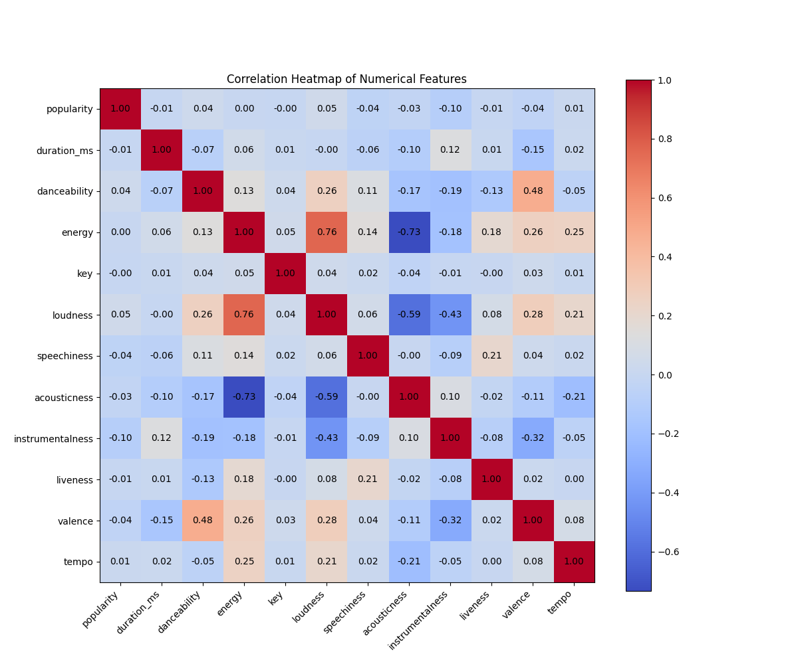

# Assignment 1 Report

## Task 1: Visualization

### Visualizations

#### 1. Correlation Heatmap

- **Description**: Displays the correlation between different features, helping to identify which features are most closely related to each other.

#### 2. Histograms

- **Description**: Shows the distribution of various features, allowing us to observe skewness, outliers, and the general spread of the data.

#### 3. Box Plots

- **Description**: Visualizes the distribution of features with respect to quartiles and highlights potential outliers.

#### 4. Violin Plots

- **Description**: Combines box plot and density plot to show the distribution of the data across different features.

#### 5. Bar Plots

- **Description**: Illustrates the distribution of categorical features, showing the count or proportion of each category.

#### 6. Pair Plots

- **Description**: Displays pairwise relationships between features through scatter plots and histograms.

#### 7. Scatter Plots

- **Danceability vs. Energy**
  
  - **Description**: Shows the relationship between danceability and energy, highlighting how these features interact across different tracks.

- **Danceability vs. Valence**
  
  - **Description**: Illustrates the correlation between danceability and valence, indicating how mood and danceability are related.

- **Loudness vs. Energy**
  
  - **Description**: Highlights the strong correlation between loudness and energy, showing how they tend to increase together.

- **Acousticness vs. Instrumentalness**
  
  - **Description**: Displays the inverse relationship between acousticness and instrumentalness, showing how acoustic tracks tend to have less instrumental content.

- **Tempo vs. Energy**
  
  - **Description**: Examines the relationship between tempo and energy, showing how faster tracks generally have more energy.

### Interpretations:

1. Correlations:
- Danceability has moderate positive correlations with energy (0.13), loudness (0.26), and valence (0.48). This suggests more danceable tracks tend to be more energetic, louder, and more positive in mood.
- Energy correlates positively with loudness (0.76) and tempo (0.25), which is intuitive.
- Acousticness has negative correlations with energy (-0.17) and loudness (-0.21), indicating acoustic tracks tend to be less energetic and quieter.
- Instrumentalness correlates negatively with speechiness (-0.19) and valence (-0.32), suggesting instrumental tracks tend to have less speech and be less positive in mood.

2. Distributions:
- Popularity: Right-skewed distribution with most tracks having low to moderate popularity.
- Danceability: Roughly normal distribution (left skewed) centered around 0.5-0.6.
- Energy:Most tracks have moderate to high energy.
- Loudness: Roughly normal distribution (left skewed).
- Speechiness: Right-skewed, most tracks have low values.
- Acousticness: Most tracks tend to be not acoustic.
, Instrumentalness:Most tracks tend to be instrumental.
- Valence: Roughly normal distribution across the range.
- Tempo: Roughly normal distribution centered around 120 BPM.

3. Outliers:
- Duration has significant outliers with some extremely long tracks.
- Loudness has some outliers on the quieter end.
- Tempo has some outliers on both low and high ends.
- Instrumentalness have multiple outliers, meaning most music is not instrumental at all but there are outliers with a varied range of more instrumentalness. 
- Danceability: Most songs have average dancebility (0.5) but there are outliers which are not danceable at all.

4. Feature importance hierarchy:
**Danceability** > **Energy** > **Valence** > **Loudness** > **Instrumentalness** > **Acousticness** > **Speechiness** > **Tempo** > **Liveness** > **Popularity** > **Key** > **Duration_ms**

Danceability is strongly correlated with other key features like energy, loudness, and valence, which are typically genre-defining characteristics. For instance, genres like EDM or pop are often high in danceability, energy, and loudness, whereas genres like classical or ambient music are lower in these attributes.

Energy is crucial in differentiating between high-energy genres like rock, metal, or electronic and low-energy genres like jazz, blues, or classical.

Instrumentalness is a key differentiator for genres like classical or ambient music, which are often instrumental, versus genres like hip-hop or pop, which tend to have vocals.

Acousticness helps differentiate between acoustic genres (folk, classical) and electronic or heavily produced genres (EDM, hip-hop). Its negative correlation with energy and loudness further strengthens its role in genre classification. 

Tempo is essential for distinguishing genres with specific tempo ranges, such as fast-paced dance music (EDM) versus slower genres like ballads or blues.

Speechiness is particularly relevant for genres like rap, hip-hop, and spoken word, where lyrics are dominant. Its negative correlation with instrumentalness also emphasizes its role in genres with high vocal content.

Popularity,distribution shows that other than some niche songs, most others follow a normal distribution, which makes sense.

Musical key usually is not genre specific.

**Artists** and **Album Name** can strongly indicate genre but are not useful for distance metrics; using them could be considered cheating. **Track Name** may have also contained hints. However we limit ourselves to only numerical features. Although time signature and mode are numbers, they are also categories.

Top 10 {k, distance_metric} pairs:
1. k=85, metric=manhattan, accuracy=0.2551
2. k=64, metric=manhattan, accuracy=0.2538
3. k=32, metric=manhattan, accuracy=0.2522
4. k=128, metric=manhattan, accuracy=0.2507
5. k=16, metric=manhattan, accuracy=0.2462
6. k=256, metric=manhattan, accuracy=0.2423
7. k=8, metric=manhattan, accuracy=0.2301
8. k=64, metric=euclidean, accuracy=0.2294
9. k=85, metric=euclidean, accuracy=0.2283
10. k=32, metric=euclidean, accuracy=0.2268

(cosine for k=85 comes to have Accuracy: 0.2174)