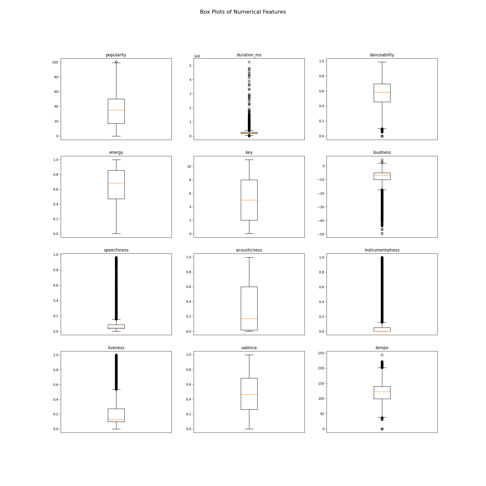

# Assignment 1 Report

To install dependencies, use 
```bash
pip install -r requirements.txt
```

To run any python3 file, run it from the base directory using,
```bash
python3 -m path.to.code.file # without .py extension
```
To run the code for this assignment,
```bash
python3 -m assignments.1.a1 # (without .py extension)
```
Website references are mentioned in the code.

## Task 1: Visualization

### Visualizations

#### 1. Correlation Heatmap

- **Description**: Displays the correlation between different features, helping to identify which features are most closely related to each other.

#### 2. Histograms

- **Description**: Shows the distribution of various features, allowing us to observe skewness, outliers, and the general spread of the data.

#### 3. Box Plots

- **Description**: Visualizes the distribution of features with respect to quartiles and highlights potential outliers.

#### 4. Violin Plots

- **Description**: Combines box plot and density plot to show the distribution of the data across different features.

#### 5. Bar Plots

- **Description**: Illustrates the distribution of categorical features, showing the count or proportion of each category.

#### 6. Pair Plots

- **Description**: Displays pairwise relationships between features through scatter plots and histograms.

#### 7. Scatter Plots

- **Danceability vs. Energy**
  
  - **Description**: Shows the relationship between danceability and energy, highlighting how these features interact across different tracks.

- **Danceability vs. Valence**
  
  - **Description**: Illustrates the correlation between danceability and valence, indicating how mood and danceability are related.

- **Loudness vs. Energy**
  
  - **Description**: Highlights the strong correlation between loudness and energy, showing how they tend to increase together.

- **Acousticness vs. Instrumentalness**
  
  - **Description**: Displays the inverse relationship between acousticness and instrumentalness, showing how acoustic tracks tend to have less instrumental content.

- **Tempo vs. Energy**
  
  - **Description**: Examines the relationship between tempo and energy, showing how faster tracks generally have more energy.


### Interpretations:

1. Correlations:
- Danceability has moderate positive correlations with energy (0.13), loudness (0.26), and valence (0.48). This suggests more danceable tracks tend to be more energetic, louder, and more positive in mood.
- Energy correlates positively with loudness (0.76) and tempo (0.25), which is intuitive.
- Acousticness has negative correlations with energy (-0.17) and loudness (-0.21), indicating acoustic tracks tend to be less energetic and quieter.
- Instrumentalness correlates negatively with speechiness (-0.19) and valence (-0.32), suggesting instrumental tracks tend to have less speech and be less positive in mood.

2. Distributions:
- Popularity: Right-skewed distribution with most tracks having low to moderate popularity.
- Danceability: Roughly normal distribution (left skewed) centered around 0.5-0.6.
- Energy:Most tracks have moderate to high energy.
- Loudness: Roughly normal distribution (left skewed).
- Speechiness: Right-skewed, most tracks have low values.
- Acousticness: Most tracks tend to be not acoustic.
, Instrumentalness:Most tracks tend to be instrumental.
- Valence: Roughly normal distribution across the range.
- Tempo: Roughly normal distribution centered around 120 BPM.

3. Outliers:
- Duration has significant outliers with some extremely long tracks.
- Loudness has some outliers on the quieter end.
- Tempo has some outliers on both low and high ends.
- Instrumentalness have multiple outliers, meaning most music is not instrumental at all but there are outliers with a varied range of more instrumentalness. 
- Danceability: Most songs have average dancebility (0.5) but there are outliers which are not danceable at all.

4. Feature importance hierarchy:
**Danceability** > **Energy** > **Valence** > **Loudness** > **Instrumentalness** > **Acousticness** > **Speechiness** > **Tempo** > **Liveness** > **Popularity** > **Key** > **Duration_ms**

Danceability is strongly correlated with other key features like energy, loudness, and valence, which are typically genre-defining characteristics. For instance, genres like EDM or pop are often high in danceability, energy, and loudness, whereas genres like classical or ambient music are lower in these attributes.

Energy is crucial in differentiating between high-energy genres like rock, metal, or electronic and low-energy genres like jazz, blues, or classical.

Instrumentalness is a key differentiator for genres like classical or ambient music, which are often instrumental, versus genres like hip-hop or pop, which tend to have vocals.

Acousticness helps differentiate between acoustic genres (folk, classical) and electronic or heavily produced genres (EDM, hip-hop). Its negative correlation with energy and loudness further strengthens its role in genre classification. 

Tempo is essential for distinguishing genres with specific tempo ranges, such as fast-paced dance music (EDM) versus slower genres like ballads or blues.

Speechiness is particularly relevant for genres like rap, hip-hop, and spoken word, where lyrics are dominant. Its negative correlation with instrumentalness also emphasizes its role in genres with high vocal content.

Popularity,distribution shows that other than some niche songs, most others follow a normal distribution, which makes sense.

Musical key usually is not genre specific.

**Artists** and **Album Name** can strongly indicate genre but are not useful for distance metrics; using them could be considered cheating. **Track Name** may have also contained hints. However we limit ourselves to only numerical features. Although time signature and mode are numbers, they are also categories.

## Task 3
The best {k, distance_metric} pair is k=85, metric=manhattan
Top 10 {k, distance_metric} pairs:
1. k=85, metric=manhattan, accuracy=0.2551
2. k=64, metric=manhattan, accuracy=0.2538
3. k=32, metric=manhattan, accuracy=0.2522
4. k=128, metric=manhattan, accuracy=0.2507
5. k=16, metric=manhattan, accuracy=0.2462
6. k=256, metric=manhattan, accuracy=0.2423
7. k=8, metric=manhattan, accuracy=0.2301
8. k=64, metric=euclidean, accuracy=0.2294
9. k=85, metric=euclidean, accuracy=0.2283
10. k=32, metric=euclidean, accuracy=0.2268

(cosine for k=85 comes to have Accuracy: 0.2174)

#### Plot k vs accuracy given a choice (yours) of any given {k, distance metric} pair with a constant data split.


#### More data need not necessarily mean best results. Try dropping various columns and check if you get better accuracy. Document the combination with which you get the best results

I had already filtered out categorical data before training my KNN models. To explore the impact of different features on the model's performance, I attempted to drop various numerical fields using the best parameters I found (k=85, metric=manhattan). However, even dropping a single field led to a noticeable fall in accuracy. This indicates that all numerical features in the dataset contribute significantly to the prediction of the target variable.

Moreover, this outcome might be influenced by the shuffled data, as the random distribution of data points across the training and validation sets could cause certain features to be more or less influential depending on the specific split.

Even duration_ms, which I put at the bottom of importance made the accruracy drop from 25% to 23.84%.

My final set of features are  
- "popularity",
- "duration_ms",
- "danceability",
- "energy",
- "key",
- "loudness",
- "speechiness",
- "acousticness",
- "instrumentalness",
- "liveness",
- "valence",
- "tempo"

Documentation of combos:

- For "popularity", "duration_ms", "danceability","energy", "key", "loudness","speechiness","acousticness",instrumentalness","liveness","valence", "tempo"
Classification Task Scores
Accuracy: 0.2551
  Precision (macro): 0.2383
  Recall (macro): 0.2496
  F1-Score (macro): 0.2438
  Precision (micro): 0.2551
  Recall (micro): 0.2551
  F1-Score (micro): 0.2551
- For "popularity", "danceability","energy", "key", "loudness","speechiness","acousticness",instrumentalness","liveness","valence", "tempo"
Classification Task Scores
Accuracy: 0.2384
  Precision (macro): 0.2226
  Recall (macro): 0.2346
  F1-Score (macro): 0.2284
  Precision (micro): 0.2384
  Recall (micro): 0.2384
  F1-Score (micro): 0.2384

- For "popularity", "duration_ms", "danceability","energy", "key", "loudness","speechiness","acousticness",instrumentalness","liveness","valence", "tempo"

Classification Task Scores
Accuracy: 0.2408
  Precision (macro): 0.2267
  Recall (macro): 0.2361
  F1-Score (macro): 0.2313
  Precision (micro): 0.2408
  Recall (micro): 0.2408
  F1-Score (micro): 0.2408
time_taken=73.59000515937805

- For "popularity", "duration_ms", "danceability","energy", "key", "loudness","speechiness","acousticness",instrumentalness","liveness","valence", 

Classification Task Scores
Accuracy: 0.2444
  Precision (macro): 0.2269
  Recall (macro): 0.2392
  F1-Score (macro): 0.2329
  Precision (micro): 0.2444
  Recall (micro): 0.2444
  F1-Score (micro): 0.2444

his does not exactly match my hierarchy of which columns are more necessary thanothers for the classification task based on the data exploration.

#### Try for all combinations of columns and see which combination gives the best result. See if that matches with the analysis made during data exploration

I predicted the order, danceability> tempo> duration_ms

Surprisingly duration_ms plays a huge role as is seen by removing it. The order here is duration_ms > danceability> tempo.

Attempting to evaluate all possible combinations of columns to determine the best result is not feasible due to the sheer number of combinations involved. Specifically, the number of combinations grows exponentially with the number of columns, leading to a combinatorial explosion. For example, considering all possible pairs (\( \binom{n}{2} \)) of columns would be impractical for large \( n \). Therefore, we will rely on the insights gained during data exploration to guide the selection of columns, focusing on the most promising combinations.

### 2.5.1 Tasks

1. I have used vectorization from the beginning to improve the execution time of the program, as I intentionally avoided using for loops. As clarified in the tutorial, this question does not require additional work since the implementation is already optimized with an O(n) time complexity.

2. 


inference_time_vs_train_size_plot.png


3. 


Observations:

- Inference time increases with the fraction of training data used for all models.

- The sklearn KNN model (blue line) has the lowest inference time across all dataset sizes, remaining nearly constant and under 5 seconds even as the dataset grows.

- The optimal KNN model (red line) shows a significant increase in inference time as the dataset size grows, but plateaus around 42 seconds for larger fractions of data.

- The best KNN model (green line) has the highest inference time, increasing linearly with dataset size and reaching over 70 seconds for the full dataset.

- There's a substantial performance gap between the sklearn implementation and the custom implementations, especially for larger datasets.

- The optimal KNN model performs better than the best KNN model in terms of inference time, especially for larger datasets.

- The difference in inference time between the models becomes more pronounced as the dataset size increases.

- Both custom implementations (best and optimal) show a steeper increase in inference time compared to the sklearn model.

### A Second Dataset

1. Class imbalance: Some classes appear in the test set but are absent in the training set. This leads to zero values in the confusion matrix, which was addressed by adding a small constant (1e-6) to avoid division by zero errors. This situation indicates that the data split is not stratified, making it suboptimal for training and testing.

2. Data preprocessing: To prepare the data, normalization was performed using both StandardScaler and MinMaxScaler. The scaling parameters (min, max, mean, standard deviation) were derived from the training set and then applied to both the validation and test sets. This approach ensures that if there are different distributions of test and validate set features, it does not have different representations of similar data in the different sets.

3. Performance impact: Despite the non-ideal data split, the model's performance was not significantly impacted. The accuracy was definitely lower compared to previous results, but the difference was not substantial, only around 3%.

4. Importance of stratified sampling: This experience highlights the importance of using stratified sampling when splitting datasets, especially for multi-class classification problems. A stratified split ensures that all classes are represented proportionally in each subset, which is crucial for reliable model training and evaluation.

## Linear regression 


Regression Task Scores:
Mean Squared Error (MSE): 0.2713
Standard Deviation: 0.5203
Variance: 0.2707


#### Reporting MSE, Variance and standard dev for the train and test set:

| k  | Train MSE | Train Std Dev | Train Variance | Test MSE | Test Std Dev | Test Variance |
|----|-----------|---------------|----------------|----------|--------------|---------------|
| 1  | 0.3383    | 0.5816        | 0.3383         | 0.1607   | 0.3417       | 0.1167        |
| 2  | 0.2142    | 0.4628        | 0.2142         | 0.2184   | 0.4464       | 0.1993        |
| 3  | 0.0898    | 0.2996        | 0.0898         | 0.0836   | 0.2655       | 0.0705        |
| 4  | 0.0910    | 0.3017        | 0.0910         | 0.0850   | 0.2693       | 0.0725        |
| 5  | 0.0557    | 0.2359        | 0.0557         | 0.0495   | 0.2068       | 0.0427        |
| 6  | 0.0553    | 0.2352        | 0.0553         | 0.0486   | 0.2040       | 0.0416        |
| 7  | 0.0373    | 0.1932        | 0.0373         | 0.0337   | 0.1730       | 0.0299        |
| 8  | 0.0365    | 0.1910        | 0.0365         | 0.0325   | 0.1696       | 0.0288        |
| 9  | 0.0259    | 0.1608        | 0.0259         | 0.0249   | 0.1508       | 0.0228        |
| 10 | 0.0252    | 0.1588        | 0.0252         | 0.0241   | 0.1484       | 0.0220        |
| 11 | 0.0192    | 0.1384        | 0.0192         | 0.0201   | 0.1370       | 0.0188        |
| 12 | 0.0189    | 0.1374        | 0.0189         | 0.0196   | 0.1354       | 0.0183        |
| 13 | 0.0157    | 0.1253        | 0.0157         | 0.0176   | 0.1286       | 0.0165        |
| 14 | 0.0156    | 0.1250        | 0.0156         | 0.0172   | 0.1275       | 0.0163        |
| 15 | 0.0141    | 0.1188        | 0.0141         | 0.0162   | 0.1237       | 0.0153        |
| 16 | 0.0142    | 0.1190        | 0.0142         | 0.0160   | 0.1230       | 0.0151        |
| 17 | 0.0135    | 0.1164        | 0.0135         | 0.0155   | 0.1210       | 0.0146        |
| 18 | 0.0136    | 0.1166        | 0.0136         | 0.0155   | 0.1206       | 0.0145        |
| 19 | 0.0134    | 0.1158        | 0.0134         | 0.0153   | 0.1196       | 0.0143        |
| 20 | 0.0134    | 0.1158        | 0.0134         | 0.0153   | 0.1194       | 0.0143        |
| 21 | 0.0134    | 0.1156        | 0.0134         | 0.0152   | 0.1189       | 0.0141        |
| 22 | 0.0133    | 0.1154        | 0.0133         | 0.0152   | 0.1189       | 0.0141        |
| 23 | 0.0133    | 0.1155        | 0.0133         | 0.0152   | 0.1187       | 0.0141        |
| 24 | 0.0133    | 0.1151        | 0.0133         | 0.0152   | 0.1188       | 0.0141        |
| 25 | 0.0133    | 0.1152        | 0.0133         | 0.0152   | 0.1188       | 0.0141        |
| 26 | 0.0132    | 0.1148        | 0.0132         | 0.0152   | 0.1190       | 0.0142        |
| 27 | 0.0132    | 0.1148        | 0.0132         | 0.0152   | 0.1191       | 0.0142        |
| 28 | 0.0131    | 0.1144        | 0.0131         | 0.0152   | 0.1194       | 0.0143        |
| 29 | 0.0131    | 0.1144        | 0.0131         | 0.0153   | 0.1195       | 0.0143        |
| 30 | 0.0130    | 0.1142        | 0.0130         | 0.0153   | 0.1198       | 0.0143        |
| 31 | 0.0130    | 0.1142        | 0.0130         | 0.0153   | 0.1199       | 0.0144        |
| 32 | 0.0130    | 0.1140        | 0.0130         | 0.0153   | 0.1200       | 0.0144        |
| 33 | 0.0130    | 0.1141        | 0.0130         | 0.0153   | 0.1201       | 0.0144        |
| 34 | 0.0130    | 0.1140        | 0.0130         | 0.0153   | 0.1201       | 0.0144        |

Best degree (k): 23 with MSE: 0.015169761262140235

Best model saved as csv:
```
degree,weights,bias
23,"[0.9124757  0.94300364 0.68936339 0.75404015 0.54614761 0.56423386
 0.44148574 0.4110342  0.36273282 0.29290072 0.30220635 0.20368127
 0.25429941 0.13778543 0.21469155 0.0909681  0.1798861  0.06029258
 0.14688713 0.04395722 0.11296114 0.04113616 0.07544906]",0.4614828326722433
```


### GIFS:
#### 2 degree polynomial

#### 5 degree polynomial

#### 10 degree polynomial

#### 15 degree polynomial

#### 23 degree polynomial

#### 32 degree polynomial


When I initially experimented with random initialization, I observed that the time to converge for generating GIFs varied depending on the random seed. Now that I am loading data from a file, the convergence time is sonstant everytime. Due to the liner regression being on such a smll dataset, the convergence times do not actually differ much in reality, it is only visiblein the GIFs.


#### Second dataset


| Regularization | Degree (k) | Mean Squared Error (MSE) | Standard Deviation | Variance |
|----------------|------------|--------------------------|--------------------|----------|
| None           | 1          | 0.1493                   | 0.3782             | 0.1430   |
| None           | 2          | 0.0196                   | 0.1301             | 0.0169   |
| None           | 3          | 0.0193                   | 0.1337             | 0.0179   |
| None           | 4          | 0.0135                   | 0.1143             | 0.0131   |
| None           | 5          | 0.0135                   | 0.1141             | 0.0130   |
| None           | 6          | 0.0122                   | 0.1090             | 0.0119   |
| None           | 7          | 0.0122                   | 0.1088             | 0.0118   |
| None           | 8          | 0.0120                   | 0.1076             | 0.0116   |
| None           | 9          | 0.0122                   | 0.1082             | 0.0117   |
| None           | 10         | 0.0122                   | 0.1080             | 0.0117   |
| None           | 11         | 0.0124                   | 0.1090             | 0.0119   |
| None           | 12         | 0.0125                   | 0.1095             | 0.0120   |
| None           | 13         | 0.0127                   | 0.1105             | 0.0122   |
| None           | 14         | 0.0128                   | 0.1111             | 0.0124   |
| None           | 15         | 0.0130                   | 0.1118             | 0.0125   |
| None           | 16         | 0.0130                   | 0.1122             | 0.0126   |
| None           | 17         | 0.0131                   | 0.1123             | 0.0126   |
| None           | 18         | 0.0130                   | 0.1123             | 0.0126   |
| None           | 19         | 0.0130                   | 0.1121             | 0.0126   |
| None           | 20         | 0.0129                   | 0.1119             | 0.0125   |
| l1             | 1          | 0.1461                   | 0.3742             | 0.1400   |
| l1             | 2          | 0.0178                   | 0.1226             | 0.0150   |
| l1             | 3          | 0.0178                   | 0.1224             | 0.0150   |
| l1             | 4          | 0.0119                   | 0.1052             | 0.0111   |
| l1             | 5          | 0.0120                   | 0.1053             | 0.0111   |
| l1             | 6          | 0.0118                   | 0.1060             | 0.0112   |
| l1             | 7          | 0.0118                   | 0.1059             | 0.0112   |
| l1             | 8          | 0.0119                   | 0.1064             | 0.0113   |
| l1             | 9          | 0.0119                   | 0.1063             | 0.0113   |
| l1             | 10         | 0.0119                   | 0.1061             | 0.0113   |
| l1             | 11         | 0.0119                   | 0.1061             | 0.0113   |
| l1             | 12         | 0.0119                   | 0.1061             | 0.0113   |
| l1             | 13         | 0.0119                   | 0.1061             | 0.0113   |
| l1             | 14         | 0.0119                   | 0.1061             | 0.0113   |
| l1             | 15         | 0.0119                   | 0.1061             | 0.0113   |
| l1             | 16         | 0.0119                   | 0.1061             | 0.0112   |
| l1             | 17         | 0.0119                   | 0.1061             | 0.0113   |
| l1             | 18         | 0.0119                   | 0.1061             | 0.0113   |
| l1             | 19         | 0.0119                   | 0.1061             | 0.0113   |
| l1             | 20         | 0.0119                   | 0.1061             | 0.0113   |
| l2             | 1          | 0.1483                   | 0.3769             | 0.1421   |
| l2             | 2          | 0.0176                   | 0.1215             | 0.0148   |
| l2             | 3          | 0.0178                   | 0.1272             | 0.0162   |
| l2             | 4          | 0.0125                   | 0.1092             | 0.0119   |
| l2             | 5          | 0.0128                   | 0.1109             | 0.0123   |
| l2             | 6          | 0.0118                   | 0.1071             | 0.0115   |
| l2             | 7          | 0.0117                   | 0.1067             | 0.0114   |
| l2             | 8          | 0.0115                   | 0.1060             | 0.0112   |
| l2             | 9          | 0.0115                   | 0.1057             | 0.0112   |
| l2             | 10         | 0.0115                   | 0.1055             | 0.0111   |
| l2             | 11         | 0.0115                   | 0.1057             | 0.0112   |
| l2             | 12         | 0.0115                   | 0.1058             | 0.0112   |
| l2             | 13         | 0.0117                   | 0.1065             | 0.0113   |
| l2             | 14         | 0.0118                   | 0.1068             | 0.0114   |
| l2             | 15         | 0.0119                   | 0.1075             | 0.0116   |
| l2             | 16         | 0.0120                   | 0.1079             | 0.0116   |
| l2             | 17         | 0.0121                   | 0.1084             | 0.0118   |
| l2             | 18         | 0.0121                   | 0.1087             | 0.0118   |
| l2             | 19         | 0.0122                   | 0.1089             | 0.0119   |
| l2             | 20         | 0.0122                   | 0.1089             | 0.0119   |

We evaluated the impact of L1 and L2 regularization on polynomial regression tasks with varying degrees of polynomials. The results for polynomial degree kk ranging from 1 to 20 were analyzed. The original polynomial was of degree 5. The performance metrics assessed include Mean Squared Error (MSE), Standard Deviation, and Variance.

The results show a decreasing trend in MSE with increasing polynomial degree until a certain point, after which the performance metrics stabilize or degrade slightly. This indicates overfitting as the polynomial degree increases, particularly evident from degree 5 onwards where the performance does not improve significantly despite the increase in model complexity.

L1 and L2 regularization maintains similar performance metrics across polynomial degrees, with slight improvements in MSE, standard deviation, and variance compared to no regularization. The regularization helps in reducing the variance of the model, aka overfitting is lowered.

In my case L1 regularisation performed better for higher degrees (k=20) while L2 performed better for lower degrees (k=10). This may be explained by the fact that L1 regularisation makes the coefficients go to 0 while L2 reduces them. So, although L2 manages to reduce overfitting more effectively compared to both L1 regularization for lower polynomials, for k=20, the polynomial coefficients of higher degrees for L2 end up contributing more to overfitting than if they were set to 0, as for L1.

In our case only very low values of lamda seem to work (below 0.01). This may be attributed to the fact of how the test data ha been randomly sampled from the overall data, so the graphs of the train and test set are almost similar. Thus, overfitting train may still give low variances on test as there are no points in ranges of X such that it is not captured by the train dataset.