# Assignment 2 Report

To install dependencies, use 
```bash
pip install -r requirements.txt
```

To run any python3 file, run it from the base directory using,
```bash
python3 -m path.to.code.file # without .py extension
```
To run the code for this assignment,
```bash
python3 -m assignments.2.a2 # (without .py extension)
```
Website references are mentioned in the code.

# K-Means Clustering

## Elbow Plot for seed 43

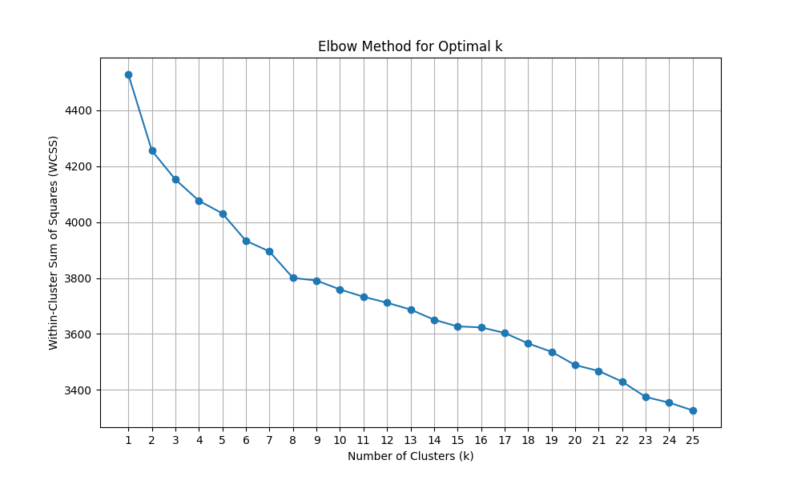

Optimal number of clusters (k_kmeans1): 8
Cluster labels: [4 4 6 2 2 7 4 4 7 6 2 4 2 1 1 0 1 4 4 3 4 4 6 4 6 0 6 4 7 0 6 5 2 5 2 7 7
 1 4 6 7 1 7 4 0 0 4 4 4 4 4 4 5 4 0 0 0 4 2 7 2 0 6 4 0 7 5 2 7 4 2 4 4 7
 5 2 0 1 0 3 4 0 0 2 1 4 7 0 0 1 3 2 4 6 4 1 7 1 0 4 1 1 0 4 7 0 3 0 1 0 7
 7 1 7 1 6 7 6 6 4 4 4 0 6 2 7 5 7 7 4 7 7 0 7 6 5 3 1 5 7 1 4 4 4 4 1 5 4
 4 4 6 0 4 4 0 0 4 4 0 0 4 2 6 6 6 0 1 5 7 6 1 7 6 7 2 0 4 1 4 5 3 0 0 6 4
 7 1 2 5 7 6 0 4 0 1 4 0 0 0 5]
WCSS cost for optimal k: 3800.3406663064675


## Elbow Plot for seed 33

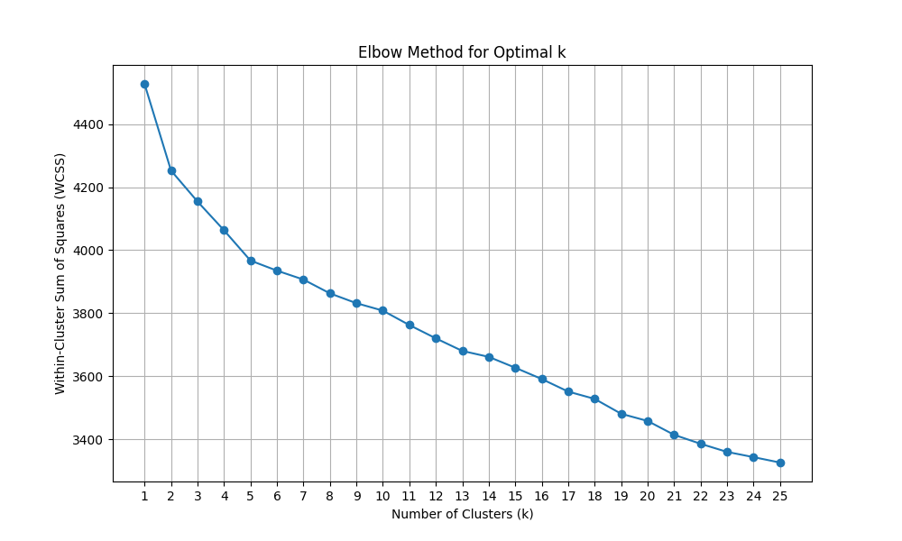

Optimal number of clusters (k_kmeans1): 5   
Cluster labels: [1 1 3 3 3 4 3 1 4 3 4 4 3 2 2 0 3 1 1 3 1 3 3 1 3 3 3 4 4 3 3 2 0 2 4 4 4
 2 1 3 4 3 4 1 0 3 1 1 1 1 3 1 0 1 0 0 3 1 3 4 2 0 3 4 3 4 0 4 4 0 4 4 4 1
 2 0 0 2 0 1 1 0 0 3 0 3 4 0 3 3 1 4 1 3 3 3 1 2 3 1 2 3 0 0 4 0 2 0 3 0 4
 4 2 4 0 3 4 0 3 3 0 0 0 3 3 4 0 4 4 1 1 4 3 1 3 0 1 2 2 4 2 3 1 1 2 2 2 0
 3 1 3 0 3 4 0 0 1 1 0 0 1 3 3 3 3 0 2 0 4 0 0 4 3 4 3 0 3 2 1 2 1 0 3 3 1
 4 0 3 2 4 3 0 1 0 2 1 0 0 0 2]
WCSS cost for optimal k: 3966.973318266988


## Elbow Plot for seed 35

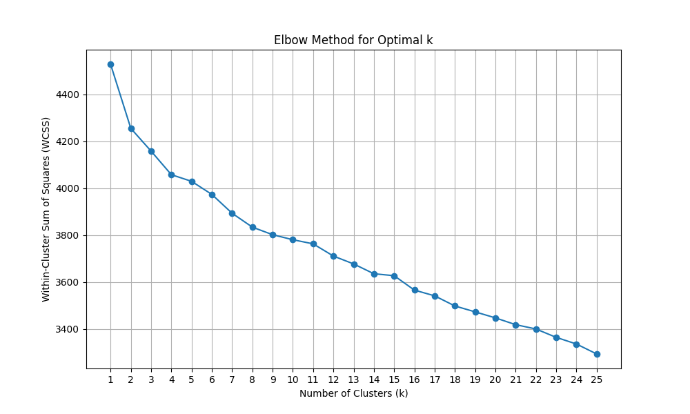

Optimal number of clusters (k_kmeans1): 4
Cluster labels: [2 1 0 0 0 1 2 2 1 0 2 1 0 3 3 2 0 1 2 2 2 0 0 2 0 2 0 1 1 2 0 3 3 3 1 1 1
 3 1 0 1 2 1 1 2 2 2 2 2 2 0 2 2 1 2 3 2 1 0 1 3 3 0 1 2 1 3 1 1 2 1 1 1 1
 3 3 3 2 3 2 2 3 3 0 3 2 1 2 2 0 2 1 1 0 2 0 1 3 0 2 3 0 2 2 1 2 3 3 0 3 1
 1 2 1 3 0 1 3 0 2 2 2 2 0 0 1 3 1 1 1 1 1 0 1 0 3 2 2 3 1 3 2 2 2 2 3 3 2
 2 2 2 2 2 1 2 3 1 2 3 2 1 0 0 3 0 2 2 3 1 3 2 1 0 1 2 2 2 2 1 3 2 2 2 0 2
 1 2 2 3 1 0 2 2 2 3 2 2 2 2 3]
WCSS cost for optimal k: 4057.293281791949

**We settle at $K_{kmeans1}$ = 5 due to the uniform nature of the WCSS graph and the single indisputable elbow point.**

For this we get WCSS cost as 3966.973318266988

Cluster 0:
table, mug, gym, passport, roof, stairs, bed, microwave, notebook, van, sweater, microphone, jacket, bench, bucket, feet, laptop, door, calendar, chair, ladder, candle, igloo, clock, oven, calculator, pillow, envelope, dustbin, ambulance, television, throne, tent, camera, car, loudspeaker, lantern, telephone, stove, wheel, toaster, shoe, keyboard, radio, truck, suitcase
Cluster 1:
drive, sing, dive, exit, brick, smile, bullet, bend, fly, face, climb, kneel, scream, kiss, selfie, catch, sleep, baseball, hollow, basket, empty, slide, drink, angry, lazy, hang, skate, tattoo, earth, tank, key, swim, zip, cook, basketball, arrow, walk, sunny
Cluster 2:
needle, eraser, brush, feather, spoon, pencil, knit, cigarette, flute, scissor, badminton, finger, hammer, toothbrush, screwdriver, fingerprints, teaspoon, length, sword, knife, toothpaste, comb, fork, paintbrush
Cluster 3:
deer, panda, ape, rose, helicopter, cat, carrot, fishing, bear, spider, shark, grass, giraffe, forest, lizard, frog, puppet, lake, monkey, rifle, cow, starfish, plant, sun, puppy, boat, pear, peacock, fish, saturn, fruit, grape, mouse, ant, goldfish, bird, spiderman, bee, tree, beetle, snake, rain, airplane, pizza, tomato, dragonfly, parachute, butterfly, elephant, pant, rainy, bicycle, windmill, potato, crocodile
Cluster 4:
listen, flame, sit, knock, bury, download, eat, postcard, hard, fight, call, hit, paint, far, dig, cry, run, clap, pull, clean, sad, draw, pray, arrest, email, buy, burn, fire, close, scary, book, enter, happy, loud, love, recycle, cut

---

# Gaussian Mixture Models

I initially tried performing GMM clustering using my own class using k = $K_{kmeans1}$ = 5, but ran into several challenges.

1. **Covariance Matrix Singularity**: 
   In the initial implementation, I encountered an error due to the covariance matrix being singular. A singular covariance matrix occurs when some features are linearly dependent or when there are too few data points compared to the number of features (512-dimensional data with 200 points in this case). This makes the covariance matrix non-invertible, and GMM fails because the matrix must be non-singular (and positive definite) to perform multivariate normal distribution calculations.

   To address this, I initially tried using `allow_singular=True` in `scipy.stats.multivariate_normal`. This allows the algorithm to proceed even if the covariance matrix is singular. [As it may lead to instabilities](https://stackoverflow.com/questions/35273908/scipy-stats-multivariate-normal-raising-linalgerror-singular-matrix-even-thou), I switched to **regularizing the covariance matrix**. This means adding a small value (`1e-6` in this case, can be changed using `reg_covar`) to the diagonal of the covariance matrix to ensure it's singular and positive definite. This method works better by making the matrix invertible with minimal changes to the data.

2. **Overflow Issues**:
  I encountered an overflow error during computation due to the high-dimensional data. I switched to using logarithms in the calculation. Specifically, I used the `logsumexp` function to safely compute the log of sums of exponentials, which prevents overflow issues during the expectation step (E-step). The function `_log_multivariate_normal_density` now computes the log of the Gaussian distribution for each point, and the likelihood is calculated using the `logsumexp` function.

### **Comparison with `sklearn` GMM**

After fixing the issues in my custom GMM class, I compared it with the `sklearn` GMM implementation. It seems sklearn handles singular matrices by default through preprocessing such as regularization. Both my class and the `sklearn` class successfully perform GMM clustering without errors. The log-likelihood values and the parameters (means, weights, covariances) are very similar, confirming that the core algorithm works as expected.

**To note:**
The final clustering effectively has, what can be called, hard assignments where each data point is assigned to only one cluster.The dataset  512 dimensions with only 200 data points causing posterior probabilities (membership values) to become very close to either 0 or 1. As covariance matrices are nearly degenerate (i.e., close to singular), the model may not accurately represent the true distribution of the data.The log-likelihood values for both my implementation and Sklearn are positive.

## AIC and BIC:

### My Implementation


## Sklearn
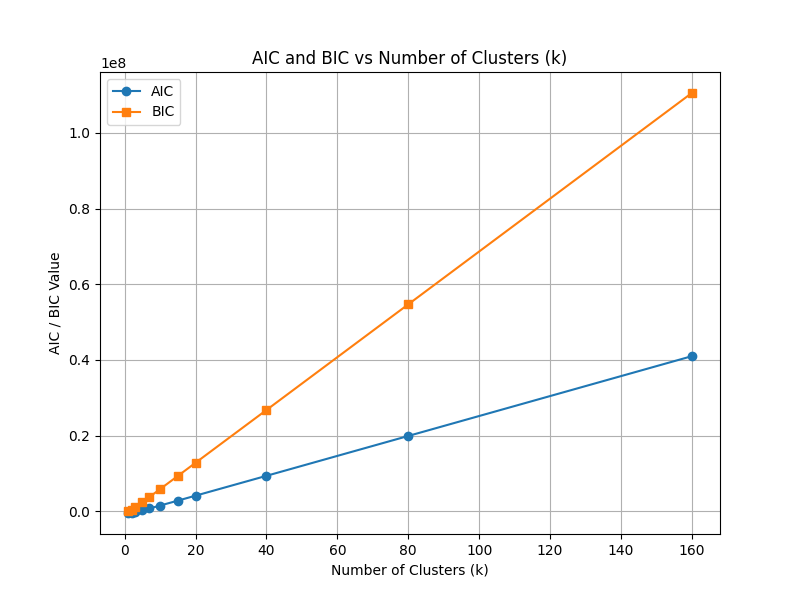
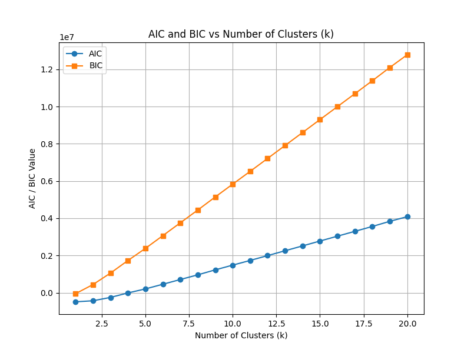

We note that both my code and Sklearn throw error for when we try to use more than k = 200 for GMM.

Optimal number of clusters based on BIC: 1
Optimal number of clusters based on AIC: 1

This again can be attributed to the nature of the dataset, which has more dimensions than datapoints. 

Thus, although both my and Sklearn's GMM runs on the data, it is far from ideal. PCA needs to be applied to be able to draw meaningful conclusions from the data.

**We settle at $K_{gmm1}$ = 1**

This gives us Log Likelihood: 375255.27444188285. The membership is obviously a one hot vector [1] for each class. 

```
Weights: [1]
Means: [[-1.29900086e-02, -5.21759896e-02, -1.90298252e-02,
         7.76085762e-02, -5.49704913e-02, -3.46861647e-02,
        -1.20059666e-01, -1.08713815e+00, -1.75144684e-01,
         2.18883874e-01,  1.43400622e-02, -1.11440015e-01,
        ...,
        -6.93333779e-02, -6.63823007e-02, -2.48983755e-01,
        -1.11258245e-01,  3.13115194e-02]], 
Covariances: [[[ 2.98234736e-02,  7.82239280e-05,  3.55016624e-03, ...,
         -6.82535628e-03,  2.67777455e-03, -1.17062036e-03],
        [ 7.82239280e-05,  4.33966894e-02, -2.43116468e-04, ...,
         -8.78883327e-03, -4.15580173e-04,  3.88595736e-03],
        ...,
        [ 2.67777455e-03, -4.15580173e-04,  1.66209159e-03, ...,
         -1.49421301e-02,  5.28725709e-02,  8.54919329e-04],
        [-1.17062036e-03,  3.88595736e-03,  3.46288488e-03, ...,
         -9.74189033e-03,  8.54919329e-04,  4.17133432e-02]]]
```

---

# Dimensionality Reduction and Visualization

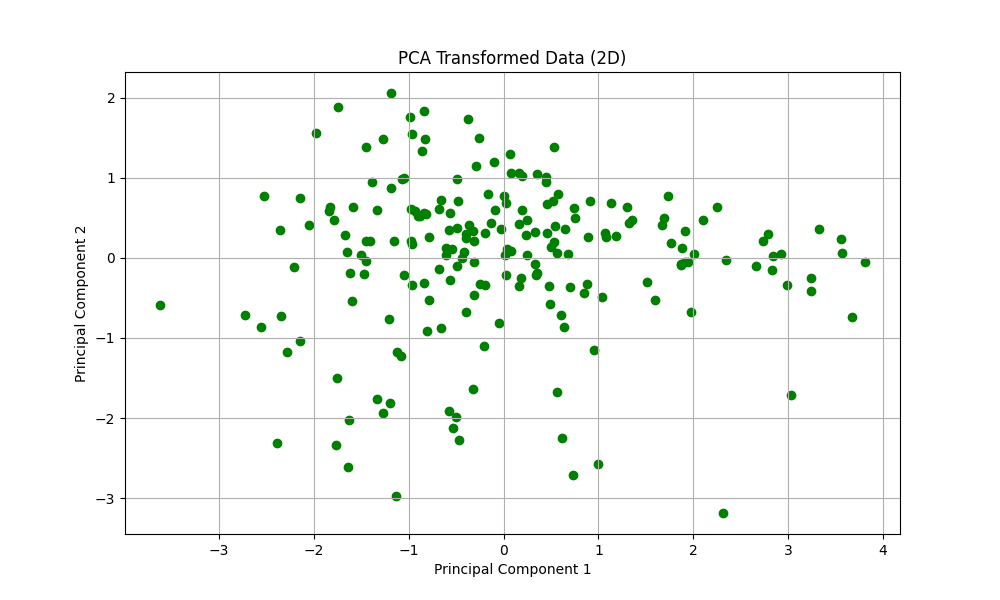
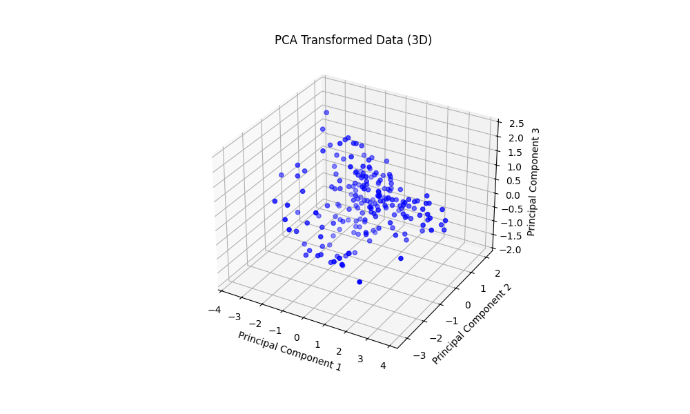

## Analysis of PCA Axes

**Words sorted along PCA Axis 1:**  
['peacock' 'lantern' 'crocodile' 'dragonfly' 'panda' 'giraffe' 'starfish'
 'elephant' 'sweater' 'pencil' 'windmill' 'beetle' 'toothbrush' 'eraser'
 'stairs' 'goldfish' 'bee' 'ant' 'badminton' 'pear' 'bench' 'cow' 'sun'
 'chair' 'deer' 'saturn' 'jacket' 'helicopter' 'parachute' 'flute'
 'microphone' 'tent' 'igloo' 'suitcase' 'tomato' 'feather' 'van' 'fruit'
 'gym' 'knit' 'paintbrush' 'butterfly' 'cat' 'bed' 'rifle' 'microwave'
 'tree' 'toothpaste' 'screwdriver' 'carrot' 'bicycle' 'spoon' 'grape'
 'lizard' 'ladder' 'pillow' 'throne' 'needle' 'ambulance' 'teaspoon'
 'fork' 'comb' 'length' 'feet' 'frog' 'stove' 'roof' 'candle' 'scissor'
 'mug' 'spider' 'grass' 'car' 'toaster' 'fishing' 'laptop' 'shark'
 'potato' 'pant' 'boat' 'airplane' 'spiderman' 'bucket' 'ape' 'forest'
 'table' 'mouse' 'television' 'door' 'loudspeaker' 'oven' 'camera'
 'finger' 'rainy' 'lake' 'monkey' 'telephone' 'brush' 'calculator'
 'calendar' 'plant' 'puppet' 'envelope' 'wheel' 'sword' 'keyboard' 'bear'
 'cigarette' 'skate' 'rain' 'rose' 'clock' 'pizza' 'dustbin'
 'fingerprints' 'snake' 'passport' 'bird' 'climb' 'shoe' 'basketball'
 'arrow' 'hammer' 'truck' 'baseball' 'walk' 'kneel' 'fish' 'knife' 'radio'
 'basket' 'scream' 'brick' 'swim' 'zip' 'puppy' 'tattoo' 'drive' 'kiss'
 'notebook' 'bend' 'sunny' 'sit' 'bullet' 'pull' 'dig' 'fly' 'exit' 'tank'
 'face' 'run' 'hollow' 'dive' 'smile' 'earth' 'empty' 'key' 'clap' 'eat'
 'selfie' 'postcard' 'paint' 'catch' 'drink' 'sing' 'slide' 'cook' 'angry'
 'arrest' 'recycle' 'bury' 'knock' 'book' 'sleep' 'far' 'email' 'lazy'
 'draw' 'enter' 'cut' 'hang' 'loud' 'call' 'sad' 'clean' 'close' 'flame'
 'fight' 'fire' 'pray' 'burn' 'happy' 'buy' 'hard' 'scary' 'download'
 'listen' 'love' 'cry' 'hit']

**Words sorted along PCA Axis 2:**  
['sad' 'cat' 'run' 'cow' 'eat' 'bee' 'panda' 'ape' 'dig' 'potato' 'sun'
 'pant' 'van' 'car' 'gym' 'tomato' 'buy' 'sit' 'camera' 'ant' 'rifle'
 'bed' 'elephant' 'clap' 'calendar' 'pencil' 'feet' 'mug' 'fly'
 'crocodile' 'bear' 'fruit' 'cry' 'starfish' 'lantern' 'pull' 'television'
 'cut' 'peacock' 'puppy' 'deer' 'frog' 'arrest' 'selfie' 'monkey' 'smile'
 'hard' 'face' 'bird' 'zip' 'plant' 'grape' 'happy' 'calculator' 'earth'
 'ambulance' 'angry' 'laptop' 'shoe' 'scary' 'rose' 'tree' 'fish'
 'helicopter' 'chair' 'radio' 'fire' 'roof' 'sweater' 'boat' 'close' 'far'
 'kneel' 'sleep' 'enter' 'hit' 'lake' 'lazy' 'parachute' 'clean' 'forest'
 'pray' 'rain' 'truck' 'jacket' 'spider' 'tank' 'burn' 'hang' 'love'
 'sunny' 'bench' 'table' 'snake' 'shark' 'pizza' 'email' 'grass' 'tattoo'
 'lizard' 'book' 'kiss' 'tent' 'microphone' 'rainy' 'flame' 'bicycle'
 'butterfly' 'listen' 'mouse' 'empty' 'paint' 'stove' 'drink' 'hammer'
 'pear' 'door' 'fight' 'swim' 'postcard' 'puppet' 'walk' 'draw' 'finger'
 'giraffe' 'toaster' 'download' 'exit' 'cigarette' 'spiderman' 'bend'
 'beetle' 'oven' 'recycle' 'climb' 'wheel' 'slide' 'baseball' 'goldfish'
 'cook' 'loud' 'bury' 'dive' 'pillow' 'throne' 'length' 'fork' 'fishing'
 'ladder' 'eraser' 'basketball' 'keyboard' 'suitcase' 'carrot' 'candle'
 'hollow' 'call' 'saturn' 'sing' 'stairs' 'brick' 'clock' 'catch' 'bucket'
 'key' 'drive' 'scissor' 'windmill' 'dragonfly' 'skate' 'knock' 'bullet'
 'envelope' 'knit' 'scream' 'igloo' 'airplane' 'microwave' 'toothpaste'
 'basket' 'arrow' 'knife' 'fingerprints' 'passport' 'telephone' 'sword'
 'dustbin' 'needle' 'notebook' 'flute' 'feather' 'comb' 'brush' 'spoon'
 'toothbrush' 'loudspeaker' 'screwdriver' 'teaspoon' 'badminton'
 'paintbrush']

**Words sorted along PCA Axis 3:**  
['laptop' 'chair' 'calendar' 'calculator' 'television' 'mug' 'bench'
 'envelope' 'pencil' 'microphone' 'stove' 'microwave' 'keyboard' 'pillow'
 'camera' 'table' 'suitcase' 'radio' 'bed' 'toaster' 'loudspeaker'
 'throne' 'van' 'tent' 'gym' 'email' 'oven' 'car' 'telephone' 'toothbrush'
 'sweater' 'notebook' 'potato' 'call' 'stairs' 'jacket' 'comb' 'book'
 'postcard' 'sit' 'eraser' 'passport' 'ambulance' 'fork' 'brush' 'pull'
 'dig' 'door' 'ladder' 'eat' 'lantern' 'toothpaste' 'sad' 'dustbin'
 'clock' 'candle' 'rifle' 'run' 'shoe' 'teaspoon' 'selfie' 'feet' 'bucket'
 'buy' 'flute' 'cut' 'cigarette' 'recycle' 'draw' 'length' 'listen'
 'drink' 'roof' 'truck' 'sun' 'paintbrush' 'knit' 'download' 'pant' 'clap'
 'wheel' 'knock' 'tattoo' 'igloo' 'badminton' 'cook' 'finger' 'exit'
 'hammer' 'brick' 'screwdriver' 'arrest' 'kneel' 'enter' 'smile' 'tomato'
 'spoon' 'key' 'slide' 'basketball' 'face' 'knife' 'bend' 'sing'
 'fingerprints' 'bury' 'burn' 'paint' 'happy' 'fruit' 'boat' 'baseball'
 'far' 'basket' 'scissor' 'zip' 'walk' 'close' 'tank' 'parachute' 'hit'
 'cry' 'drive' 'empty' 'bicycle' 'loud' 'kiss' 'scary' 'skate' 'sword'
 'sleep' 'catch' 'needle' 'helicopter' 'cat' 'plant' 'tree' 'pizza'
 'fight' 'cow' 'lazy' 'puppet' 'fire' 'windmill' 'love' 'sunny' 'hard'
 'grass' 'hang' 'hollow' 'pear' 'peacock' 'bullet' 'scream' 'clean'
 'carrot' 'pray' 'angry' 'fishing' 'mouse' 'rose' 'feather' 'flame'
 'earth' 'ape' 'swim' 'rain' 'grape' 'panda' 'bee' 'rainy' 'ant' 'climb'
 'dive' 'saturn' 'lake' 'arrow' 'starfish' 'airplane' 'forest' 'fly'
 'elephant' 'goldfish' 'crocodile' 'puppy' 'beetle' 'fish' 'snake' 'bird'
 'bear' 'spiderman' 'deer' 'monkey' 'butterfly' 'shark' 'spider' 'giraffe'
 'lizard' 'frog' 'dragonfly']

### PCA Axis 1: Abstraction Level
This axis appears to represent a continuum from concrete, tangible objects to abstract concepts and actions.

- Starts with: Concrete nouns (e.g., peacock, lantern, crocodile)
- Ends with: Abstract verbs and concepts (e.g., love, cry, hit)


### PCA Axis 2: Animacy and Mobility

This axis seems to capture the distinction between things that can move or have agency and those that are typically stationary or used as tools.

- Starts with: Living creatures and dynamic objects (e.g., sad, cat, run, cow)
- Ends with: Static tools and small objects (e.g., paintbrush, teaspoon, screwdriver)


### PCA Axis 3: Human-Centric vs. Nature-Centric
This axis seems to move from human-made, indoor items from natural, outdoor elements.

- Starts with: Man-made, indoor objects (e.g., laptop, chair, calendar)
- Ends with: Natural, outdoor elements (e.g., butterfly, shark, spider, giraffe)

By observation I was able to identify 4 distinct clusters. Thus, $$k_2 = 4$$

# PCA + KMeans Clustering

K-Means on $k_2 = 4$  
Clusters:
3 1 3 3 3 1 3 3 1 3 3 1 3 2 2 0 3 3 3 3 3 3 3 3 3 3 3 1 1 3 3 2 0 2 1 1 1
 2 3 3 1 3 1 3 0 3 3 3 3 3 3 3 0 1 0 0 3 1 3 1 2 0 3 1 3 1 0 3 1 0 3 1 3 1
 2 0 0 3 0 3 3 0 0 3 0 3 1 0 3 3 3 1 3 3 3 3 1 2 3 1 2 3 0 0 1 0 2 0 3 0 1
 1 2 1 0 3 1 0 3 3 0 0 0 3 3 1 0 1 1 1 1 1 3 1 3 0 3 2 2 1 2 3 3 3 3 2 2 0
 3 3 3 0 3 1 0 0 2 3 0 0 3 3 3 3 3 0 2 0 1 0 0 1 3 1 3 0 3 2 1 2 3 0 3 3 3
 1 0 3 2 1 3 3 3 0 2 3 0 0 0 2
WCSS cost for k=4: 4063.222058671721

## Scree Plot for Optimal Dimensions:

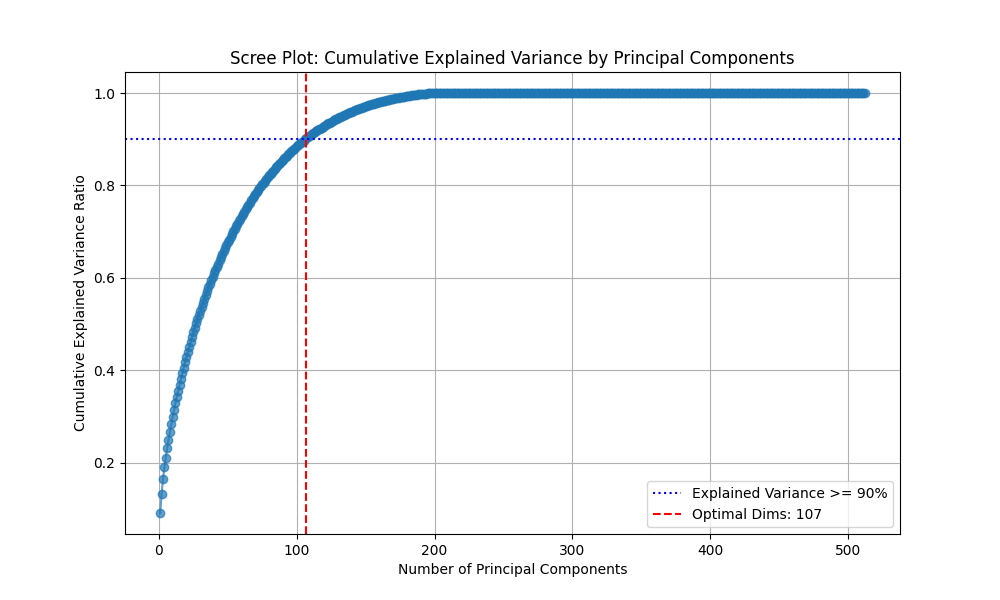
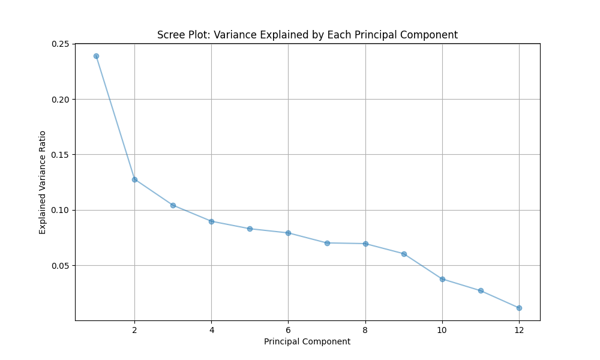

**Optimal number of dimensions based on 90% explained variance: 107**

## Elbow plot with reduced dataset

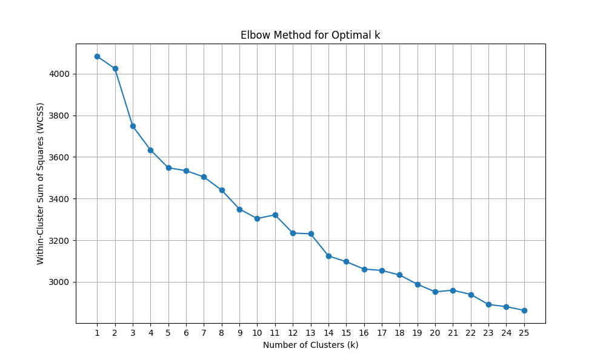

Observing the elbow plot,$k_{kmeans3} = 5$

Performing K-Means clustering with k=5 on the reduced dataset, we get:

Cluster labels for reduced dataset (k=5): [1 1 3 3 3 4 3 1 4 3 4 4 3 2 2 0 3 1 0 3 1 3 3 1 3 3 3 4 4 3 3 2 0 2 4 4 4
 2 1 3 4 3 4 1 0 3 1 1 1 1 3 1 0 1 0 2 3 1 3 4 2 0 3 1 3 4 0 4 4 0 4 4 1 1
 2 0 0 2 0 1 1 0 0 3 0 3 4 0 3 3 1 4 1 3 3 3 1 2 3 1 2 3 0 2 4 0 2 0 3 2 4
 4 2 4 0 3 4 0 3 3 0 0 0 3 3 4 0 4 4 1 1 4 3 1 3 0 1 2 2 4 2 3 1 1 2 2 2 0
 3 1 3 0 3 4 0 0 1 1 0 0 1 3 3 3 3 0 2 0 4 0 0 4 3 4 3 0 3 2 1 2 1 0 3 3 1
 4 0 3 2 4 3 0 1 0 2 1 0 0 0 2]
WCSS cost for reduced dataset (k=5): 3530.4813079576106

Number of clusters = k_kmeans3 = 5
Cluster 0
table, mug, gym, passport, roof, stairs, bed, microwave, notebook, van, sweater, microphone, jacket, bench, bucket, feet, laptop, door, calendar, chair, ladder, candle, igloo, clock, oven, calculator, pillow, envelope, dustbin, ambulance, television, throne, tent, camera, car, loudspeaker, lantern, telephone, stove, wheel, toaster, shoe, keyboard, radio, truck, suitcase  

Cluster 1
drive, sing, dive, exit, brick, smile, bullet, bend, fly, face, climb, kneel, scream, kiss, selfie, catch, sleep, baseball, hollow, basket, empty, slide, drink, angry, lazy, hang, skate, tattoo, earth, tank, key, swim, zip, cook, basketball, arrow, walk, sunny  

Cluster 2
needle, eraser, brush, feather, spoon, pencil, knit, cigarette, flute, scissor, badminton, finger, hammer, toothbrush, screwdriver, fingerprints, teaspoon, length, sword, knife, toothpaste, comb, fork, paintbrush  

Cluster 3
deer, panda, ape, rose, helicopter, cat, carrot, fishing, bear, spider, shark, grass, giraffe, forest, lizard, frog, puppet, lake, monkey, rifle, cow, starfish, plant, sun, puppy, boat, pear, peacock, fish, saturn, fruit, grape, mouse, ant, goldfish, bird, spiderman, bee, tree, beetle, snake, rain, airplane, pizza, tomato, dragonfly, parachute, butterfly, elephant, pant, rainy, bicycle, windmill, potato, crocodile  

Cluster 4
listen, flame, sit, knock, bury, download, eat, postcard, hard, fight, call, hit, paint, far, dig, cry, run, clap, pull, clean, sad, draw, pray, arrest, email, buy, burn, fire, close, scary, book, enter, happy, loud, love, recycle, cut


---

# PCA + GMM

GMM on $k_2 = 4$ gives log likelihood 544089.8358658948

## AIC/BIC with reduced dataset

### Using My Implementation

Optimal number of clusters based on BIC: 4  
Optimal number of clusters based on AIC: 6

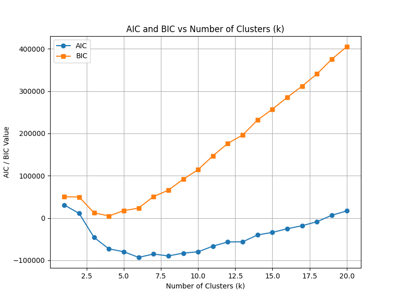

### Using Sklearn

Optimal number of clusters based on BIC: 4  
Optimal number of clusters based on AIC: 6

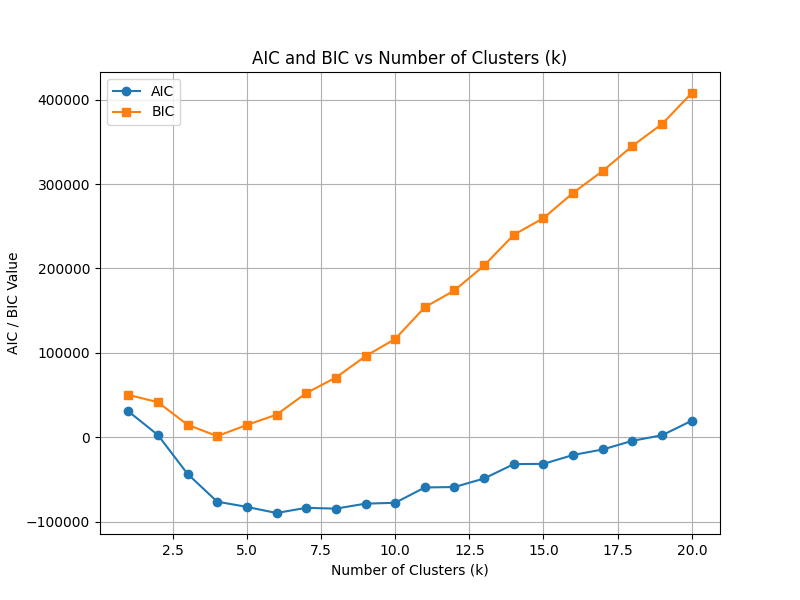

**We take $k_{gmm3} = argmin_k BIC = 4$**   

Applying $k_{gmm3} = 4$  
**Log Likelihood using my implementation**: 57082.45751057781
**Log Likelihood using Sklearn**: 57393.64792527589


Cluster 0
deer, panda, ape, helicopter, sit, cat, needle, eraser, fishing, bullet, giraffe, mug, eat, gym, lake, stairs, rifle, cow, pencil, bed, starfish, dig, run, van, baseball, jacket, bench, sun, feet, peacock, flute, fruit, laptop, calendar, chair, ladder, ant, bee, pillow, tree, hammer, length, tent, camera, zip, dragonfly, parachute, car, sword, lantern, elephant, pant, knife, bicycle, windmill, potato, crocodile, fork, truck
Cluster 1
rose, bear, spider, shark, grass, forest, lizard, frog, monkey, kiss, roof, plant, bucket, puppy, boat, pear, basket, saturn, scissor, grape, goldfish, snake, tattoo, rain, pizza, key, tomato, butterfly, rainy, basketball
Cluster 2
sing, listen, dive, flame, knock, exit, brick, smile, bury, download, postcard, hard, bend, fight, fly, face, climb, kneel, scream, selfie, catch, hit, paint, far, cry, notebook, clap, pull, sleep, hollow, clean, sad, empty, fish, slide, drink, draw, pray, arrest, email, buy, bird, oven, burn, fire, close, angry, lazy, scary, hang, book, earth, dustbin, enter, swim, happy, loud, love, stove, cook, arrow, recycle, cut, walk, sunny
Cluster 3
drive, table, carrot, brush, feather, spoon, puppet, call, passport, microwave, knit, sweater, cigarette, microphone, door, badminton, mouse, finger, candle, igloo, clock, calculator, spiderman, beetle, envelope, skate, toothbrush, screwdriver, fingerprints, teaspoon, tank, airplane, ambulance, television, throne, loudspeaker, telephone, toothpaste, wheel, toaster, comb, shoe, keyboard, radio, suitcase, paintbrush

Reconstruction Error: 0.03835961161605422
Explained Variance Ratio: 0.1325
Reconstruction Error: 0.03692622888597155
Explained Variance Ratio: 0.1649

--- 

# K- Means Cluster Analysis

Number of clusters = k_kmeans1 = 5
Cluster 0
table, mug, gym, passport, roof, stairs, bed, microwave, notebook, van, sweater, microphone, jacket, bench, bucket, feet, laptop, door, calendar, chair, ladder, candle, igloo, clock, oven, calculator, pillow, envelope, dustbin, ambulance, television, throne, tent, camera, car, loudspeaker, lantern, telephone, stove, wheel, toaster, shoe, keyboard, radio, truck, suitcase
Cluster 1
drive, sing, dive, exit, brick, smile, bullet, bend, fly, face, climb, kneel, scream, kiss, selfie, catch, sleep, baseball, hollow, basket, empty, slide, drink, angry, lazy, hang, skate, tattoo, earth, tank, key, swim, zip, cook, basketball, arrow, walk, sunny
Cluster 2
needle, eraser, brush, feather, spoon, pencil, knit, cigarette, flute, scissor, badminton, finger, hammer, toothbrush, screwdriver, fingerprints, teaspoon, length, sword, knife, toothpaste, comb, fork, paintbrush
Cluster 3
deer, panda, ape, rose, helicopter, cat, carrot, fishing, bear, spider, shark, grass, giraffe, forest, lizard, frog, puppet, lake, monkey, rifle, cow, starfish, plant, sun, puppy, boat, pear, peacock, fish, saturn, fruit, grape, mouse, ant, goldfish, bird, spiderman, bee, tree, beetle, snake, rain, airplane, pizza, tomato, dragonfly, parachute, butterfly, elephant, pant, rainy, bicycle, windmill, potato, crocodile
Cluster 4
listen, flame, sit, knock, bury, download, eat, postcard, hard, fight, call, hit, paint, far, dig, cry, run, clap, pull, clean, sad, draw, pray, arrest, email, buy, burn, fire, close, scary, book, enter, happy, loud, love, recycle, cut
Cluster labels: [1 1 3 3 3 4 3 1 4 3 4 4 3 2 2 0 3 1 1 3 1 3 3 1 3 3 3 4 4 3 3 2 0 2 4 4 4
 2 1 3 4 3 4 1 0 3 1 1 1 1 3 1 0 1 0 0 3 1 3 4 2 0 3 4 3 4 0 4 4 0 4 4 4 1
 2 0 0 2 0 1 1 0 0 3 0 3 4 0 3 3 1 4 1 3 3 3 1 2 3 1 2 3 0 0 4 0 2 0 3 0 4
 4 2 4 0 3 4 0 3 3 0 0 0 3 3 4 0 4 4 1 1 4 3 1 3 0 1 2 2 4 2 3 1 1 2 2 2 0
 3 1 3 0 3 4 0 0 1 1 0 0 1 3 3 3 3 0 2 0 4 0 0 4 3 4 3 0 3 2 1 2 1 0 3 3 1
 4 0 3 2 4 3 0 1 0 2 1 0 0 0 2]
WCSS cost for optimal k: 3966.973318266988
_______________________
Number of clusters = K_2 = 4
Cluster 0
table, mug, gym, passport, roof, stairs, bed, microwave, notebook, van, sweater, microphone, jacket, bench, bucket, feet, laptop, door, calendar, chair, ladder, candle, igloo, clock, oven, calculator, pillow, envelope, dustbin, ambulance, television, throne, tent, camera, car, loudspeaker, lantern, telephone, stove, wheel, toaster, keyboard, radio, truck, suitcase
Cluster 1
sing, listen, flame, knock, bury, download, eat, postcard, hard, fight, call, selfie, catch, hit, paint, far, cry, clap, sleep, clean, sad, slide, drink, draw, pray, arrest, email, buy, burn, fire, close, angry, lazy, scary, hang, book, enter, happy, loud, love, cook, recycle, cut
Cluster 2
needle, eraser, brush, feather, spoon, pencil, knit, flute, scissor, badminton, finger, hammer, toothbrush, screwdriver, teaspoon, length, key, sword, knife, toothpaste, comb, fork, paintbrush
Cluster 3
drive, deer, panda, ape, rose, dive, helicopter, sit, cat, carrot, exit, brick, fishing, smile, bear, spider, bullet, shark, grass, giraffe, forest, lizard, bend, frog, puppet, fly, lake, face, climb, kneel, scream, monkey, kiss, rifle, cow, starfish, plant, dig, run, pull, cigarette, baseball, hollow, sun, puppy, boat, pear, basket, empty, peacock, fish, saturn, fruit, grape, mouse, ant, goldfish, bird, spiderman, bee, tree, beetle, skate, snake, tattoo, earth, fingerprints, rain, tank, airplane, pizza, swim, zip, tomato, dragonfly, parachute, butterfly, elephant, pant, rainy, basketball, bicycle, windmill, arrow, potato, crocodile, shoe, walk, sunny
Cluster labels: [3 1 3 3 3 1 3 3 1 3 3 1 3 2 2 0 3 3 3 3 3 3 3 3 3 3 3 1 1 3 3 2 0 2 1 1 1
 2 3 3 1 3 1 3 0 3 3 3 3 3 3 3 0 1 0 0 3 1 3 1 2 0 3 1 3 1 0 3 1 0 3 1 3 1
 2 0 0 3 0 3 3 0 0 3 0 3 1 0 3 3 3 1 3 3 3 3 1 2 3 1 2 3 0 0 1 0 2 0 3 0 1
 1 2 1 0 3 1 0 3 3 0 0 0 3 3 1 0 1 1 1 1 1 3 1 3 0 3 2 2 1 2 3 3 3 3 2 2 0
 3 3 3 0 3 1 0 0 2 3 0 0 3 3 3 3 3 0 2 0 1 0 0 1 3 1 3 0 3 2 1 2 3 0 3 3 3
 1 0 3 2 1 3 3 3 0 2 3 0 0 0 2]
WCSS cost for optimal k: 4063.222058671721

---

Number of clusters = k_kmeans3 = 5
Cluster 0
table, mug, gym, passport, roof, stairs, bed, microwave, notebook, van, sweater, microphone, jacket, bench, bucket, feet, laptop, door, calendar, chair, ladder, candle, igloo, clock, oven, calculator, pillow, envelope, dustbin, ambulance, television, throne, tent, camera, car, loudspeaker, lantern, telephone, stove, wheel, toaster, shoe, keyboard, radio, truck, suitcase  

Cluster 1
drive, sing, dive, exit, brick, smile, bullet, bend, fly, face, climb, kneel, scream, kiss, selfie, catch, sleep, baseball, hollow, basket, empty, slide, drink, angry, lazy, hang, skate, tattoo, earth, tank, key, swim, zip, cook, basketball, arrow, walk, sunny  

Cluster 2
needle, eraser, brush, feather, spoon, pencil, knit, cigarette, flute, scissor, badminton, finger, hammer, toothbrush, screwdriver, fingerprints, teaspoon, length, sword, knife, toothpaste, comb, fork, paintbrush  

Cluster 3
deer, panda, ape, rose, helicopter, cat, carrot, fishing, bear, spider, shark, grass, giraffe, forest, lizard, frog, puppet, lake, monkey, rifle, cow, starfish, plant, sun, puppy, boat, pear, peacock, fish, saturn, fruit, grape, mouse, ant, goldfish, bird, spiderman, bee, tree, beetle, snake, rain, airplane, pizza, tomato, dragonfly, parachute, butterfly, elephant, pant, rainy, bicycle, windmill, potato, crocodile  

Cluster 4
listen, flame, sit, knock, bury, download, eat, postcard, hard, fight, call, hit, paint, far, dig, cry, run, clap, pull, clean, sad, draw, pray, arrest, email, buy, burn, fire, close, scary, book, enter, happy, loud, love, recycle, cut
Cluster labels: [1 1 3 3 3 4 3 1 4 3 4 4 3 2 2 0 3 1 1 3 1 3 3 1 3 3 3 4 4 3 3 2 0 2 4 4 4
 2 1 3 4 3 4 1 0 3 1 1 1 1 3 1 0 1 0 0 3 1 3 4 2 0 3 4 3 4 0 4 4 0 4 4 4 1
 2 0 0 2 0 1 1 0 0 3 0 3 4 0 3 3 1 4 1 3 3 3 1 2 3 1 2 3 0 0 4 0 2 0 3 0 4
 4 2 4 0 3 4 0 3 3 0 0 0 3 3 4 0 4 4 1 1 4 3 1 3 0 1 2 2 4 2 3 1 1 2 2 2 0
 3 1 3 0 3 4 0 0 1 1 0 0 1 3 3 3 3 0 2 0 4 0 0 4 3 4 3 0 3 2 1 2 1 0 3 3 1
 4 0 3 2 4 3 0 1 0 2 1 0 0 0 2]
WCSS cost for optimal k: 3966.973318266988

## Analysis of k=5 Clustering (= $K_{kmeans1}$ = $K_{kmeans3}$)

1. Cluster 0: Indoor/Household Objects
   - Examples: table, mug, microwave, bed, chair, oven
   - Theme: Primarily indoor and household items

2. Cluster 1: Actions (most of which are also nouns)
   - Examples: drive, sing, dive, smile, climb, sleep

3. Cluster 2: Small Tools and Instruments
   - Examples: needle, eraser, brush, spoon, pencil, hammer

4. Cluster 3: Animals and Nature
   - Examples: deer, panda, rose, cat, grass, tree

5. Cluster 4: Activities
   - Examples: listen, flame, bury, fight, pray, love

## Analysis of k=4 Clustering (= $K_2$)

1. Cluster 0: Indoor/Household Objects
   - Examples: table, mug, microwave, bed, chair, oven

2. Cluster 1: Actions
   - Examples: sing, listen, flame, fight, pray, love

3. Cluster 2: Small Tools and Instruments
   - Examples: needle, eraser, brush, spoon, pencil, hammer
   - Theme: Identical to Cluster 2 in k=5

4. Cluster 3: Objects, Animals and Actions (most of which are also nouns)
   - Examples: drive, deer, panda, rose, smile, boat

## Evaluation

1. Interpretability:
   - k=5 offers more distinct and interpretable clusters, separating actions, abstract concepts, and concrete objects more clearly.
   - k=4 combines some categories, making interpretation slightly less straightforward.

2. Homogeneity:
   - k=5 appears to have more homogeneous clusters.
   - k=4 has more mixed clusters, particularly in Cluster 3, which 

3. WCSS (Within-Cluster Sum of Squares) Cost:
   - k=5: 3966.97
   - k=4: 4063.22
   - The lower WCSS for k=5 indicates more compact clusters, which is expected when k is increased.

4. Granularity:
   - k=5 provides a finer granularity, which might be beneficial for more detailed analysis.
   - k=4 offers a simpler, more general categorization.

Thus, $K_{kmeans}$ = 5.

# GMM Cluster Analysis

Number of clusters = k_gmm1 = 1
Custom GMM:
Cluster 0
drive, sing, deer, panda, ape, listen, rose, dive, flame, helicopter, sit, knock, cat, needle, eraser, table, carrot, exit, brick, fishing, smile, bear, spider, bullet, shark, grass, giraffe, bury, download, forest, lizard, brush, mug, feather, eat, postcard, hard, spoon, bend, frog, fight, puppet, call, fly, gym, lake, face, climb, kneel, scream, monkey, kiss, passport, selfie, roof, stairs, rifle, catch, cow, hit, pencil, bed, starfish, paint, plant, far, microwave, dig, cry, notebook, run, clap, pull, sleep, knit, van, sweater, cigarette, microphone, baseball, hollow, jacket, bench, sun, bucket, puppy, clean, feet, boat, pear, basket, sad, empty, peacock, fish, saturn, slide, flute, fruit, drink, scissor, grape, laptop, door, draw, calendar, badminton, chair, mouse, ladder, pray, arrest, finger, email, candle, ant, buy, igloo, goldfish, bird, clock, oven, calculator, spiderman, bee, burn, pillow, fire, close, angry, lazy, scary, tree, hang, beetle, envelope, skate, hammer, toothbrush, book, screwdriver, snake, tattoo, earth, fingerprints, teaspoon, length, dustbin, rain, tank, airplane, ambulance, pizza, enter, television, throne, key, swim, tent, camera, zip, tomato, dragonfly, parachute, butterfly, car, sword, loudspeaker, happy, lantern, telephone, loud, elephant, love, pant, stove, rainy, knife, cook, toothpaste, basketball, wheel, bicycle, windmill, arrow, recycle, toaster, potato, comb, cut, crocodile, shoe, walk, keyboard, fork, sunny, radio, truck, suitcase, paintbrush
Cluster labels: [0 0 0 0 0 0 0 0 0 0 0 0 0 0 0 0 0 0 0 0 0 0 0 0 0 0 0 0 0 0 0 0 0 0 0 0 0
 0 0 0 0 0 0 0 0 0 0 0 0 0 0 0 0 0 0 0 0 0 0 0 0 0 0 0 0 0 0 0 0 0 0 0 0 0
 0 0 0 0 0 0 0 0 0 0 0 0 0 0 0 0 0 0 0 0 0 0 0 0 0 0 0 0 0 0 0 0 0 0 0 0 0
 0 0 0 0 0 0 0 0 0 0 0 0 0 0 0 0 0 0 0 0 0 0 0 0 0 0 0 0 0 0 0 0 0 0 0 0 0
 0 0 0 0 0 0 0 0 0 0 0 0 0 0 0 0 0 0 0 0 0 0 0 0 0 0 0 0 0 0 0 0 0 0 0 0 0
 0 0 0 0 0 0 0 0 0 0 0 0 0 0 0]
_______________________
Number of clusters = K_2 = 4
Custom GMM:
Cluster 0
drive, sing, listen, dive, flame, sit, knock, exit, fishing, smile, bury, download, brush, postcard, hard, bend, fight, puppet, call, fly, face, scream, passport, selfie, catch, hit, paint, far, dig, cry, notebook, run, pull, sleep, clean, sad, empty, fish, slide, door, draw, calendar, pray, arrest, buy, burn, fire, close, angry, lazy, scary, hang, skate, hammer, book, tattoo, earth, fingerprints, rain, tank, enter, key, swim, happy, loud, love, pant, cook, recycle, cut, walk, sunny, radio, paintbrush
Cluster 1
ape, rose, cat, eraser, carrot, brick, bear, grass, mug, spoon, frog, lake, kneel, monkey, plant, clap, puppy, feet, pear, fruit, grape, laptop, mouse, bee, snake, length, zip, tomato, car, rainy, toaster, potato, suitcase
Cluster 2
bullet, eat, kiss, rifle, pencil, knit, cigarette, microphone, baseball, hollow, flute, drink, finger, email, candle, calculator, envelope, toothbrush, teaspoon, dustbin, pizza, television, camera, telephone, knife, toothpaste, arrow, shoe, keyboard, fork
Cluster 3
deer, panda, helicopter, needle, table, spider, shark, giraffe, forest, lizard, feather, gym, climb, roof, stairs, cow, bed, starfish, microwave, van, sweater, jacket, bench, sun, bucket, boat, basket, peacock, saturn, scissor, badminton, chair, ladder, ant, igloo, goldfish, bird, clock, oven, spiderman, pillow, tree, beetle, screwdriver, airplane, ambulance, throne, tent, dragonfly, parachute, butterfly, sword, loudspeaker, lantern, elephant, stove, basketball, wheel, bicycle, windmill, comb, crocodile, truck
Cluster labels: [0 0 3 3 1 0 1 0 0 3 0 0 1 3 1 3 1 0 1 0 0 1 3 2 3 1 3 0 0 3 3 0 1 3 2 0 0
 1 0 1 0 0 0 0 3 1 0 3 1 0 1 2 0 0 3 3 2 0 3 0 2 3 3 0 1 0 3 0 0 0 0 1 0 0
 2 3 3 2 2 2 2 3 3 3 3 1 0 1 3 1 3 0 0 3 0 3 0 2 1 2 3 1 1 0 0 0 3 3 1 3 0
 0 2 2 2 3 0 3 3 3 3 3 2 3 1 0 3 0 0 0 0 0 3 0 3 2 0 0 2 0 3 1 0 0 0 2 1 2
 0 0 3 3 2 0 2 3 0 0 3 2 1 1 3 3 3 1 3 3 0 3 2 0 3 0 0 3 1 2 0 2 3 3 3 3 2
 0 1 1 3 0 3 2 0 2 2 0 0 3 1 0]
_______________________
Number of clusters = k_gmm3 = 4
Cluster 0
deer, panda, ape, helicopter, sit, cat, needle, eraser, fishing, bullet, giraffe, mug, eat, gym, lake, stairs, rifle, cow, pencil, bed, starfish, dig, run, van, baseball, jacket, bench, sun, feet, peacock, flute, fruit, laptop, calendar, chair, ladder, ant, bee, pillow, tree, hammer, length, tent, camera, zip, dragonfly, parachute, car, sword, lantern, elephant, pant, knife, bicycle, windmill, potato, crocodile, fork, truck
Cluster 1
rose, bear, spider, shark, grass, forest, lizard, frog, monkey, kiss, roof, plant, bucket, puppy, boat, pear, basket, saturn, scissor, grape, goldfish, snake, tattoo, rain, pizza, key, tomato, butterfly, rainy, basketball
Cluster 2
sing, listen, dive, flame, knock, exit, brick, smile, bury, download, postcard, hard, bend, fight, fly, face, climb, kneel, scream, selfie, catch, hit, paint, far, cry, notebook, clap, pull, sleep, hollow, clean, sad, empty, fish, slide, drink, draw, pray, arrest, email, buy, bird, oven, burn, fire, close, angry, lazy, scary, hang, book, earth, dustbin, enter, swim, happy, loud, love, stove, cook, arrow, recycle, cut, walk, sunny
Cluster 3
drive, table, carrot, brush, feather, spoon, puppet, call, passport, microwave, knit, sweater, cigarette, microphone, door, badminton, mouse, finger, candle, igloo, clock, calculator, spiderman, beetle, envelope, skate, toothbrush, screwdriver, fingerprints, teaspoon, tank, airplane, ambulance, television, throne, loudspeaker, telephone, toothpaste, wheel, toaster, comb, shoe, keyboard, radio, suitcase, paintbrush
Cluster labels: [3 2 0 0 0 2 1 2 2 0 0 2 0 0 0 3 3 2 2 0 2 1 1 0 1 1 0 2 2 1 1 3 0 3 0 2 2
 3 2 1 2 3 3 2 0 0 2 2 2 2 1 1 3 2 1 0 0 2 0 2 0 0 0 2 1 2 3 0 2 2 0 2 2 2
 3 0 3 3 3 0 2 0 0 0 1 1 2 0 1 1 1 2 2 0 2 1 2 0 0 2 1 1 0 3 2 0 3 0 3 0 2
 2 3 2 3 0 2 3 1 2 3 2 3 3 0 2 0 2 2 2 2 2 0 2 3 3 3 0 3 2 3 1 1 2 3 3 0 2
 1 3 3 3 1 2 3 3 1 2 0 0 0 1 0 0 1 0 0 3 2 0 3 2 0 2 0 2 1 0 2 3 1 3 0 0 2
 2 3 0 3 2 0 3 2 3 0 2 3 0 3 3]

 # Cluster Analysis

# Gaussian Mixture Model (GMM) Cluster Analysis Report

- GMM successfully identified broad conceptual categories, separating natural elements, man-made objects, and actions/emotions.
- The model captured some nuanced relationships, such as grouping household items and technology-related objects together.
- However some clusters particularly Cluster 0 has = seemingly unrelated itemsand a high degree of diversity.

## Cluster Summaries

### Cluster 0: Diverse Objects with Animal and Tool Focus
- Broad idea: A mixed category with emphasis on animals and everyday objects
- Key components: Animals, tools, vehicles, and various concrete nouns
- Examples: deer, panda, helicopter, needle, eraser

### Cluster 1: Nature and Food
- Broad idea: Items related to the natural world and edible objects
- Key components: Animals, plants, natural elements, and food items
- Examples: rose, bear, forest, grape, tomato, pear

### Cluster 2: Actions, Emotions, and Abstract Concepts
- Broad idea: Human experiences and behaviors
- Key components: Verbs, emotional states, and abstract ideas
- Examples: sing, smile, cry, hollow, angry

### Cluster 3: Household and Technological Items
- Broad idea: Man-made objects, particularly those found in homes and offices
- Key components: Household items, technological devices, and some vehicles
- Examples: table, microwave, calculator, airplane, toothbrush

---

$K_{gmm} = 4$ as K=1 does not make sense and K=2 also does not capture much.

To evaluate how KMeans clustering performs better than GMM in this context, let's examine the effectiveness of each approach by looking at the groupings they produce and considering factors like the similarity within clusters and the separation between different clusters.

### Similarity Within Clusters

**GMM:**
- **Cluster 0:** This cluster mixes animals with tools and other concrete nouns, which results in a diverse range of objects that don’t share a clear commonality, making it less coherent.
- **Cluster 1:** This cluster has a reasonable grouping of nature-related items and food, though it includes both animals and plants, which could be seen as slightly overlapping categories.
- **Cluster 2:** Contains actions, emotions, and abstract concepts, which are related but span a broad range of different kinds of words (verbs, states, ideas).
- **Cluster 3:** This cluster includes household and technological items, showing some coherence, though it also includes a few vehicles, which might not fit as well with household items.

**KMeans:**
- **Cluster 0:** Contains a diverse array of household items, technological devices, and other man-made objects. Although broad, these items are related through their utility and context of use.
- **Cluster 1:** Groups actions, verbs, and states together. This clustering is effective in grouping words with similar functions or contexts (e.g., actions and emotional expressions).
- **Cluster 2:** Contains mostly tools and objects used in specific tasks. Items here are more focused on functional or practical uses.
- **Cluster 3:** Includes a wide range of natural elements, animals, and food. While diverse, there is a clear focus on natural and living things.

### Separation Between Clusters

**GMM:**
- The separation between clusters is less pronounced because GMM assumes that clusters can overlap and that data points can belong to multiple clusters with varying degrees of membership. This can lead to less distinct boundaries and more overlapping categories.

**KMeans:**
- KMeans creates more distinct and non-overlapping clusters, which often results in clearer boundaries between clusters. For instance:
  - **Cluster 0** (household and tech) is clearly distinct from **Cluster 1** (actions and states).
  - **Cluster 2** (tools) is distinct from **Cluster 3** (natural elements and animals).

### Evaluating the Effectiveness

**Grouping Quality:**
- KMeans clusters show a more meaningful and coherent grouping for specific contexts (household items, actions, tools). The distinct clusters facilitate understanding and using the grouped items based on their common properties or contexts.

**Cluster Meaningfulness:**
- KMeans clusters align better with intuitive categories, making it easier to see relationships between items within the same cluster. For example, having all household items in one cluster and actions in another is more practical and meaningful for certain applications compared to the mixed categories seen in GMM.

**Overall Comparison:**
KMeans generally provides better results than GMM in this scenario due to its ability to create well-separated, non-overlapping clusters that more clearly define specific categories. The meaningfulness of the clusters in KMeans comes from their more defined and coherent groupings, which enhances their practical utility in applications requiring clear distinctions between categories. GMM, while useful in scenarios where overlapping clusters might be expected, results in less distinct and less interpretable groupings in this case.


# Hierarchical Clustering

## Metrics and Methods

- **Metrics**: `euclidean`, `cityblock`, `cosine`
- **Methods**: `single`, `complete`, `average`, `ward`, `centroid`, `median`

Note: The methods "ward", "centroid", and "median" are only applicable with the "euclidean" metric.

### Euclidean Distance

#### Single Linkage
Linkage matrix shape: `(199, 4)`
```
[[148.         176.           2.08776529   2.        ]
 [  8.         127.           2.5120195    2.        ]
 [ 22.         123.           3.76979249   2.        ]
 [ 36.          59.           3.8860424    2.        ]
 [125.         201.           3.91276439   3.        ]]
```
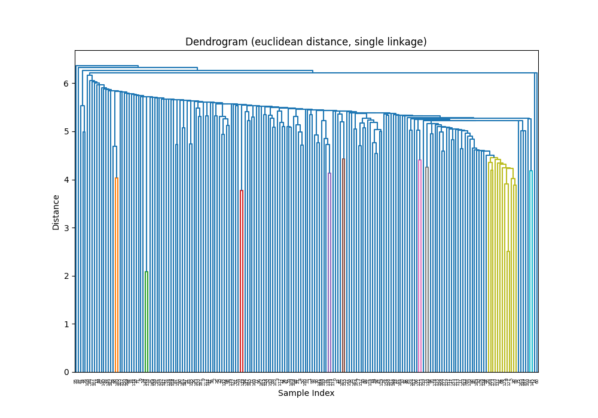

#### Complete Linkage
Linkage matrix shape: `(199, 4)`
```
[[148.         176.           2.08776529   2.        ]
 [  8.         127.           2.5120195    2.        ]
 [ 22.         123.           3.76979249   2.        ]
 [ 36.          59.           3.8860424    2.        ]
 [ 90.         180.           4.02718737   2.        ]]
```
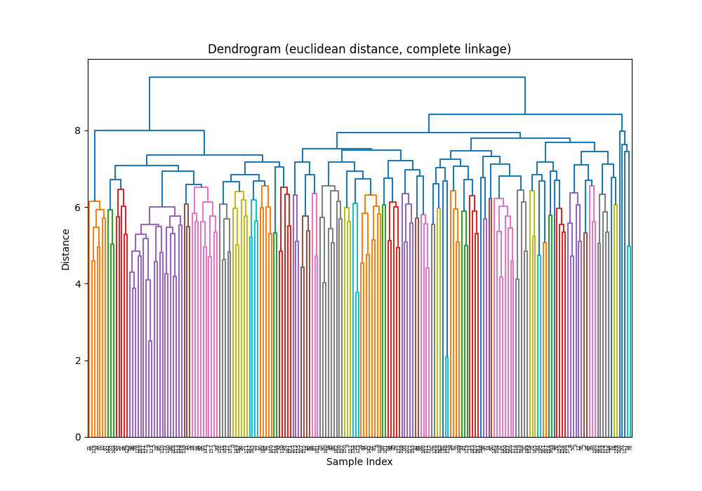

#### Average Linkage
Linkage matrix shape: `(199, 4)`
```
[[148.         176.           2.08776529   2.        ]
 [  8.         127.           2.5120195    2.        ]
 [ 22.         123.           3.76979249   2.        ]
 [ 36.          59.           3.8860424    2.        ]
 [125.         201.           4.00966176   3.        ]]
```
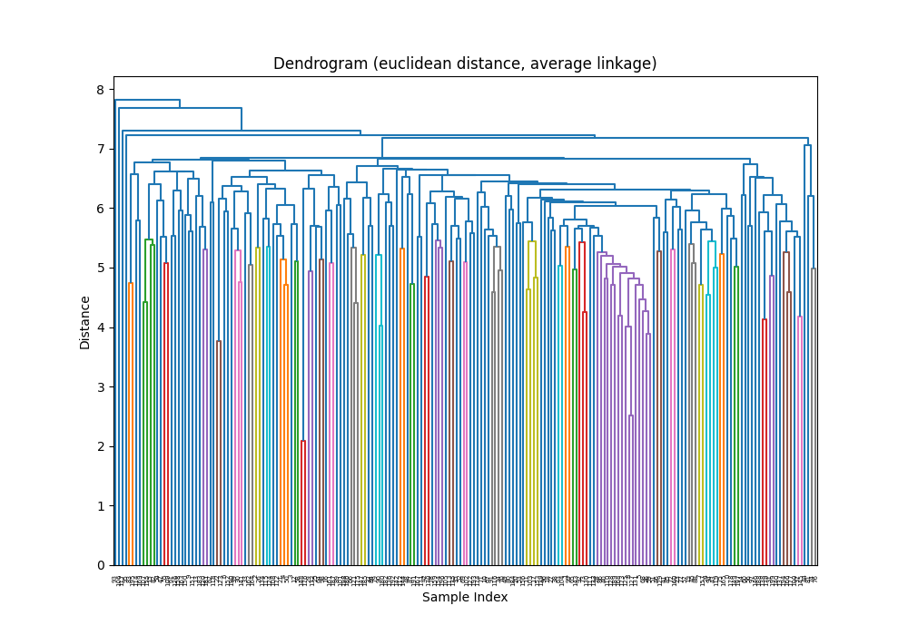

#### Ward Linkage
Linkage matrix shape: `(199, 4)`
```
[[148.         176.           2.08776529   2.        ]
 [  8.         127.           2.5120195    2.        ]
 [ 22.         123.           3.76979249   2.        ]
 [ 36.          59.           3.8860424    2.        ]
 [ 90.         180.           4.02718737   2.        ]]
```
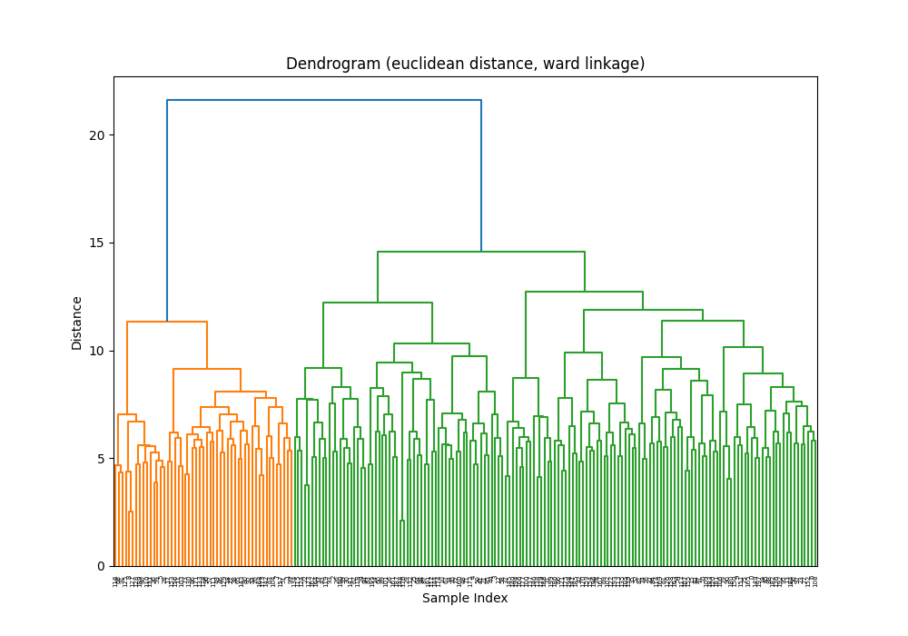

#### Centroid Linkage
Linkage matrix shape: `(199, 4)`
```
[[148.         176.           2.08776529   2.        ]
 [  8.         127.           2.5120195    2.        ]
 [ 22.         123.           3.76979249   2.        ]
 [125.         201.           3.80909648   3.        ]
 [ 36.          59.           3.8860424    2.        ]]
```
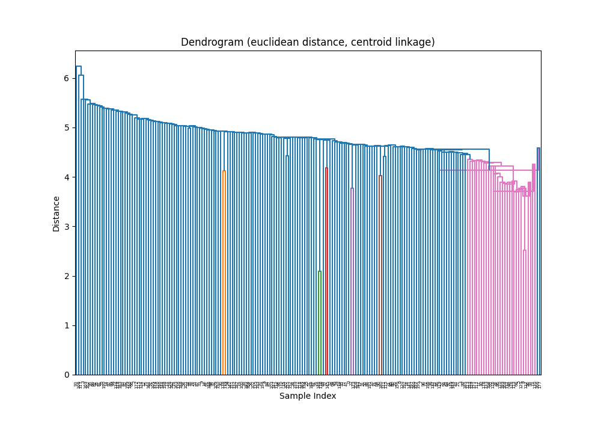

#### Median Linkage
Linkage matrix shape: `(199, 4)`
```
[[148.         176.           2.08776529   2.        ]
 [  8.         127.           2.5120195    2.        ]
 [ 22.         123.           3.76979249   2.        ]
 [125.         201.           3.80909648   3.        ]
 [ 36.          59.           3.8860424    2.        ]]
```
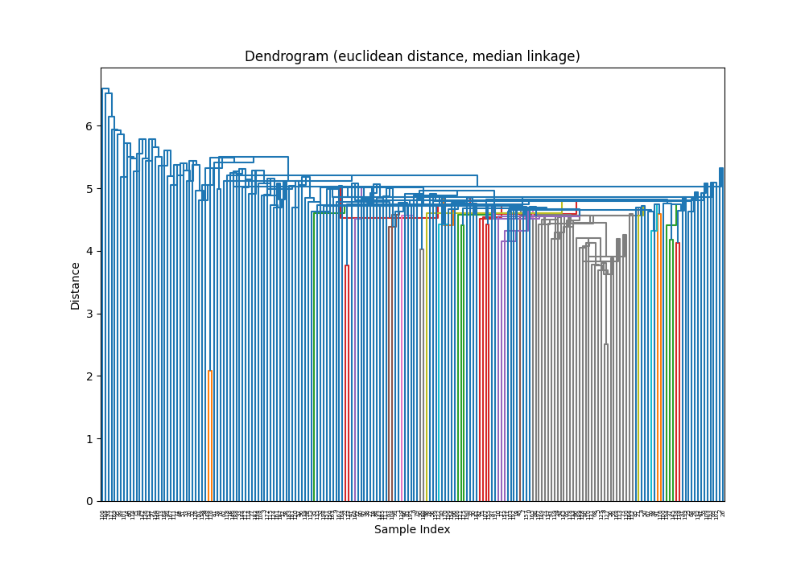

### Cityblock Distance

#### Single Linkage
Linkage matrix shape: `(199, 4)`
```
[[148.         176.          37.97104677   2.        ]
 [  8.         127.          45.31089746   2.        ]
 [ 22.         123.          68.90832999   2.        ]
 [ 36.          59.          69.24541447   2.        ]
 [125.         201.          69.6822987    3.        ]]
```
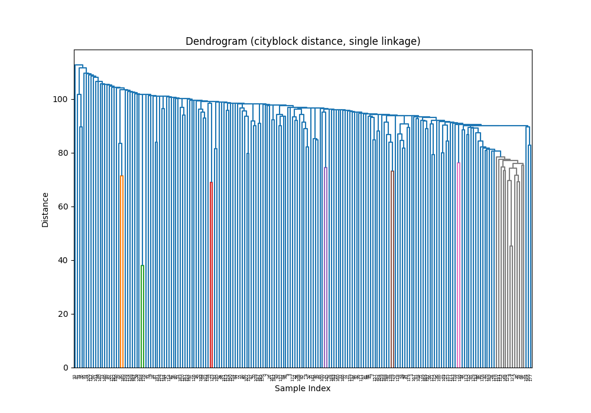

#### Complete Linkage
Linkage matrix shape: `(199, 4)`
```
[[148.         176.          37.97104677   2.        ]
 [  8.         127.          45.31089746   2.        ]
 [ 22.         123.          68.90832999   2.        ]
 [ 36.          59.          69.24541447   2.        ]
 [ 90.         180.          71.40514299   2.        ]]
```
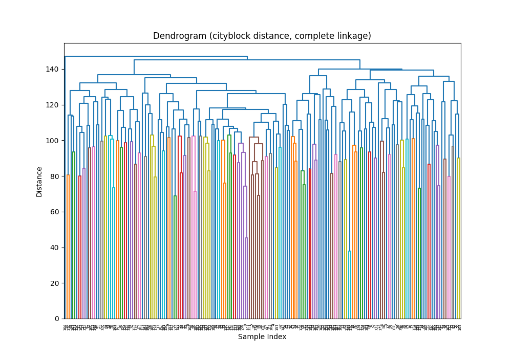

#### Average Linkage
Linkage matrix shape: `(199, 4)`
```
[[148.         176.          37.97104677   2.        ]
 [  8.         127.          45.31089746   2.        ]
 [ 22.         123.          68.90832999   2.        ]
 [ 36.          59.          69.24541447   2.        ]
 [ 90.         180.          71.40514299   2.        ]]
```
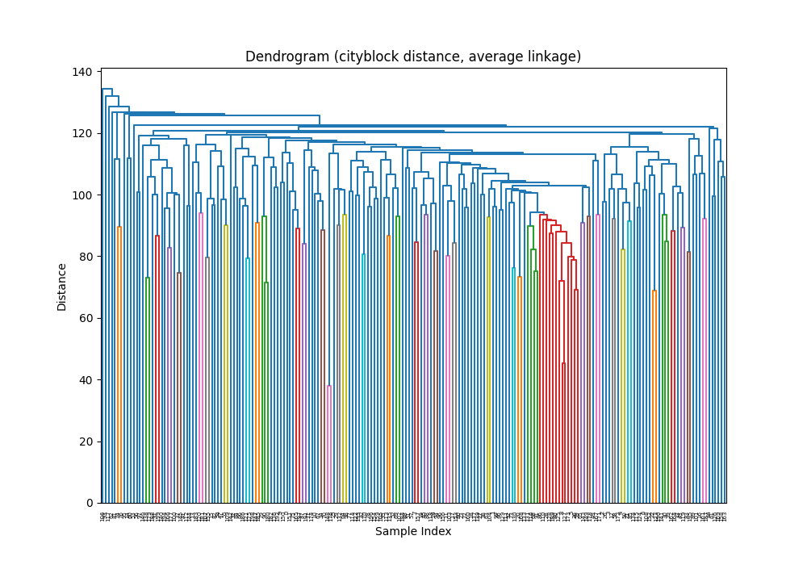

### Cosine Distance

#### Single Linkage
Linkage matrix shape: `(199, 4)`
```
[[1.48000000e+02 1.76000000e+02 2.03264290e-02 2.00000000e+00]
 [8.00000000e+00 1.27000000e+02 2.06957833e-02 2.00000000e+00]
 [3.60000000e+01 5.90000000e+01 4.50194997e-02 2.00000000e+00]
 [5.00000000e+00 2.02000000e+02 4.77875955e-02 3.00000000e+00]
 [1.25000000e+02 2.01000000e+02 4.96769522e-02 3.00000000e+00]]
```
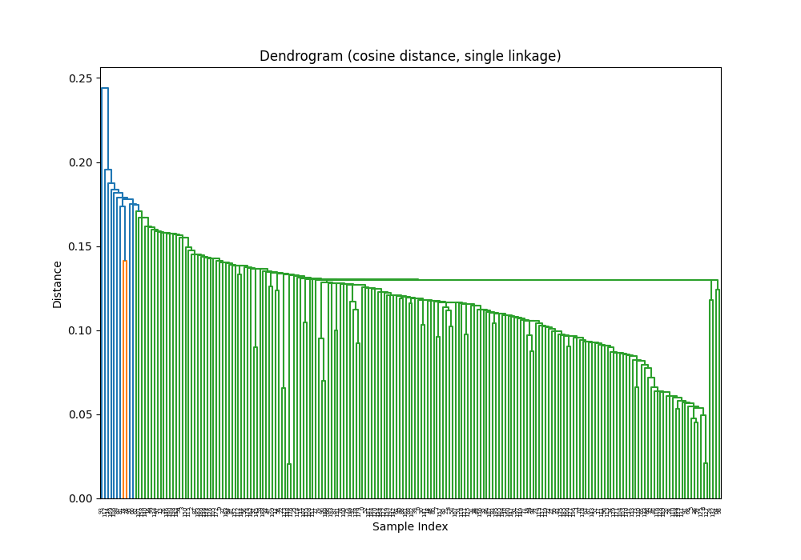

#### Complete Linkage
Linkage matrix shape: `(199, 4)`
```
[[1.48000000e+02 1.76000000e+02 2.03264290e-02 2.00000000e+00]
 [8.00000000e+00 1.27000000e+02 2.06957833e-02 2.00000000e+00]
 [3.60000000e+01 5.90000000e+01 4.50194997e-02 2.00000000e+00]
 [1.68000000e+02 1.73000000e+02 5.33126479e-02 2.00000000e+00]
 [6.80000000e+01 2.02000000e+02 5.47828520e-02 3.00000000e+00]]
```
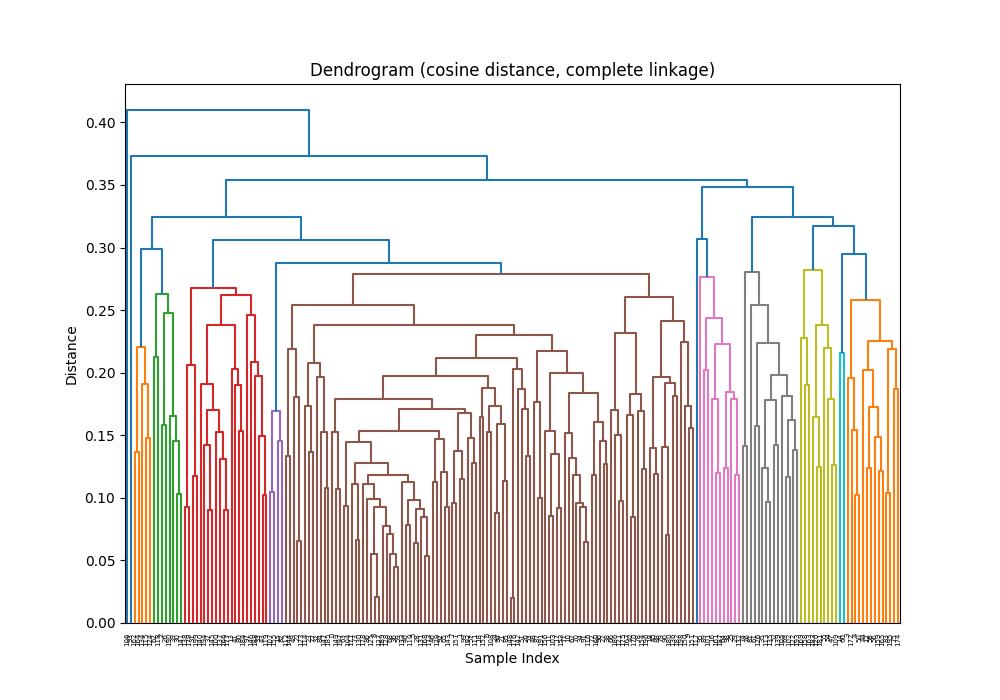

#### Average Linkage
Linkage matrix shape: `(199, 4)`
```
[[1.48000000e+02 1.76000000e+02 2.03264290e-02 2.00000000e+

00]
 [8.00000000e+00 1.27000000e+02 2.06957833e-02 2.00000000e+00]
 [3.60000000e+01 5.90000000e+01 4.50194997e-02 2.00000000e+00]
 [1.25000000e+02 2.01000000e+02 5.23835887e-02 3.00000000e+00]
 [1.68000000e+02 1.73000000e+02 5.33126479e-02 2.00000000e+00]]
```
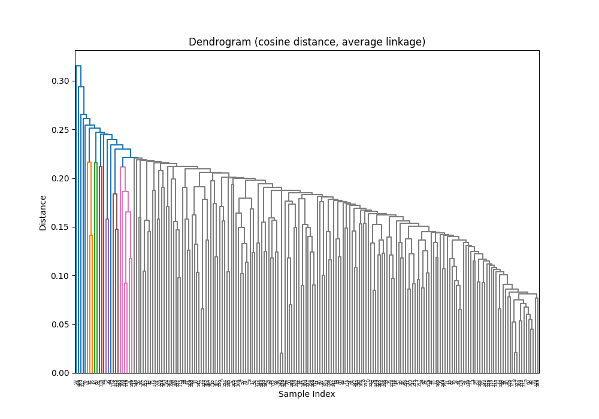

Some of the initial merges:

Words merged: rain and rainy
Words merged: flame and fire
Words merged: hard and hit
Words merged: spider and spiderman

Comparing using Euclidean distance as that allows for all linkages:
1. Average Linkage:
   - Shows a balanced hierarchical structure
   - Clusters form gradually, with many small merges at lower distances
   - Preserves intermediate distances well
   - Less susceptible to outliers compared to single linkage
   - Tends to produce compact, spherical clusters

2. Complete Linkage:
   - Forms more distinct, separated clusters
   - Larger jumps between merges, especially at higher distances
   - Sensitive to outliers, as it considers the maximum distance between clusters
   - Tends to produce tighter, more evenly sized clusters
   - Can sometimes break large clusters incorrectly

3. Single Linkage:
   - Shows a "chaining" effect, with many points joining existing clusters individually
   - Prone to producing elongated, straggly clusters
   - Very sensitive to noise and outliers
   - Preserves small distances well, but can distort larger distances
   - Useful for detecting elongated or non-spherical clusters

4. Ward Linkag:
   - Forms compact, spherical clusters
   - Minimizes within-cluster variance
   - Shows a clear hierarchical structure with distinct levels
   - Less sensitive to outliers compared to complete linkage
   - Tends to produce clusters of similar sizes

Euclidean distance is used in all four dendrograms, however it is often appropriate for = low-dimensional spaces.

Best dendrogram:
The **Ward linkage** appears to be the best overall. The dendogram for Ward Linkage clearly shows distinct, meaningful clusters. The clusters are well-separated, and there are clear cuts where merging occurs at higher distances. These significant gaps between the clusters at higher levels indicate strong cluster separation.
1. It shows a clear hierarchical structure with distinct clusters
2. Provides a good balance between small and large clusters
3. Less prone to chaining or outlier effects
4. Tends to produce more interpretable results for many real-world datasets

However, the "best" dendrogram depends on the specific dataset and clustering goals. For example:
- Single linkage might be preferable for detecting elongated clusters
- Average linkage could be better for datasets with varying cluster sizes
- Complete linkage might be useful when very compact clusters are desired

---

## Using Ward Linkage and euclidean distance

**Cluster assignments for k = $k_{best1} = 5:**

[5 1 2 3 3 1 5 1 1 5 3 1 3 5 3 5 3 1 1 5 1 3 2 5 2 3 2 1 1 3 2 4 5 2 3 5 1
 4 1 2 1 3 5 2 3 5 1 5 3 1 3 1 5 1 5 5 5 1 3 1 3 5 2 1 3 1 5 3 1 5 3 3 3 1
 5 5 5 5 5 5 1 5 5 3 5 3 1 3 5 3 5 1 1 2 2 5 1 5 3 1 4 3 5 1 1 5 5 5 5 5 1
 1 3 5 5 2 1 5 2 2 5 5 5 2 2 1 5 1 1 1 1 1 3 1 2 5 5 4 4 5 4 2 1 1 3 4 4 5
 3 5 5 5 5 1 5 5 1 1 5 5 3 3 2 5 2 5 4 5 1 5 5 1 3 1 3 5 3 4 1 4 5 5 5 5 5
 5 5 3 4 1 2 3 5 5 4 3 5 5 5 4]  
**Cluster 1**  
sing, listen, dive, flame, knock, exit, brick, smile, bury, download, hard, bend, fight, face, scream, kiss, selfie, catch, hit, paint, far, cry, sleep, hollow, clean, sad, empty, slide, drink, door, draw, pray, arrest, buy, burn, fire, close, angry, lazy, scary, hang, tattoo, earth, enter, key, swim, happy, loud, love, cook, cut  
**Cluster 2**  
deer, spider, shark, giraffe, lizard, feather, frog, fly, starfish, peacock, fish, ant, goldfish, bird, spiderman, bee, beetle, snake, dragonfly, butterfly, crocodile  
**Cluster 3**  
panda, ape, sit, cat, eraser, carrot, bear, grass, forest, eat, puppet, gym, kneel, monkey, cow, pencil, plant, dig, run, clap, pull, sun, puppy, feet, pear, fruit, grape, finger, tree, fingerprints, rain, zip, tomato, elephant, pant, rainy, potato, shoe, sunny  
**Cluster 4**  
brush, spoon, scissor, hammer, toothbrush, screwdriver, teaspoon, length, sword, knife, toothpaste, comb, fork, paintbrush  
**Cluster 5**  
drive, rose, helicopter, needle, table, fishing, bullet, mug, postcard, call, lake, climb, passport, roof, stairs, rifle, bed, microwave, notebook, knit, van, sweater, cigarette, microphone, baseball, jacket, bench, bucket, boat, basket, saturn, flute, laptop, calendar, badminton, chair, mouse, ladder, email, candle, igloo, clock, oven, calculator, pillow, envelope, skate, book, dustbin, tank, airplane, ambulance, pizza, television, throne, tent, camera, parachute, car, loudspeaker, lantern, telephone, stove, basketball, wheel, bicycle, windmill, arrow, recycle, toaster, walk, keyboard, radio, truck, suitcase  

### Hierarchical Cluster 1 vs K-Means Clusters 1 and 4
- Alignment: Hierarchical Cluster 1 closely aligns with K-Means Cluster 4 (Abstract Actions and Concepts).
- Difference: K-Means separates some concrete actions (e.g., "sleep", "cook") into Cluster 1 (Actions and States), while hierarchical clustering keeps these with abstract concepts.

### Hierarchical Cluster 2 vs K-Means Cluster 3
- Alignment: Both clusters focus on animals and insects.
- Difference: Hierarchical clustering is more specific, focusing on smaller animals and insects, while K-Means Cluster 3 includes all animals and nature-related words.

### Hierarchical Cluster 3 vs K-Means Clusters 3 and 1
- Alignment: Partially aligns with K-Means Cluster 3 (Animals and Nature).
- Difference: Hierarchical clustering includes some body parts and actions that K-Means places in Cluster 1 (Actions and States) or Cluster 0 (Indoor/Household Objects).

### Hierarchical Cluster 4 vs K-Means Cluster 2
- Strong Alignment: Both methods identify a distinct cluster for small tools and utensils.
- Difference: Minimal. This category shows the strongest consistency between the two methods.

### Hierarchical Cluster 5 vs K-Means Clusters 0 and 1
- Partial Alignment: Many indoor/household objects in Hierarchical Cluster 5 align with K-Means Cluster 0.
- Major Difference: Hierarchical Cluster 5 is much more heterogeneous, including items that K-Means distributes across multiple clusters (mainly 0 and 1).

1. Consistency in Tools Category:
   Both methods agree on a distinct cluster for small tools and utensils (Hierarchical Cluster 4, K-Means Cluster 2).

2. Treatment of Animals and Nature:
   Hierarchical clustering provides more granular distinctions (small vs. large animals), while K-Means groups all animals and nature words together.

3. Abstract vs. Concrete Concepts:
   K-Means tends to separate abstract concepts and concrete actions/objects more clearly. Hierarchical clustering often combines these, particularly in Clusters 1 and 5.

4. Heterogeneity in Hierarchical Clustering:
   Hierarchical Cluster 5 is notably more mixed, combining objects and concepts that K-Means separates into distinct clusters.

5. Action Words:
   K-Means has a more focused cluster for actions (Cluster 1), while hierarchical clustering distributes action words across multiple clusters (mainly 1 and 5).


**Cluster assignments for k = $k_{best2} = 4:**  
[4 1 2 2 2 1 4 1 1 4 2 1 2 4 2 4 2 1 1 4 1 2 2 4 2 2 2 1 1 2 2 3 4 2 2 4 1
 3 1 2 1 2 4 2 2 4 1 4 2 1 2 1 4 1 4 4 4 1 2 1 2 4 2 1 2 1 4 2 1 4 2 2 2 1
 4 4 4 4 4 4 1 4 4 2 4 2 1 2 4 2 4 1 1 2 2 4 1 4 2 1 3 2 4 1 1 4 4 4 4 4 1
 1 2 4 4 2 1 4 2 2 4 4 4 2 2 1 4 1 1 1 1 1 2 1 2 4 4 3 3 4 3 2 1 1 2 3 3 4
 2 4 4 4 4 1 4 4 1 1 4 4 2 2 2 4 2 4 3 4 1 4 4 1 2 1 2 4 2 3 1 3 4 4 4 4 4
 4 4 2 3 1 2 2 4 4 3 2 4 4 4 3]  
**Cluster 1**  
sing, listen, dive, flame, knock, exit, brick, smile, bury, download, hard, bend, fight, face, scream, kiss, selfie, catch, hit, paint, far, cry, sleep, hollow, clean, sad, empty, slide, drink, door, draw, pray, arrest, buy, burn, fire, close, angry, lazy, scary, hang, tattoo, earth, enter, key, swim, happy, loud, love, cook, cut  
**Cluster 2**  
deer, panda, ape, sit, cat, eraser, carrot, bear, spider, shark, grass, giraffe, forest, lizard, feather, eat, frog, puppet, fly, gym, kneel, monkey, cow, pencil, starfish, plant, dig, run, clap, pull, sun, puppy, feet, pear, peacock, fish, fruit, grape, finger, ant, goldfish, bird, spiderman, bee, tree, beetle, snake, fingerprints, rain, zip, tomato, dragonfly, butterfly, elephant, pant, rainy, potato, crocodile, shoe, sunny  
**Cluster 3**  
brush, spoon, scissor, hammer, toothbrush, screwdriver, teaspoon, length, sword, knife, toothpaste, comb, fork, paintbrush  
**Cluster 4**  
drive, rose, helicopter, needle, table, fishing, bullet, mug, postcard, call, lake, climb, passport, roof, stairs, rifle, bed, microwave, notebook, knit, van, sweater, cigarette, microphone, baseball, jacket, bench, bucket, boat, basket, saturn, flute, laptop, calendar, badminton, chair, mouse, ladder, email, candle, igloo, clock, oven, calculator, pillow, envelope, skate, book, dustbin, tank, airplane, ambulance, pizza, television, throne, tent, camera, parachute, car, loudspeaker, lantern, telephone, stove, basketball, wheel, bicycle, windmill, arrow, recycle, toaster, walk, keyboard, radio, truck, suitcase
  
### Cluster 1 (Hierarchical)
**Content:** Primarily actions, emotions, and abstract concepts (e.g., sing, listen, smile, fight, cry, angry)

**Comparison with GMM:**
- Aligns closely with GMM Cluster 2, which also focused on actions, emotions, and abstract concepts.
- Notable differences:
  - Includes some concrete nouns (e.g., flame, brick, door) that were in different GMM clusters.
  - Contains "tattoo" and "key," which were in GMM Cluster 1 (nature and food).

### Cluster 2 (Hierarchical)
**Content:** Predominantly animals and nature-related items, with some body parts and insects.

**Comparison with GMM:**
- Combines elements from GMM Cluster 0 (animals) and GMM Cluster 1 (nature items).
- Notable differences:
  - Includes more diverse elements like "eraser," "pencil," and "spiderman," which were in different GMM clusters.
  - Contains weather-related terms (rain, sunny) that were split across GMM clusters.

### Cluster 3 (Hierarchical)
**Content:** Tools and utensils, primarily those used for writing, grooming, and eating.

**Comparison with GMM:**
- Most closely aligns with parts of GMM Cluster 3 (household items) and Cluster 0 (tools).
- Notable differences:
  - Much more focused and specific than any single GMM cluster.
  - Excludes larger household items and technology that were present in GMM Cluster 3.

### Cluster 4 (Hierarchical)
**Content:** Man-made objects, including vehicles, furniture, buildings, and technology.

**Comparison with GMM:**
- Combines elements from GMM Cluster 0 (diverse objects) and Cluster 3 (household and technology items).
- Notable differences:
  - Includes "rose" and "pizza," which were in GMM Cluster 1 (nature and food).
  - Contains a broader range of man-made objects than any single GMM cluster.

**Natural vs. Man-made Division:** Hierarchical clustering more clearly separates natural elements (Cluster 2) from man-made objects (Cluster 4), whereas GMM had this distinction but with more overlap.

**Granularity:** Hierarchical Cluster 3 (tools) demonstrates finer granularity than GMM, focusing specifically on handheld tools and utensils.

**Diverse Cluster Handling:** GMM's Cluster 0 was highly diverse, while hierarchical clustering distributes these diverse elements more evenly across its clusters.


# KNN + PCA

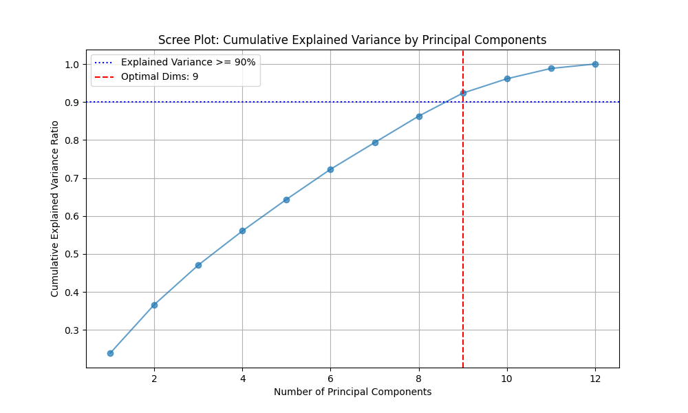
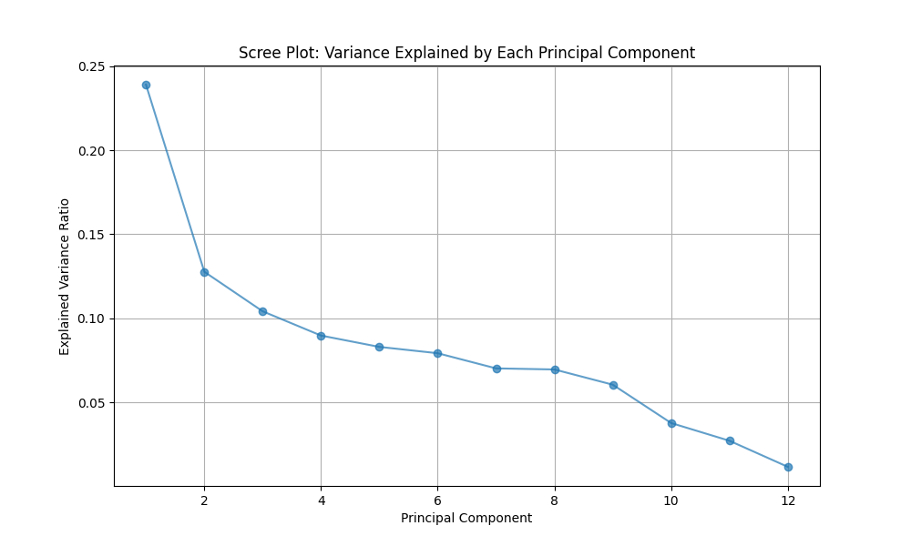

Optimal number of dimensions based on 90% explained variance: 9
Reconstruction Error: 0.07658321607853308
Explained Variance Ratio: 0.9234

### Comparison of Metrics (Original vs PCA)

- **Accuracy**:
  - **Original (12 dim)**: 0.2561
  - **PCA (9 dim)**: 0.2207
  - **Analysis**: There is a slight drop in accuracy (~3.5%) when using PCA. This can happen because dimensionality reduction may lose some information that is important for classification tasks.

- **Macro Precision, Recall, and F1-Score**:
  - **Precision (macro)**: 
    - Original: 0.2340
    - PCA: 0.1941
  - **Recall (macro)**:
    - Original: 0.2472
    - PCA: 0.2135
  - **F1-Score (macro)**:
    - Original: 0.2405
    - PCA: 0.2033
  - **Analysis**: The macro scores all drop when using PCA. Macro scores are more sensitive to class imbalance since they compute the metric independently for each class and then take the average. Some features may have contributed more to minority classes, and reducing dimensions could negatively impact performance.

- **Micro Precision, Recall, and F1-Score**:
  - **Precision (micro)**: 
    - Original: 0.2561
    - PCA: 0.2207
  - **Recall (micro)**: 
    - Original: 0.2561
    - PCA: 0.2207
  - **F1-Score (micro)**: 
    - Original: 0.2561
    - PCA: 0.2207
  - **Analysis**: The micro scores drop similarly to accuracy. Since micro-averaging accounts for all instances equally, the drop suggests that reducing dimensions impacted the overall classification ability of the model across all classes.

- **Time Taken**:
  - **Original**: 66.57 seconds
  - **PCA (9 dim)**: 51.34 seconds
  - **Analysis**: PCA reduces the inference time by ~23%. The dimensionality reduction lowers the computational cost, but there’s a tradeoff with the slight reduction in classification performance. This is expected in most cases when applying PCA—faster inference at the cost of some accuracy.

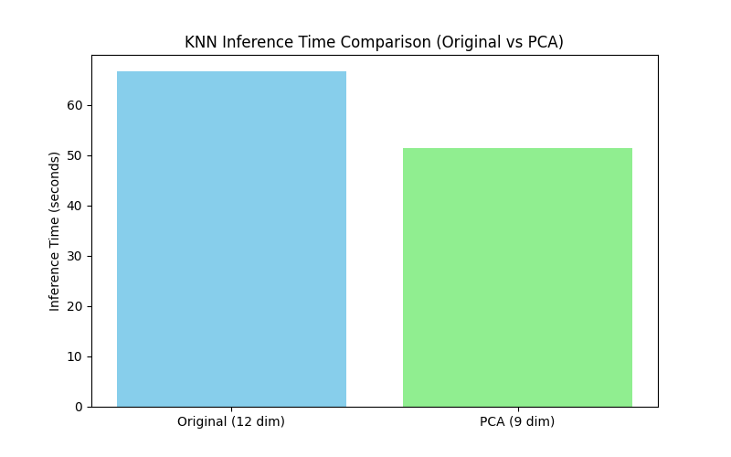