# Assignment 3 Report

To install dependencies, use 
```bash
pip install -r requirements.txt
```

To run any python3 file, run it from the base directory using,
```bash
python3 -m path.to.code.file # without .py extension
```
To run the code for this assignment,
```bash
python3 -m assignments.3.a3 # (without .py extension)
```
Website references are mentioned in the code.

## 2.1 Data Preprocessing
### 1. Describe the dataset using mean, standard deviation, min, and max values for all attributes


| Attribute            |       Mean |   Standard Deviation |     Min |       Max |
|:---------------------|-----------:|---------------------:|--------:|----------:|
| fixed acidity        |  8.31111   |           1.74683    | 4.6     |  15.9     |
| volatile acidity     |  0.531339  |           0.179555   | 0.12    |   1.58    |
| citric acid          |  0.268364  |           0.1966     | 0       |   1       |
| residual sugar       |  2.53215   |           1.35532    | 0.9     |  15.5     |
| chlorides            |  0.0869326 |           0.0472467  | 0.012   |   0.611   |
| free sulfur dioxide  | 15.6155    |          10.246      | 1       |  68       |
| total sulfur dioxide | 45.9147    |          32.7678     | 6       | 289       |
| density              |  0.99673   |           0.00192422 | 0.99007 |   1.00369 |
| pH                   |  3.31101   |           0.156596   | 2.74    |   4.01    |
| sulphates            |  0.657708  |           0.170324   | 0.33    |   2       |
| alcohol              | 10.4421    |           1.08172    | 8.4     |  14.9     |
| quality              |  5.65704   |           0.805472   | 3       |   8       |

### 2. Draw a graph that shows the distribution of the various labels across the entire dataset. You are allowed to use standard libraries like Matplotlib

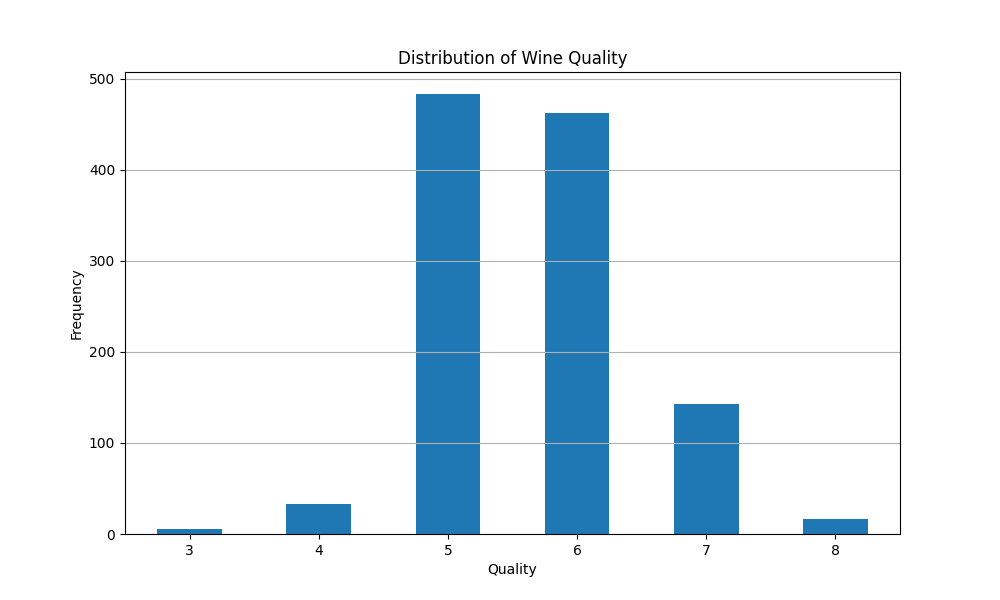

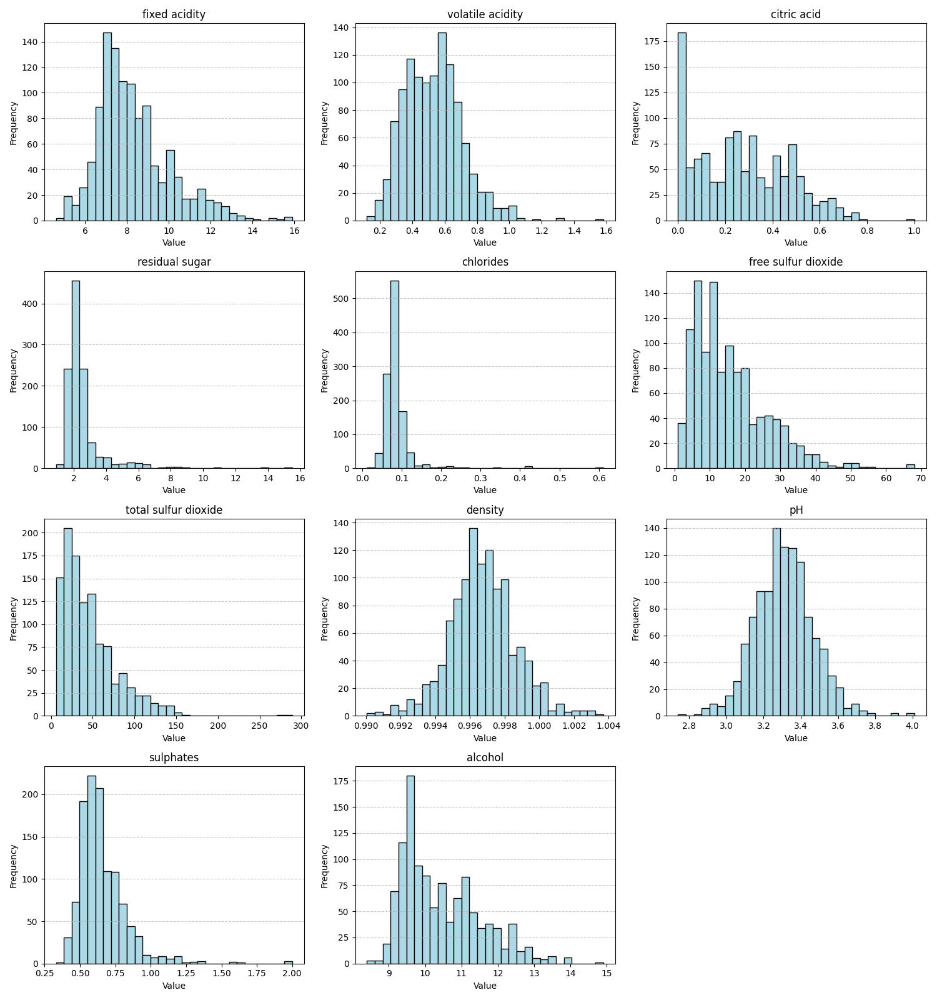

## 3. Normalise and standarize the data. Make sure to handle the missing or inconsistent data values if necessary. You can use sklearn for this.

Saved to data/interim/3/WineQT in WineQT_normalized.csv and WineQT_standardized.csv

## 2.2 Model Building from Scratch 

To initialize the `MLPClassifier`, use the following syntax:

```python
model = MLPClassifier(input_size, hidden_layers, num_classes=6, learning_rate=0.01, activation='sigmoid', optimizer='sgd', wandb_log=False, print_every=10)
```

To fit the model to training data, use the `fit` method:

```python
model.fit(X_train, y_train, X_validation, y_validation, max_epochs=10, batch_size=32, early_stopping=True)
```

To make predictions, use the `predict` method:

```python
predictions = model.predict(X_test)
```

The unit tests for gradient checking in the `TestMLPGradientChecking` class ensure that the gradient computation is accurate for various configurations. All tests pass for the following scenarios:

1. **Sigmoid Activation**: Tests gradient checking using a model with a hidden layer of 10 and 5 neurons, using stochastic gradient descent (SGD).
   ```python
   model.gradient_checking(self.X_train_classification[:20], self.y_train_classification[:20])
   ```

2. **ReLU Activation**: Tests gradient checking with a model having one hidden layer of 10 neurons, using batch gradient descent (BGD).
   ```python
   model.gradient_checking(self.X_train_classification[100:110], self.y_train_classification[100:110])
   ```

3. **Tanh Activation**: Tests gradient checking with a more complex model with three hidden layers (15, 5, and 3 neurons) and using mini-batch gradient descent (MBGD).
   ```python
   model.gradient_checking(self.X_train_classification[200:300], self.y_train_classification[200:300])
   ```

All gradient checks confirm the correctness of the gradients across these configurations.

## 2.3 Model Training & Hyperparameter Tuning using W&B
1. Plot the trend of accuracy scores with change in these hyperparameters
using W&B.
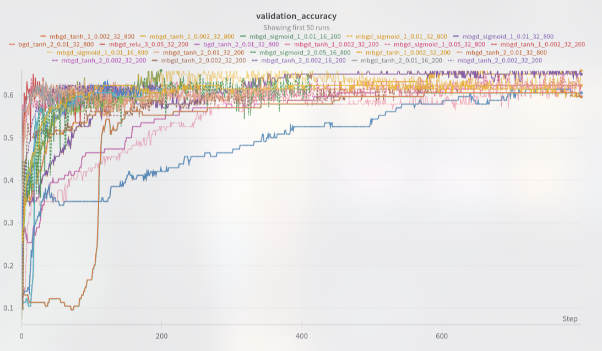
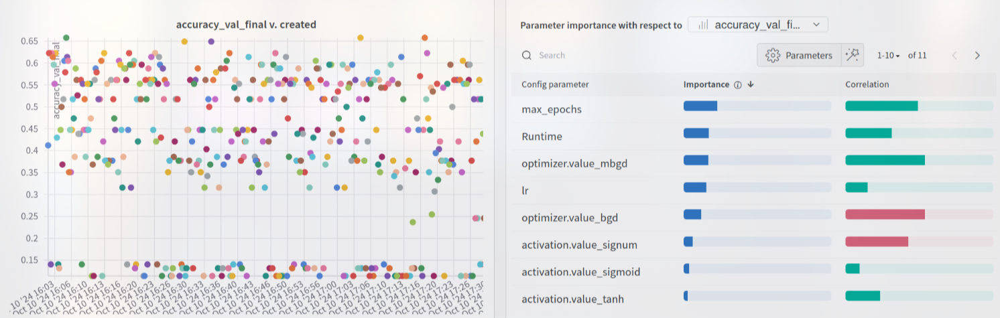
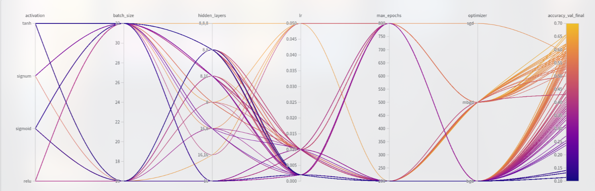

2. Generate a table listing all the hyperparameters tested and their corre-
sponding metrics mentioned above

<details>
  <summary>View Table</summary>


| Activation   |   Batch Size | Hidden Layers   | Optimizer   |   Learning Rate |   Max Epochs |   Validation Accuracy |   Epoch |   F1 Score |   Precision |     Recall |
|:-------------|-------------:|:----------------|:------------|----------------:|-------------:|----------------------:|--------:|-----------:|------------:|-----------:|
| tanh         |           32 | [16]            | mbgd        |           0.002 |          800 |            0.657895   |     800 | 0.290646   |   0.293096  | 0.288235   |
| sigmoid      |           16 | [16]            | mbgd        |           0.01  |          200 |            0.657895   |     200 | 0.311248   |   0.340203  | 0.286835   |
| tanh         |           32 | [16]            | mbgd        |           0.002 |          800 |            0.657895   |     800 | 0.290646   |   0.293096  | 0.288235   |
| sigmoid      |           32 | [16]            | mbgd        |           0.01  |          800 |            0.649123   |     800 | 0.298194   |   0.314412  | 0.283567   |
| sigmoid      |           32 | [16]            | mbgd        |           0.01  |          800 |            0.649123   |     800 | 0.298194   |   0.314412  | 0.283567   |
| tanh         |           32 | [8,16]          | bgd         |           0.01  |          800 |            0.622807   |     800 | 0.29319    |   0.298519  | 0.288049   |
| sigmoid      |           16 | [16,16]         | mbgd        |           0.05  |          800 |            0.622807   |     413 | 0.276794   |   0.283036  | 0.270822   |
| tanh         |           32 | [8,16]          | mbgd        |           0.01  |          200 |            0.622807   |     200 | 0.289318   |   0.299845  | 0.279505   |
| tanh         |           32 | [16]            | mbgd        |           0.002 |          200 |            0.622807   |     200 | 0.281192   |   0.280779  | 0.281606   |
| sigmoid      |           16 | [16]            | mbgd        |           0.01  |          800 |            0.622807   |     800 | 0.265027   |   0.264836  | 0.265219   |
| tanh         |           32 | [16]            | mbgd        |           0.002 |          200 |            0.622807   |     200 | 0.281192   |   0.280779  | 0.281606   |
| sigmoid      |           32 | [8]             | mbgd        |           0.05  |          800 |            0.622807   |     800 | 0.281107   |   0.282728  | 0.279505   |
| tanh         |           32 | [16]            | mbgd        |           0.002 |          200 |            0.622807   |     200 | 0.281192   |   0.280779  | 0.281606   |
| tanh         |           32 | [8,16]          | bgd         |           0.01  |          800 |            0.622807   |     800 | 0.29319    |   0.298519  | 0.288049   |
| relu         |           32 | [8,8,8]         | mbgd        |           0.05  |          200 |            0.622807   |     133 | 0.295498   |   0.29809   | 0.292951   |
| tanh         |           32 | [8,8]           | mbgd        |           0.002 |          200 |            0.614035   |     200 | 0.306628   |   0.366924  | 0.263352   |
| tanh         |           32 | [8,8]           | mbgd        |           0.002 |          200 |            0.614035   |     200 | 0.306628   |   0.366924  | 0.263352   |
| tanh         |           16 | [8,16]          | mbgd        |           0.002 |          200 |            0.614035   |     200 | 0.282699   |   0.287948  | 0.277638   |
| tanh         |           16 | [16]            | mbgd        |           0.002 |          200 |            0.614035   |     200 | 0.266803   |   0.26455   | 0.269094   |
| tanh         |           32 | [8,8]           | mbgd        |           0.002 |          200 |            0.614035   |     200 | 0.306628   |   0.366924  | 0.263352   |
| tanh         |           16 | [8,8]           | mbgd        |           0.01  |          200 |            0.614035   |      93 | 0.283048   |   0.284983  | 0.281139   |
| tanh         |           32 | [8,8]           | mbgd        |           0.01  |          800 |            0.614035   |     356 | 0.291423   |   0.29686   | 0.286181   |
| tanh         |           32 | [8,8]           | mbgd        |           0.002 |          200 |            0.614035   |     200 | 0.306628   |   0.366924  | 0.263352   |
| tanh         |           32 | [8,8]           | mbgd        |           0.01  |          800 |            0.614035   |     356 | 0.291423   |   0.29686   | 0.286181   |
| tanh         |           32 | [8,8]           | mbgd        |           0.002 |          200 |            0.614035   |     200 | 0.306628   |   0.366924  | 0.263352   |
| tanh         |           32 | [8,8]           | mbgd        |           0.002 |          200 |            0.614035   |     200 | 0.306628   |   0.366924  | 0.263352   |
| sigmoid      |           32 | [16]            | mbgd        |           0.002 |          800 |            0.605263   |     800 | 0.219452   |   0.199595  | 0.243697   |
| sigmoid      |           32 | [16]            | mbgd        |           0.002 |          800 |            0.605263   |     800 | 0.219452   |   0.199595  | 0.243697   |
| sigmoid      |           32 | [16]            | mbgd        |           0.002 |          800 |            0.605263   |     800 | 0.219452   |   0.199595  | 0.243697   |
| sigmoid      |           32 | [16]            | mbgd        |           0.002 |          800 |            0.605263   |     800 | 0.219452   |   0.199595  | 0.243697   |
| sigmoid      |           32 | [16]            | mbgd        |           0.002 |          800 |            0.605263   |     800 | 0.219452   |   0.199595  | 0.243697   |
| sigmoid      |           32 | [16]            | mbgd        |           0.002 |          800 |            0.605263   |     800 | 0.219452   |   0.199595  | 0.243697   |
| sigmoid      |           16 | [16]            | mbgd        |           0.002 |          800 |            0.605263   |     800 | 0.264359   |   0.281176  | 0.24944    |
| relu         |           32 | [8,16]          | mbgd        |           0.002 |          200 |            0.605263   |     200 | 0.293064   |   0.323405  | 0.267927   |
| tanh         |           32 | [8,16]          | mbgd        |           0.002 |          200 |            0.605263   |     200 | 0.286946   |   0.292593  | 0.281513   |
| sigmoid      |           32 | [8,8]           | mbgd        |           0.01  |          800 |            0.596491   |     800 | 0.217345   |   0.198785  | 0.239729   |
| tanh         |           32 | [8,8]           | bgd         |           0.01  |          800 |            0.596491   |     800 | 0.216799   |   0.196928  | 0.24113    |
| tanh         |           32 | [8,8]           | bgd         |           0.01  |          800 |            0.596491   |     800 | 0.216799   |   0.196928  | 0.24113    |
| tanh         |           16 | [8,8]           | bgd         |           0.01  |          800 |            0.596491   |     800 | 0.216799   |   0.196928  | 0.24113    |
| tanh         |           32 | [8,8]           | bgd         |           0.01  |          800 |            0.596491   |     800 | 0.216799   |   0.196928  | 0.24113    |
| tanh         |           32 | [8,8]           | bgd         |           0.01  |          800 |            0.596491   |     800 | 0.216799   |   0.196928  | 0.24113    |
| tanh         |           32 | [8,8]           | bgd         |           0.01  |          800 |            0.596491   |     800 | 0.216799   |   0.196928  | 0.24113    |
| tanh         |           32 | [8,8]           | bgd         |           0.01  |          800 |            0.596491   |     800 | 0.216799   |   0.196928  | 0.24113    |
| tanh         |           32 | [8,16]          | mbgd        |           0.002 |          800 |            0.596491   |     800 | 0.271448   |   0.273217  | 0.269701   |
| tanh         |           32 | [8,8]           | bgd         |           0.01  |          800 |            0.596491   |     800 | 0.216799   |   0.196928  | 0.24113    |
| tanh         |           32 | [8,8]           | bgd         |           0.01  |          800 |            0.596491   |     800 | 0.216799   |   0.196928  | 0.24113    |
| tanh         |           32 | [8,8]           | bgd         |           0.01  |          800 |            0.596491   |     800 | 0.216799   |   0.196928  | 0.24113    |
| tanh         |           32 | [8,8]           | bgd         |           0.01  |          800 |            0.596491   |     800 | 0.216799   |   0.196928  | 0.24113    |
| tanh         |           32 | [8,8]           | bgd         |           0.01  |          800 |            0.596491   |     800 | 0.216799   |   0.196928  | 0.24113    |
| tanh         |           32 | [8,8]           | bgd         |           0.01  |          800 |            0.596491   |     800 | 0.216799   |   0.196928  | 0.24113    |
| sigmoid      |           32 | [8,8]           | mbgd        |           0.01  |          800 |            0.596491   |     800 | 0.217345   |   0.198785  | 0.239729   |
| tanh         |           32 | [8,8]           | bgd         |           0.01  |          800 |            0.596491   |     800 | 0.216799   |   0.196928  | 0.24113    |
| tanh         |           32 | [8,8]           | bgd         |           0.01  |          800 |            0.596491   |     800 | 0.216799   |   0.196928  | 0.24113    |
| tanh         |           32 | [8,8]           | bgd         |           0.01  |          800 |            0.596491   |     800 | 0.216799   |   0.196928  | 0.24113    |
| sigmoid      |           32 | [8,8]           | mbgd        |           0.01  |          200 |            0.587719   |     200 | 0.212099   |   0.192754  | 0.235761   |
| tanh         |           16 | [8,8]           | mbgd        |           0.002 |          200 |            0.587719   |     200 | 0.263416   |   0.267675  | 0.25929    |
| sigmoid      |           32 | [8,8]           | mbgd        |           0.01  |          200 |            0.587719   |     200 | 0.212099   |   0.192754  | 0.235761   |
| tanh         |           32 | [8,8]           | mbgd        |           0.002 |          800 |            0.587719   |     800 | 0.263416   |   0.267675  | 0.25929    |
| sigmoid      |           32 | [16,8]          | sgd         |           0.05  |          800 |            0.587719   |     176 | 0.268396   |   0.264061  | 0.272876   |
| sigmoid      |           32 | [8,8]           | mbgd        |           0.01  |          200 |            0.587719   |     200 | 0.212099   |   0.192754  | 0.235761   |
| tanh         |           32 | [8,8]           | mbgd        |           0.002 |          800 |            0.587719   |     800 | 0.263416   |   0.267675  | 0.25929    |
| tanh         |           16 | [8,8]           | mbgd        |           0.002 |          200 |            0.587719   |     200 | 0.263416   |   0.267675  | 0.25929    |
| sigmoid      |           32 | [8,8]           | mbgd        |           0.01  |          200 |            0.587719   |     200 | 0.212099   |   0.192754  | 0.235761   |
| tanh         |           32 | [8,8]           | mbgd        |           0.002 |          800 |            0.587719   |     800 | 0.263416   |   0.267675  | 0.25929    |
| tanh         |           32 | [8,8]           | mbgd        |           0.002 |          800 |            0.587719   |     800 | 0.263416   |   0.267675  | 0.25929    |
| tanh         |           32 | [16]            | bgd         |           0.01  |          800 |            0.587719   |     800 | 0.270887   |   0.274011  | 0.267834   |
| tanh         |           32 | [8,8]           | mbgd        |           0.002 |          800 |            0.587719   |     800 | 0.263416   |   0.267675  | 0.25929    |
| sigmoid      |           16 | [8,8]           | mbgd        |           0.002 |          800 |            0.587719   |     800 | 0.212365   |   0.192726  | 0.236461   |
| tanh         |           32 | [8,8]           | mbgd        |           0.002 |          800 |            0.587719   |     800 | 0.263416   |   0.267675  | 0.25929    |
| tanh         |           16 | [8,8]           | mbgd        |           0.002 |          800 |            0.587719   |     730 | 0.272085   |   0.277981  | 0.266433   |
| sigmoid      |           16 | [8,8]           | mbgd        |           0.01  |          200 |            0.587719   |     200 | 0.212355   |   0.192708  | 0.236461   |
| tanh         |           16 | [8,8]           | mbgd        |           0.002 |          200 |            0.587719   |     200 | 0.263416   |   0.267675  | 0.25929    |
| tanh         |           32 | [8,8]           | mbgd        |           0.002 |          800 |            0.587719   |     800 | 0.263416   |   0.267675  | 0.25929    |
| sigmoid      |           32 | [8,8]           | mbgd        |           0.01  |          200 |            0.587719   |     200 | 0.212099   |   0.192754  | 0.235761   |
| sigmoid      |           32 | [16]            | mbgd        |           0.01  |          200 |            0.578947   |     200 | 0.208525   |   0.189502  | 0.231793   |
| tanh         |           32 | [8,8]           | mbgd        |           0.01  |          200 |            0.578947   |     200 | 0.270427   |   0.276554  | 0.264566   |
| relu         |           16 | [8,8]           | mbgd        |           0.002 |          800 |            0.578947   |     800 | 0.271599   |   0.267949  | 0.27535    |
| sigmoid      |           32 | [16]            | mbgd        |           0.01  |          200 |            0.578947   |     200 | 0.208525   |   0.189502  | 0.231793   |
| tanh         |           32 | [8]             | bgd         |           0.01  |          200 |            0.578947   |     200 | 0.207389   |   0.188095  | 0.231092   |
| signum       |           32 | [8]             | bgd         |           0.01  |          200 |            0.570175   |     200 | 0.20449    |   0.187391  | 0.225023   |
| signum       |           32 | [8]             | bgd         |           0.01  |          200 |            0.570175   |     200 | 0.20449    |   0.187391  | 0.225023   |
| signum       |           32 | [16]            | mbgd        |           0.002 |          200 |            0.570175   |     200 | 0.293244   |   0.287601  | 0.299113   |
| relu         |           16 | [8,16]          | bgd         |           0.01  |          800 |            0.570175   |     800 | 0.271167   |   0.300559  | 0.247012   |
| tanh         |           16 | [8,8]           | bgd         |           0.002 |          800 |            0.561404   |     800 | 0.205924   |   0.189153  | 0.225957   |
| tanh         |           32 | [8,8]           | bgd         |           0.002 |          800 |            0.561404   |     800 | 0.205924   |   0.189153  | 0.225957   |
| tanh         |           32 | [8,8]           | bgd         |           0.002 |          800 |            0.561404   |     800 | 0.205924   |   0.189153  | 0.225957   |
| tanh         |           16 | [8,8]           | bgd         |           0.002 |          800 |            0.561404   |     800 | 0.205924   |   0.189153  | 0.225957   |
| tanh         |           32 | [8,8]           | bgd         |           0.002 |          800 |            0.561404   |     800 | 0.205924   |   0.189153  | 0.225957   |
| tanh         |           32 | [8,8]           | bgd         |           0.002 |          800 |            0.561404   |     800 | 0.205924   |   0.189153  | 0.225957   |
| tanh         |           32 | [8,8]           | bgd         |           0.002 |          800 |            0.561404   |     800 | 0.205924   |   0.189153  | 0.225957   |
| tanh         |           32 | [8,8]           | bgd         |           0.002 |          800 |            0.561404   |     800 | 0.205924   |   0.189153  | 0.225957   |
| tanh         |           32 | [8,8]           | bgd         |           0.002 |          800 |            0.561404   |     800 | 0.205924   |   0.189153  | 0.225957   |
| tanh         |           32 | [8,8]           | bgd         |           0.002 |          800 |            0.561404   |     800 | 0.205924   |   0.189153  | 0.225957   |
| tanh         |           32 | [8,8]           | bgd         |           0.002 |          800 |            0.561404   |     800 | 0.205924   |   0.189153  | 0.225957   |
| tanh         |           16 | [8,8]           | bgd         |           0.002 |          800 |            0.561404   |     800 | 0.205924   |   0.189153  | 0.225957   |
| tanh         |           16 | [8,8]           | bgd         |           0.002 |          800 |            0.561404   |     800 | 0.205924   |   0.189153  | 0.225957   |
| tanh         |           32 | [8,8]           | bgd         |           0.002 |          800 |            0.561404   |     800 | 0.205924   |   0.189153  | 0.225957   |
| tanh         |           16 | [8,8]           | bgd         |           0.002 |          800 |            0.561404   |     800 | 0.205924   |   0.189153  | 0.225957   |
| tanh         |           32 | [8,8]           | bgd         |           0.002 |          800 |            0.561404   |     800 | 0.205924   |   0.189153  | 0.225957   |
| tanh         |           32 | [8,8]           | bgd         |           0.002 |          800 |            0.561404   |     800 | 0.205924   |   0.189153  | 0.225957   |
| tanh         |           32 | [8,8]           | bgd         |           0.002 |          800 |            0.561404   |     800 | 0.205924   |   0.189153  | 0.225957   |
| tanh         |           32 | [8,8]           | bgd         |           0.002 |          800 |            0.561404   |     800 | 0.205924   |   0.189153  | 0.225957   |
| tanh         |           32 | [8,8]           | bgd         |           0.002 |          800 |            0.561404   |     800 | 0.205924   |   0.189153  | 0.225957   |
| signum       |           32 | [8,16]          | mbgd        |           0.01  |          800 |            0.561404   |     353 | 0.296783   |   0.347916  | 0.258753   |
| tanh         |           16 | [8,8]           | bgd         |           0.002 |          800 |            0.561404   |     800 | 0.205924   |   0.189153  | 0.225957   |
| tanh         |           32 | [8,8]           | bgd         |           0.002 |          800 |            0.561404   |     800 | 0.205924   |   0.189153  | 0.225957   |
| tanh         |           32 | [8,8]           | bgd         |           0.002 |          800 |            0.561404   |     800 | 0.205924   |   0.189153  | 0.225957   |
| tanh         |           16 | [8,8]           | bgd         |           0.002 |          800 |            0.561404   |     800 | 0.205924   |   0.189153  | 0.225957   |
| tanh         |           32 | [8,8]           | bgd         |           0.002 |          800 |            0.561404   |     800 | 0.205924   |   0.189153  | 0.225957   |
| tanh         |           32 | [8,8]           | bgd         |           0.002 |          800 |            0.561404   |     800 | 0.205924   |   0.189153  | 0.225957   |
| tanh         |           32 | [8,8]           | bgd         |           0.002 |          800 |            0.561404   |     800 | 0.205924   |   0.189153  | 0.225957   |
| tanh         |           16 | [8,8]           | bgd         |           0.002 |          800 |            0.561404   |     800 | 0.205924   |   0.189153  | 0.225957   |
| tanh         |           16 | [8,8]           | bgd         |           0.002 |          800 |            0.561404   |     800 | 0.205924   |   0.189153  | 0.225957   |
| tanh         |           32 | [8,8]           | bgd         |           0.002 |          800 |            0.561404   |     800 | 0.205924   |   0.189153  | 0.225957   |
| tanh         |           32 | [8,8]           | bgd         |           0.002 |          800 |            0.561404   |     800 | 0.205924   |   0.189153  | 0.225957   |
| tanh         |           32 | [8,8]           | bgd         |           0.002 |          800 |            0.561404   |     800 | 0.205924   |   0.189153  | 0.225957   |
| tanh         |           32 | [8,8]           | bgd         |           0.002 |          800 |            0.561404   |     800 | 0.205924   |   0.189153  | 0.225957   |
| tanh         |           32 | [8,8]           | bgd         |           0.002 |          800 |            0.561404   |     800 | 0.205924   |   0.189153  | 0.225957   |
| tanh         |           32 | [8,8]           | bgd         |           0.002 |          800 |            0.561404   |     800 | 0.205924   |   0.189153  | 0.225957   |
| tanh         |           16 | [8,8]           | bgd         |           0.002 |          800 |            0.561404   |     800 | 0.205924   |   0.189153  | 0.225957   |
| tanh         |           32 | [8,8]           | bgd         |           0.002 |          800 |            0.561404   |     800 | 0.205924   |   0.189153  | 0.225957   |
| tanh         |           32 | [8,8]           | bgd         |           0.002 |          800 |            0.561404   |     800 | 0.205924   |   0.189153  | 0.225957   |
| tanh         |           32 | [8,8]           | bgd         |           0.002 |          800 |            0.561404   |     800 | 0.205924   |   0.189153  | 0.225957   |
| tanh         |           32 | [8,8]           | bgd         |           0.002 |          800 |            0.561404   |     800 | 0.205924   |   0.189153  | 0.225957   |
| tanh         |           32 | [8,8]           | bgd         |           0.002 |          800 |            0.561404   |     800 | 0.205924   |   0.189153  | 0.225957   |
| tanh         |           32 | [8,8]           | bgd         |           0.002 |          800 |            0.561404   |     800 | 0.205924   |   0.189153  | 0.225957   |
| tanh         |           16 | [8,8]           | bgd         |           0.01  |          200 |            0.552632   |     200 | 0.200613   |   0.183472  | 0.221289   |
| tanh         |           32 | [8,8]           | bgd         |           0.01  |          200 |            0.552632   |     200 | 0.200613   |   0.183472  | 0.221289   |
| tanh         |           32 | [8,8]           | bgd         |           0.01  |          200 |            0.552632   |     200 | 0.200613   |   0.183472  | 0.221289   |
| tanh         |           32 | [8,8]           | bgd         |           0.01  |          200 |            0.552632   |     200 | 0.200613   |   0.183472  | 0.221289   |
| tanh         |           32 | [8,8]           | bgd         |           0.01  |          200 |            0.552632   |     200 | 0.200613   |   0.183472  | 0.221289   |
| tanh         |           32 | [8,8]           | bgd         |           0.01  |          200 |            0.552632   |     200 | 0.200613   |   0.183472  | 0.221289   |
| tanh         |           16 | [8,8]           | bgd         |           0.01  |          200 |            0.552632   |     200 | 0.200613   |   0.183472  | 0.221289   |
| tanh         |           32 | [8,8]           | bgd         |           0.01  |          200 |            0.552632   |     200 | 0.200613   |   0.183472  | 0.221289   |
| tanh         |           32 | [8,8]           | bgd         |           0.01  |          200 |            0.552632   |     200 | 0.200613   |   0.183472  | 0.221289   |
| tanh         |           32 | [8,8]           | bgd         |           0.01  |          200 |            0.552632   |     200 | 0.200613   |   0.183472  | 0.221289   |
| tanh         |           32 | [8,8]           | bgd         |           0.01  |          200 |            0.552632   |     200 | 0.200613   |   0.183472  | 0.221289   |
| tanh         |           32 | [8,8]           | bgd         |           0.01  |          200 |            0.552632   |     200 | 0.200613   |   0.183472  | 0.221289   |
| tanh         |           32 | [8,8]           | bgd         |           0.01  |          200 |            0.552632   |     200 | 0.200613   |   0.183472  | 0.221289   |
| sigmoid      |           32 | [8,8]           | mbgd        |           0.002 |          800 |            0.552632   |     800 | 0.197636   |   0.179474  | 0.219888   |
| tanh         |           32 | [8,8]           | bgd         |           0.01  |          200 |            0.552632   |     200 | 0.200613   |   0.183472  | 0.221289   |
| sigmoid      |           32 | [8,8]           | mbgd        |           0.002 |          800 |            0.552632   |     800 | 0.197636   |   0.179474  | 0.219888   |
| tanh         |           32 | [8,8]           | bgd         |           0.01  |          200 |            0.552632   |     200 | 0.200613   |   0.183472  | 0.221289   |
| tanh         |           32 | [8,8]           | bgd         |           0.01  |          200 |            0.552632   |     200 | 0.200613   |   0.183472  | 0.221289   |
| tanh         |           16 | [8,8]           | bgd         |           0.01  |          200 |            0.552632   |     200 | 0.200613   |   0.183472  | 0.221289   |
| tanh         |           32 | [8,8]           | bgd         |           0.01  |          200 |            0.552632   |     200 | 0.200613   |   0.183472  | 0.221289   |
| tanh         |           32 | [8,8]           | bgd         |           0.01  |          200 |            0.552632   |     200 | 0.200613   |   0.183472  | 0.221289   |
| tanh         |           32 | [8,8]           | bgd         |           0.01  |          200 |            0.552632   |     200 | 0.200613   |   0.183472  | 0.221289   |
| sigmoid      |           32 | [8,8]           | mbgd        |           0.002 |          800 |            0.552632   |     800 | 0.197636   |   0.179474  | 0.219888   |
| tanh         |           32 | [8,8]           | bgd         |           0.01  |          200 |            0.552632   |     200 | 0.200613   |   0.183472  | 0.221289   |
| signum       |           32 | [8,8]           | bgd         |           0.01  |          800 |            0.552632   |     800 | 0.241709   |   0.244989  | 0.238515   |
| tanh         |           16 | [8,8]           | bgd         |           0.01  |          200 |            0.552632   |     200 | 0.200613   |   0.183472  | 0.221289   |
| tanh         |           32 | [8,8]           | bgd         |           0.01  |          200 |            0.552632   |     200 | 0.200613   |   0.183472  | 0.221289   |
| tanh         |           32 | [8,8]           | bgd         |           0.01  |          200 |            0.552632   |     200 | 0.200613   |   0.183472  | 0.221289   |
| tanh         |           32 | [8,8]           | bgd         |           0.01  |          200 |            0.552632   |     200 | 0.200613   |   0.183472  | 0.221289   |
| tanh         |           32 | [8,8]           | bgd         |           0.01  |          200 |            0.552632   |     200 | 0.200613   |   0.183472  | 0.221289   |
| tanh         |           32 | [8,8]           | bgd         |           0.01  |          200 |            0.552632   |     200 | 0.200613   |   0.183472  | 0.221289   |
| tanh         |           32 | [8,16]          | bgd         |           0.01  |          200 |            0.54386    |     200 | 0.261111   |   0.270521  | 0.252334   |
| tanh         |           32 | [8,16]          | bgd         |           0.01  |          200 |            0.54386    |     200 | 0.261111   |   0.270521  | 0.252334   |
| tanh         |           32 | [8,16]          | bgd         |           0.01  |          200 |            0.54386    |     200 | 0.261111   |   0.270521  | 0.252334   |
| tanh         |           32 | [8,16]          | bgd         |           0.01  |          200 |            0.54386    |     200 | 0.261111   |   0.270521  | 0.252334   |
| signum       |           32 | [8,8]           | bgd         |           0.01  |          200 |            0.54386    |     200 | 0.245362   |   0.256386  | 0.235247   |
| tanh         |           32 | [8,16]          | bgd         |           0.01  |          200 |            0.54386    |     200 | 0.261111   |   0.270521  | 0.252334   |
| tanh         |           32 | [8,16]          | bgd         |           0.01  |          200 |            0.54386    |     200 | 0.261111   |   0.270521  | 0.252334   |
| signum       |           32 | [8,8]           | bgd         |           0.002 |          800 |            0.54386    |     800 | 0.245362   |   0.256386  | 0.235247   |
| signum       |           32 | [8,16]          | bgd         |           0.01  |          800 |            0.54386    |     800 | 0.311711   |   0.385872  | 0.261461   |
| signum       |           32 | [8,8]           | bgd         |           0.002 |          800 |            0.54386    |     800 | 0.245362   |   0.256386  | 0.235247   |
| signum       |           32 | [8,8]           | bgd         |           0.002 |          800 |            0.54386    |     800 | 0.245362   |   0.256386  | 0.235247   |
| relu         |           32 | [8,8]           | mbgd        |           0.002 |          200 |            0.535088   |     200 | 0.1922     |   0.174396  | 0.214052   |
| relu         |           32 | [8,16]          | bgd         |           0.01  |          200 |            0.535088   |     200 | 0.273309   |   0.34544   | 0.226097   |
| sigmoid      |           16 | [8,8]           | mbgd        |           0.002 |          200 |            0.526316   |     200 | 0.189045   |   0.172308  | 0.209384   |
| sigmoid      |           32 | [8,8]           | bgd         |           0.01  |          800 |            0.517544   |     800 | 0.186394   |   0.169643  | 0.206816   |
| sigmoid      |           32 | [8,8]           | bgd         |           0.01  |          800 |            0.517544   |     800 | 0.186394   |   0.169643  | 0.206816   |
| tanh         |           16 | [8,16]          | bgd         |           0.002 |          800 |            0.517544   |     800 | 0.240683   |   0.256321  | 0.226844   |
| sigmoid      |           16 | [8,8]           | bgd         |           0.01  |          800 |            0.517544   |     800 | 0.186394   |   0.169643  | 0.206816   |
| sigmoid      |           32 | [8,8]           | bgd         |           0.01  |          800 |            0.517544   |     800 | 0.186394   |   0.169643  | 0.206816   |
| sigmoid      |           32 | [8,8]           | bgd         |           0.01  |          800 |            0.517544   |     800 | 0.186394   |   0.169643  | 0.206816   |
| sigmoid      |           16 | [8,8]           | bgd         |           0.01  |          800 |            0.517544   |     800 | 0.186394   |   0.169643  | 0.206816   |
| sigmoid      |           32 | [8,8]           | bgd         |           0.01  |          800 |            0.517544   |     800 | 0.186394   |   0.169643  | 0.206816   |
| sigmoid      |           32 | [8]             | bgd         |           0.01  |          200 |            0.517544   |     200 | 0.180779   |   0.164112  | 0.201214   |
| relu         |           16 | [8,8]           | bgd         |           0.01  |          800 |            0.517544   |     800 | 0.185567   |   0.168277  | 0.206816   |
| sigmoid      |           32 | [8,8]           | bgd         |           0.01  |          800 |            0.517544   |     800 | 0.186394   |   0.169643  | 0.206816   |
| tanh         |           32 | [8,16]          | bgd         |           0.002 |          800 |            0.517544   |     800 | 0.240683   |   0.256321  | 0.226844   |
| relu         |           16 | [8,16]          | bgd         |           0.002 |          800 |            0.517544   |     800 | 0.191992   |   0.175629  | 0.211718   |
| tanh         |           16 | [8,16]          | bgd         |           0.002 |          800 |            0.517544   |     800 | 0.240683   |   0.256321  | 0.226844   |
| sigmoid      |           32 | [8,8]           | bgd         |           0.01  |          800 |            0.517544   |     800 | 0.186394   |   0.169643  | 0.206816   |
| tanh         |           16 | [8,16]          | bgd         |           0.002 |          800 |            0.517544   |     800 | 0.240683   |   0.256321  | 0.226844   |
| tanh         |           32 | [8,16]          | bgd         |           0.002 |          800 |            0.517544   |     800 | 0.240683   |   0.256321  | 0.226844   |
| sigmoid      |           32 | [8,8]           | bgd         |           0.01  |          800 |            0.517544   |     800 | 0.186394   |   0.169643  | 0.206816   |
| sigmoid      |           16 | [8]             | bgd         |           0.01  |          200 |            0.517544   |     200 | 0.180779   |   0.164112  | 0.201214   |
| tanh         |           32 | [8,16]          | bgd         |           0.002 |          800 |            0.517544   |     800 | 0.240683   |   0.256321  | 0.226844   |
| tanh         |           32 | [8,16]          | bgd         |           0.002 |          800 |            0.517544   |     800 | 0.240683   |   0.256321  | 0.226844   |
| sigmoid      |           32 | [8,8]           | bgd         |           0.01  |          800 |            0.517544   |     800 | 0.186394   |   0.169643  | 0.206816   |
| sigmoid      |           32 | [8,8]           | bgd         |           0.01  |          800 |            0.517544   |     800 | 0.186394   |   0.169643  | 0.206816   |
| relu         |           32 | [8,16]          | bgd         |           0.002 |          800 |            0.517544   |     800 | 0.191992   |   0.175629  | 0.211718   |
| relu         |           32 | [8,8]           | bgd         |           0.01  |          800 |            0.517544   |     800 | 0.185567   |   0.168277  | 0.206816   |
| relu         |           32 | [8,16]          | bgd         |           0.002 |          800 |            0.517544   |     800 | 0.191992   |   0.175629  | 0.211718   |
| sigmoid      |           32 | [8,8]           | bgd         |           0.01  |          800 |            0.517544   |     800 | 0.186394   |   0.169643  | 0.206816   |
| sigmoid      |           32 | [8,8]           | bgd         |           0.01  |          800 |            0.517544   |     800 | 0.186394   |   0.169643  | 0.206816   |
| relu         |           32 | [8,16]          | bgd         |           0.002 |          800 |            0.517544   |     800 | 0.191992   |   0.175629  | 0.211718   |
| sigmoid      |           16 | [8,8]           | bgd         |           0.01  |          800 |            0.517544   |     800 | 0.186394   |   0.169643  | 0.206816   |
| sigmoid      |           32 | [8,8]           | bgd         |           0.01  |          800 |            0.517544   |     800 | 0.186394   |   0.169643  | 0.206816   |
| sigmoid      |           32 | [8,8]           | bgd         |           0.01  |          800 |            0.517544   |     800 | 0.186394   |   0.169643  | 0.206816   |
| signum       |           16 | [16]            | mbgd        |           0.01  |          800 |            0.517544   |     460 | 0.222849   |   0.222496  | 0.223203   |
| relu         |           32 | [8,16]          | bgd         |           0.002 |          800 |            0.517544   |     800 | 0.191992   |   0.175629  | 0.211718   |
| sigmoid      |           16 | [8,8]           | bgd         |           0.01  |          800 |            0.517544   |     800 | 0.186394   |   0.169643  | 0.206816   |
| sigmoid      |           32 | [8,8]           | bgd         |           0.01  |          800 |            0.517544   |     800 | 0.186394   |   0.169643  | 0.206816   |
| tanh         |           16 | [8,16]          | bgd         |           0.002 |          800 |            0.517544   |     800 | 0.240683   |   0.256321  | 0.226844   |
| sigmoid      |           32 | [8,8]           | mbgd        |           0.002 |          200 |            0.5        |     200 | 0.179063   |   0.162838  | 0.19888    |
| sigmoid      |           32 | [8,8]           | mbgd        |           0.002 |          200 |            0.5        |     200 | 0.179063   |   0.162838  | 0.19888    |
| sigmoid      |           32 | [8,8]           | mbgd        |           0.002 |          200 |            0.5        |     200 | 0.179063   |   0.162838  | 0.19888    |
| sigmoid      |           32 | [8,8]           | mbgd        |           0.002 |          200 |            0.5        |     200 | 0.179063   |   0.162838  | 0.19888    |
| sigmoid      |           32 | [8,8]           | mbgd        |           0.002 |          200 |            0.5        |     200 | 0.179063   |   0.162838  | 0.19888    |
| tanh         |           32 | [16]            | bgd         |           0.01  |          200 |            0.473684   |     200 | 0.205972   |   0.207196  | 0.204762   |
| tanh         |           32 | [16]            | bgd         |           0.01  |          200 |            0.473684   |     200 | 0.205972   |   0.207196  | 0.204762   |
| tanh         |           16 | [16]            | bgd         |           0.01  |          200 |            0.473684   |     200 | 0.205972   |   0.207196  | 0.204762   |
| tanh         |           32 | [16]            | bgd         |           0.01  |          200 |            0.473684   |     200 | 0.205972   |   0.207196  | 0.204762   |
| tanh         |           16 | [16]            | bgd         |           0.01  |          200 |            0.473684   |     200 | 0.205972   |   0.207196  | 0.204762   |
| tanh         |           32 | [16]            | bgd         |           0.01  |          200 |            0.473684   |     200 | 0.205972   |   0.207196  | 0.204762   |
| tanh         |           32 | [16]            | bgd         |           0.01  |          200 |            0.473684   |     200 | 0.205972   |   0.207196  | 0.204762   |
| tanh         |           32 | [16]            | bgd         |           0.01  |          200 |            0.473684   |     200 | 0.205972   |   0.207196  | 0.204762   |
| tanh         |           32 | [16]            | bgd         |           0.01  |          200 |            0.473684   |     200 | 0.205972   |   0.207196  | 0.204762   |
| sigmoid      |           16 | [8,8]           | bgd         |           0.002 |          800 |            0.447368   |     800 | 0.10303    |   0.0745614 | 0.166667   |
| sigmoid      |           16 | [8,8]           | bgd         |           0.002 |          800 |            0.447368   |     800 | 0.10303    |   0.0745614 | 0.166667   |
| sigmoid      |           32 | [8,8]           | bgd         |           0.002 |          800 |            0.447368   |     800 | 0.10303    |   0.0745614 | 0.166667   |
| sigmoid      |           32 | [8,8]           | bgd         |           0.002 |          800 |            0.447368   |     800 | 0.10303    |   0.0745614 | 0.166667   |
| sigmoid      |           32 | [8,8]           | bgd         |           0.002 |          800 |            0.447368   |     800 | 0.10303    |   0.0745614 | 0.166667   |
| sigmoid      |           32 | [8,16]          | bgd         |           0.002 |          200 |            0.447368   |     200 | 0.10303    |   0.0745614 | 0.166667   |
| sigmoid      |           32 | [8,8]           | bgd         |           0.002 |          800 |            0.447368   |     800 | 0.10303    |   0.0745614 | 0.166667   |
| sigmoid      |           32 | [8,8]           | bgd         |           0.002 |          800 |            0.447368   |     800 | 0.10303    |   0.0745614 | 0.166667   |
| sigmoid      |           32 | [8,8]           | bgd         |           0.002 |          800 |            0.447368   |     800 | 0.10303    |   0.0745614 | 0.166667   |
| sigmoid      |           32 | [8,8]           | bgd         |           0.002 |          800 |            0.447368   |     800 | 0.10303    |   0.0745614 | 0.166667   |
| sigmoid      |           32 | [8,16]          | bgd         |           0.002 |          200 |            0.447368   |     200 | 0.10303    |   0.0745614 | 0.166667   |
| sigmoid      |           16 | [8,8]           | bgd         |           0.002 |          800 |            0.447368   |     800 | 0.10303    |   0.0745614 | 0.166667   |
| sigmoid      |           32 | [8,16]          | bgd         |           0.002 |          200 |            0.447368   |     200 | 0.10303    |   0.0745614 | 0.166667   |
| sigmoid      |           32 | [8,8]           | bgd         |           0.002 |          800 |            0.447368   |     800 | 0.10303    |   0.0745614 | 0.166667   |
| sigmoid      |           32 | [8,8]           | bgd         |           0.002 |          800 |            0.447368   |     800 | 0.10303    |   0.0745614 | 0.166667   |
| sigmoid      |           32 | [8,8]           | bgd         |           0.002 |          800 |            0.447368   |     800 | 0.10303    |   0.0745614 | 0.166667   |
| sigmoid      |           32 | [8,16]          | bgd         |           0.002 |          200 |            0.447368   |     200 | 0.10303    |   0.0745614 | 0.166667   |
| sigmoid      |           32 | [8,8]           | bgd         |           0.002 |          800 |            0.447368   |     800 | 0.10303    |   0.0745614 | 0.166667   |
| sigmoid      |           32 | [8,16]          | bgd         |           0.002 |          200 |            0.447368   |     200 | 0.10303    |   0.0745614 | 0.166667   |
| sigmoid      |           32 | [8,8]           | bgd         |           0.002 |          800 |            0.447368   |     800 | 0.10303    |   0.0745614 | 0.166667   |
| sigmoid      |           32 | [8,8]           | bgd         |           0.002 |          800 |            0.447368   |     800 | 0.10303    |   0.0745614 | 0.166667   |
| sigmoid      |           32 | [8,8]           | bgd         |           0.002 |          800 |            0.447368   |     800 | 0.10303    |   0.0745614 | 0.166667   |
| sigmoid      |           16 | [8,16]          | bgd         |           0.002 |          200 |            0.447368   |     200 | 0.10303    |   0.0745614 | 0.166667   |
| sigmoid      |           16 | [8,8]           | bgd         |           0.002 |          800 |            0.447368   |     800 | 0.10303    |   0.0745614 | 0.166667   |
| sigmoid      |           32 | [8,8]           | bgd         |           0.002 |          800 |            0.447368   |     800 | 0.10303    |   0.0745614 | 0.166667   |
| sigmoid      |           32 | [8,8]           | bgd         |           0.002 |          800 |            0.447368   |     800 | 0.10303    |   0.0745614 | 0.166667   |
| sigmoid      |           32 | [8,8]           | bgd         |           0.002 |          800 |            0.447368   |     800 | 0.10303    |   0.0745614 | 0.166667   |
| sigmoid      |           16 | [8,8]           | bgd         |           0.002 |          800 |            0.447368   |     800 | 0.10303    |   0.0745614 | 0.166667   |
| sigmoid      |           16 | [8,16]          | bgd         |           0.002 |          200 |            0.447368   |     200 | 0.10303    |   0.0745614 | 0.166667   |
| sigmoid      |           32 | [8,8]           | bgd         |           0.002 |          800 |            0.447368   |     800 | 0.10303    |   0.0745614 | 0.166667   |
| sigmoid      |           32 | [8,8]           | bgd         |           0.002 |          800 |            0.447368   |     800 | 0.10303    |   0.0745614 | 0.166667   |
| sigmoid      |           32 | [8,8]           | bgd         |           0.002 |          800 |            0.447368   |     800 | 0.10303    |   0.0745614 | 0.166667   |
| sigmoid      |           32 | [8,8]           | bgd         |           0.002 |          800 |            0.447368   |     800 | 0.10303    |   0.0745614 | 0.166667   |
| sigmoid      |           16 | [8,8]           | bgd         |           0.002 |          800 |            0.447368   |     800 | 0.10303    |   0.0745614 | 0.166667   |
| sigmoid      |           32 | [8,8]           | bgd         |           0.01  |          200 |            0.438596   |     200 | 0.135857   |   0.115909  | 0.164099   |
| sigmoid      |           32 | [8,8]           | bgd         |           0.01  |          200 |            0.438596   |     200 | 0.135857   |   0.115909  | 0.164099   |
| sigmoid      |           32 | [8,8]           | bgd         |           0.01  |          200 |            0.438596   |     200 | 0.135857   |   0.115909  | 0.164099   |
| sigmoid      |           16 | [8,8]           | bgd         |           0.01  |          200 |            0.438596   |     200 | 0.135857   |   0.115909  | 0.164099   |
| sigmoid      |           16 | [8,8]           | bgd         |           0.01  |          200 |            0.438596   |     200 | 0.135857   |   0.115909  | 0.164099   |
| sigmoid      |           32 | [8,8]           | bgd         |           0.01  |          200 |            0.438596   |     200 | 0.135857   |   0.115909  | 0.164099   |
| sigmoid      |           32 | [8,8]           | bgd         |           0.01  |          200 |            0.438596   |     200 | 0.135857   |   0.115909  | 0.164099   |
| sigmoid      |           32 | [8,8]           | bgd         |           0.01  |          200 |            0.438596   |     200 | 0.135857   |   0.115909  | 0.164099   |
| sigmoid      |           32 | [8,8]           | bgd         |           0.01  |          200 |            0.438596   |     200 | 0.135857   |   0.115909  | 0.164099   |
| sigmoid      |           32 | [8,8]           | bgd         |           0.01  |          200 |            0.438596   |     200 | 0.135857   |   0.115909  | 0.164099   |
| sigmoid      |           32 | [8,16]          | mbgd        |           0.002 |          200 |            0.429825   |     200 | 0.152469   |   0.138725  | 0.169234   |
| sigmoid      |           32 | [8,16]          | mbgd        |           0.002 |          200 |            0.429825   |     200 | 0.152469   |   0.138725  | 0.169234   |
| sigmoid      |           32 | [16]            | mbgd        |           0.002 |          200 |            0.429825   |     200 | 0.156153   |   0.142003  | 0.173436   |
| sigmoid      |           32 | [8,16]          | mbgd        |           0.002 |          200 |            0.429825   |     200 | 0.152469   |   0.138725  | 0.169234   |
| relu         |           32 | [8,8]           | bgd         |           0.002 |          800 |            0.421053   |     800 | 0.152328   |   0.138337  | 0.169468   |
| tanh         |           32 | [16]            | bgd         |           0.002 |          800 |            0.421053   |     800 | 0.156202   |   0.145379  | 0.168768   |
| tanh         |           16 | [16]            | bgd         |           0.002 |          800 |            0.421053   |     800 | 0.156202   |   0.145379  | 0.168768   |
| tanh         |           32 | [16]            | bgd         |           0.002 |          800 |            0.421053   |     800 | 0.156202   |   0.145379  | 0.168768   |
| tanh         |           32 | [16]            | bgd         |           0.002 |          800 |            0.421053   |     800 | 0.156202   |   0.145379  | 0.168768   |
| tanh         |           32 | [16]            | bgd         |           0.002 |          800 |            0.421053   |     800 | 0.156202   |   0.145379  | 0.168768   |
| tanh         |           32 | [16]            | bgd         |           0.002 |          800 |            0.421053   |     800 | 0.156202   |   0.145379  | 0.168768   |
| tanh         |           32 | [16]            | bgd         |           0.002 |          800 |            0.421053   |     800 | 0.156202   |   0.145379  | 0.168768   |
| tanh         |           32 | [16]            | bgd         |           0.002 |          800 |            0.421053   |     800 | 0.156202   |   0.145379  | 0.168768   |
| tanh         |           16 | [16]            | bgd         |           0.002 |          800 |            0.421053   |     800 | 0.156202   |   0.145379  | 0.168768   |
| relu         |           16 | [8,8]           | bgd         |           0.002 |          800 |            0.421053   |     800 | 0.152328   |   0.138337  | 0.169468   |
| tanh         |           32 | [16]            | bgd         |           0.002 |          800 |            0.421053   |     800 | 0.156202   |   0.145379  | 0.168768   |
| tanh         |           32 | [16]            | bgd         |           0.002 |          800 |            0.421053   |     800 | 0.156202   |   0.145379  | 0.168768   |
| relu         |           32 | [8,8]           | bgd         |           0.002 |          800 |            0.421053   |     800 | 0.152328   |   0.138337  | 0.169468   |
| tanh         |           32 | [16]            | bgd         |           0.002 |          800 |            0.421053   |     800 | 0.156202   |   0.145379  | 0.168768   |
| tanh         |           32 | [16]            | bgd         |           0.002 |          800 |            0.421053   |     800 | 0.156202   |   0.145379  | 0.168768   |
| tanh         |           32 | [16]            | bgd         |           0.002 |          800 |            0.421053   |     800 | 0.156202   |   0.145379  | 0.168768   |
| relu         |           32 | [8,8]           | bgd         |           0.002 |          800 |            0.421053   |     800 | 0.152328   |   0.138337  | 0.169468   |
| tanh         |           32 | [16]            | bgd         |           0.002 |          800 |            0.421053   |     800 | 0.156202   |   0.145379  | 0.168768   |
| sigmoid      |           32 | [16,16]         | bgd         |           0.05  |          800 |            0.412281   |     800 | 0.149777   |   0.137265  | 0.164799   |
| relu         |           16 | [8]             | bgd         |           0.002 |          200 |            0.403509   |     200 | 0.111922   |   0.0891473 | 0.150327   |
| relu         |           16 | [8,8]           | bgd         |           0.01  |          200 |            0.403509   |     200 | 0.147248   |   0.133847  | 0.163632   |
| relu         |           32 | [8,8]           | bgd         |           0.01  |          200 |            0.403509   |     200 | 0.147248   |   0.133847  | 0.163632   |
| relu         |           32 | [16,8]          | bgd         |           0.002 |          800 |            0.394737   |     800 | 0.132294   |   0.117981  | 0.15056    |
| relu         |           32 | [16]            | bgd         |           0.002 |          800 |            0.394737   |     800 | 0.175415   |   0.180679  | 0.170448   |
| sigmoid      |           32 | [16]            | bgd         |           0.01  |          800 |            0.385965   |     800 | 0.141125   |   0.128102  | 0.157096   |
| sigmoid      |           32 | [8,16]          | bgd         |           0.002 |          800 |            0.385965   |     800 | 0.119349   |   0.100978  | 0.145892   |
| sigmoid      |           32 | [8,16]          | bgd         |           0.002 |          800 |            0.385965   |     800 | 0.119349   |   0.100978  | 0.145892   |
| sigmoid      |           32 | [8,16]          | bgd         |           0.002 |          800 |            0.385965   |     800 | 0.119349   |   0.100978  | 0.145892   |
| sigmoid      |           32 | [16]            | bgd         |           0.01  |          800 |            0.385965   |     800 | 0.141125   |   0.128102  | 0.157096   |
| sigmoid      |           32 | [16]            | bgd         |           0.01  |          800 |            0.385965   |     800 | 0.141125   |   0.128102  | 0.157096   |
| sigmoid      |           16 | [16]            | bgd         |           0.01  |          800 |            0.385965   |     800 | 0.141125   |   0.128102  | 0.157096   |
| sigmoid      |           32 | [16]            | bgd         |           0.01  |          800 |            0.385965   |     800 | 0.141125   |   0.128102  | 0.157096   |
| sigmoid      |           32 | [16]            | bgd         |           0.01  |          800 |            0.385965   |     800 | 0.141125   |   0.128102  | 0.157096   |
| sigmoid      |           32 | [16]            | bgd         |           0.01  |          800 |            0.385965   |     800 | 0.141125   |   0.128102  | 0.157096   |
| sigmoid      |           32 | [16]            | bgd         |           0.01  |          800 |            0.385965   |     800 | 0.141125   |   0.128102  | 0.157096   |
| sigmoid      |           32 | [16]            | bgd         |           0.01  |          800 |            0.385965   |     800 | 0.141125   |   0.128102  | 0.157096   |
| sigmoid      |           32 | [8,16]          | bgd         |           0.002 |          800 |            0.385965   |     800 | 0.119349   |   0.100978  | 0.145892   |
| sigmoid      |           32 | [16]            | bgd         |           0.01  |          800 |            0.385965   |     800 | 0.141125   |   0.128102  | 0.157096   |
| sigmoid      |           32 | [8,16]          | bgd         |           0.002 |          800 |            0.385965   |     800 | 0.119349   |   0.100978  | 0.145892   |
| sigmoid      |           32 | [16]            | bgd         |           0.01  |          800 |            0.385965   |     800 | 0.141125   |   0.128102  | 0.157096   |
| relu         |           32 | [8,16]          | bgd         |           0.002 |          200 |            0.377193   |     200 | 0.153907   |   0.148148  | 0.160131   |
| tanh         |           32 | [8,16]          | bgd         |           0.002 |          200 |            0.377193   |     200 | 0.160581   |   0.168627  | 0.153268   |
| tanh         |           32 | [8,16]          | bgd         |           0.002 |          200 |            0.377193   |     200 | 0.160581   |   0.168627  | 0.153268   |
| tanh         |           32 | [8,16]          | bgd         |           0.002 |          200 |            0.377193   |     200 | 0.160581   |   0.168627  | 0.153268   |
| relu         |           32 | [8,16]          | bgd         |           0.002 |          200 |            0.377193   |     200 | 0.153907   |   0.148148  | 0.160131   |
| tanh         |           16 | [8,16]          | bgd         |           0.002 |          200 |            0.377193   |     200 | 0.160581   |   0.168627  | 0.153268   |
| tanh         |           32 | [8,16]          | bgd         |           0.002 |          200 |            0.377193   |     200 | 0.160581   |   0.168627  | 0.153268   |
| tanh         |           16 | [8,16]          | bgd         |           0.002 |          200 |            0.377193   |     200 | 0.160581   |   0.168627  | 0.153268   |
| tanh         |           16 | [8,16]          | bgd         |           0.002 |          200 |            0.377193   |     200 | 0.160581   |   0.168627  | 0.153268   |
| sigmoid      |           32 | [8,16]          | bgd         |           0.01  |          800 |            0.377193   |     800 | 0.131372   |   0.118406  | 0.147526   |
| tanh         |           32 | [8,16]          | bgd         |           0.002 |          200 |            0.377193   |     200 | 0.160581   |   0.168627  | 0.153268   |
| tanh         |           32 | [8,16]          | bgd         |           0.002 |          200 |            0.377193   |     200 | 0.160581   |   0.168627  | 0.153268   |
| tanh         |           16 | [8,16]          | bgd         |           0.002 |          200 |            0.377193   |     200 | 0.160581   |   0.168627  | 0.153268   |
| relu         |           32 | [8,16]          | bgd         |           0.002 |          200 |            0.377193   |     200 | 0.153907   |   0.148148  | 0.160131   |
| tanh         |           32 | [8,16]          | bgd         |           0.002 |          200 |            0.377193   |     200 | 0.160581   |   0.168627  | 0.153268   |
| relu         |           32 | [8,16]          | bgd         |           0.002 |          200 |            0.377193   |     200 | 0.153907   |   0.148148  | 0.160131   |
| tanh         |           32 | [8,16]          | bgd         |           0.002 |          200 |            0.377193   |     200 | 0.160581   |   0.168627  | 0.153268   |
| tanh         |           32 | [8,16]          | bgd         |           0.002 |          200 |            0.377193   |     200 | 0.160581   |   0.168627  | 0.153268   |
| relu         |           32 | [8,16]          | bgd         |           0.002 |          200 |            0.377193   |     200 | 0.153907   |   0.148148  | 0.160131   |
| relu         |           32 | [8,16]          | bgd         |           0.002 |          200 |            0.377193   |     200 | 0.153907   |   0.148148  | 0.160131   |
| tanh         |           32 | [8,16]          | bgd         |           0.002 |          200 |            0.377193   |     200 | 0.160581   |   0.168627  | 0.153268   |
| tanh         |           16 | [8,16]          | bgd         |           0.002 |          200 |            0.377193   |     200 | 0.160581   |   0.168627  | 0.153268   |
| tanh         |           32 | [8,16]          | bgd         |           0.002 |          200 |            0.377193   |     200 | 0.160581   |   0.168627  | 0.153268   |
| tanh         |           32 | [8,16]          | bgd         |           0.002 |          200 |            0.377193   |     200 | 0.160581   |   0.168627  | 0.153268   |
| relu         |           32 | [8,16]          | bgd         |           0.002 |          200 |            0.377193   |     200 | 0.153907   |   0.148148  | 0.160131   |
| tanh         |           16 | [8,16]          | bgd         |           0.002 |          200 |            0.377193   |     200 | 0.160581   |   0.168627  | 0.153268   |
| tanh         |           32 | [8,16]          | bgd         |           0.002 |          200 |            0.377193   |     200 | 0.160581   |   0.168627  | 0.153268   |
| tanh         |           16 | [8,16]          | bgd         |           0.002 |          200 |            0.377193   |     200 | 0.160581   |   0.168627  | 0.153268   |
| sigmoid      |           32 | [16]            | bgd         |           0.01  |          200 |            0.368421   |     200 | 0.136635   |   0.120614  | 0.157563   |
| sigmoid      |           16 | [16]            | bgd         |           0.01  |          200 |            0.368421   |     200 | 0.136635   |   0.120614  | 0.157563   |
| relu         |           16 | [8,8]           | bgd         |           0.002 |          200 |            0.368421   |     200 | 0.175328   |   0.162497  | 0.190359   |
| sigmoid      |           16 | [16]            | bgd         |           0.01  |          200 |            0.368421   |     200 | 0.136635   |   0.120614  | 0.157563   |
| relu         |           32 | [8,8]           | bgd         |           0.002 |          200 |            0.368421   |     200 | 0.175328   |   0.162497  | 0.190359   |
| sigmoid      |           16 | [16]            | bgd         |           0.01  |          200 |            0.368421   |     200 | 0.136635   |   0.120614  | 0.157563   |
| relu         |           16 | [8,8]           | bgd         |           0.002 |          200 |            0.368421   |     200 | 0.175328   |   0.162497  | 0.190359   |
| relu         |           32 | [8,8]           | bgd         |           0.002 |          200 |            0.368421   |     200 | 0.175328   |   0.162497  | 0.190359   |
| sigmoid      |           32 | [16]            | bgd         |           0.01  |          200 |            0.368421   |     200 | 0.136635   |   0.120614  | 0.157563   |
| relu         |           32 | [8,8]           | bgd         |           0.002 |          200 |            0.368421   |     200 | 0.175328   |   0.162497  | 0.190359   |
| relu         |           16 | [8,8]           | bgd         |           0.002 |          200 |            0.368421   |     200 | 0.175328   |   0.162497  | 0.190359   |
| sigmoid      |           32 | [16]            | bgd         |           0.01  |          200 |            0.368421   |     200 | 0.136635   |   0.120614  | 0.157563   |
| relu         |           32 | [8,8]           | bgd         |           0.002 |          200 |            0.368421   |     200 | 0.175328   |   0.162497  | 0.190359   |
| sigmoid      |           32 | [16]            | bgd         |           0.01  |          200 |            0.368421   |     200 | 0.136635   |   0.120614  | 0.157563   |
| tanh         |           16 | [16,8]          | bgd         |           0.01  |          200 |            0.359649   |     200 | 0.169991   |   0.172008  | 0.168021   |
| tanh         |           32 | [16]            | bgd         |           0.002 |          200 |            0.350877   |     200 | 0.133505   |   0.125483  | 0.142624   |
| tanh         |           32 | [16]            | bgd         |           0.002 |          200 |            0.350877   |     200 | 0.133505   |   0.125483  | 0.142624   |
| tanh         |           32 | [16]            | bgd         |           0.002 |          200 |            0.350877   |     200 | 0.133505   |   0.125483  | 0.142624   |
| tanh         |           16 | [16]            | bgd         |           0.002 |          200 |            0.350877   |     200 | 0.133505   |   0.125483  | 0.142624   |
| tanh         |           32 | [16]            | bgd         |           0.002 |          200 |            0.350877   |     200 | 0.133505   |   0.125483  | 0.142624   |
| tanh         |           32 | [16]            | bgd         |           0.002 |          200 |            0.350877   |     200 | 0.133505   |   0.125483  | 0.142624   |
| tanh         |           32 | [16]            | bgd         |           0.002 |          200 |            0.350877   |     200 | 0.133505   |   0.125483  | 0.142624   |
| tanh         |           32 | [16]            | bgd         |           0.002 |          200 |            0.350877   |     200 | 0.133505   |   0.125483  | 0.142624   |
| tanh         |           16 | [16]            | bgd         |           0.002 |          200 |            0.350877   |     200 | 0.133505   |   0.125483  | 0.142624   |
| tanh         |           32 | [16]            | bgd         |           0.002 |          200 |            0.350877   |     200 | 0.133505   |   0.125483  | 0.142624   |
| tanh         |           32 | [16]            | bgd         |           0.002 |          200 |            0.350877   |     200 | 0.133505   |   0.125483  | 0.142624   |
| tanh         |           32 | [16]            | bgd         |           0.002 |          200 |            0.350877   |     200 | 0.133505   |   0.125483  | 0.142624   |
| tanh         |           32 | [16]            | bgd         |           0.002 |          200 |            0.350877   |     200 | 0.133505   |   0.125483  | 0.142624   |
| tanh         |           32 | [16]            | bgd         |           0.002 |          200 |            0.350877   |     200 | 0.133505   |   0.125483  | 0.142624   |
| tanh         |           16 | [16]            | bgd         |           0.002 |          200 |            0.350877   |     200 | 0.133505   |   0.125483  | 0.142624   |
| tanh         |           16 | [16]            | bgd         |           0.002 |          200 |            0.350877   |     200 | 0.133505   |   0.125483  | 0.142624   |
| tanh         |           32 | [16]            | bgd         |           0.002 |          200 |            0.350877   |     200 | 0.133505   |   0.125483  | 0.142624   |
| tanh         |           32 | [16,8]          | bgd         |           0.002 |          800 |            0.342105   |     800 | 0.174206   |   0.178595  | 0.170028   |
| tanh         |           16 | [16,8]          | bgd         |           0.002 |          800 |            0.342105   |     800 | 0.174206   |   0.178595  | 0.170028   |
| signum       |           32 | [8,16]          | bgd         |           0.01  |          200 |            0.333333   |     200 | 0.123314   |   0.114217  | 0.133987   |
| signum       |           32 | [8,16]          | bgd         |           0.002 |          800 |            0.333333   |     800 | 0.123314   |   0.114217  | 0.133987   |
| signum       |           32 | [8,16]          | bgd         |           0.002 |          800 |            0.333333   |     800 | 0.123314   |   0.114217  | 0.133987   |
| signum       |           32 | [8,16]          | bgd         |           0.01  |          200 |            0.333333   |     200 | 0.123314   |   0.114217  | 0.133987   |
| sigmoid      |           32 | [16]            | bgd         |           0.002 |          800 |            0.315789   |     800 | 0.135276   |   0.124638  | 0.147899   |
| sigmoid      |           32 | [16]            | bgd         |           0.002 |          800 |            0.315789   |     800 | 0.135276   |   0.124638  | 0.147899   |
| sigmoid      |           32 | [16]            | bgd         |           0.002 |          800 |            0.315789   |     800 | 0.135276   |   0.124638  | 0.147899   |
| sigmoid      |           32 | [16]            | bgd         |           0.002 |          800 |            0.315789   |     800 | 0.135276   |   0.124638  | 0.147899   |
| sigmoid      |           32 | [16]            | bgd         |           0.002 |          800 |            0.315789   |     800 | 0.135276   |   0.124638  | 0.147899   |
| sigmoid      |           32 | [16]            | bgd         |           0.002 |          800 |            0.315789   |     800 | 0.135276   |   0.124638  | 0.147899   |
| sigmoid      |           32 | [16]            | bgd         |           0.002 |          800 |            0.315789   |     800 | 0.135276   |   0.124638  | 0.147899   |
| sigmoid      |           32 | [16]            | bgd         |           0.002 |          800 |            0.315789   |     800 | 0.135276   |   0.124638  | 0.147899   |
| sigmoid      |           32 | [16]            | bgd         |           0.002 |          800 |            0.315789   |     800 | 0.135276   |   0.124638  | 0.147899   |
| sigmoid      |           32 | [16]            | bgd         |           0.002 |          800 |            0.315789   |     800 | 0.135276   |   0.124638  | 0.147899   |
| sigmoid      |           16 | [16]            | bgd         |           0.002 |          800 |            0.315789   |     800 | 0.135276   |   0.124638  | 0.147899   |
| sigmoid      |           32 | [16]            | bgd         |           0.002 |          800 |            0.315789   |     800 | 0.135276   |   0.124638  | 0.147899   |
| signum       |           32 | [16]            | bgd         |           0.01  |          200 |            0.307018   |     200 | 0.166547   |   0.186403  | 0.150514   |
| signum       |           32 | [16]            | bgd         |           0.01  |          200 |            0.307018   |     200 | 0.166547   |   0.186403  | 0.150514   |
| signum       |           32 | [16,8]          | bgd         |           0.01  |          200 |            0.27193    |     200 | 0.139843   |   0.166861  | 0.120355   |
| signum       |           32 | [8,16]          | bgd         |           0.002 |          200 |            0.254386   |     200 | 0.137287   |   0.141667  | 0.13317    |
| signum       |           32 | [8,16]          | bgd         |           0.002 |          200 |            0.254386   |     200 | 0.137287   |   0.141667  | 0.13317    |
| signum       |           32 | [16]            | bgd         |           0.002 |          200 |            0.245614   |     200 | 0.18114    |   0.15874   | 0.210901   |
| signum       |           32 | [16]            | bgd         |           0.002 |          200 |            0.245614   |     200 | 0.18114    |   0.15874   | 0.210901   |
| signum       |           32 | [16]            | bgd         |           0.002 |          200 |            0.245614   |     200 | 0.18114    |   0.15874   | 0.210901   |
| signum       |           32 | [16]            | bgd         |           0.002 |          200 |            0.245614   |     200 | 0.18114    |   0.15874   | 0.210901   |
| tanh         |           32 | [16,8]          | bgd         |           0.002 |          200 |            0.236842   |     200 | 0.152424   |   0.101538  | 0.305555   |
| sigmoid      |           32 | [16]            | bgd         |           0.002 |          200 |            0.140351   |     200 | 0.0726682  |   0.0419974 | 0.269444   |
| sigmoid      |           32 | [16]            | bgd         |           0.002 |          200 |            0.140351   |     200 | 0.0726682  |   0.0419974 | 0.269444   |
| sigmoid      |           32 | [16]            | bgd         |           0.002 |          200 |            0.140351   |     200 | 0.0726682  |   0.0419974 | 0.269444   |
| sigmoid      |           32 | [16]            | bgd         |           0.002 |          200 |            0.140351   |     200 | 0.0726682  |   0.0419974 | 0.269444   |
| sigmoid      |           32 | [16]            | bgd         |           0.002 |          200 |            0.140351   |     200 | 0.0726682  |   0.0419974 | 0.269444   |
| sigmoid      |           16 | [16]            | bgd         |           0.002 |          200 |            0.140351   |     200 | 0.0726682  |   0.0419974 | 0.269444   |
| sigmoid      |           16 | [16]            | bgd         |           0.002 |          200 |            0.140351   |     200 | 0.0726682  |   0.0419974 | 0.269444   |
| sigmoid      |           32 | [16]            | bgd         |           0.002 |          200 |            0.140351   |     200 | 0.0726682  |   0.0419974 | 0.269444   |
| sigmoid      |           32 | [16]            | bgd         |           0.002 |          200 |            0.140351   |     200 | 0.0726682  |   0.0419974 | 0.269444   |
| sigmoid      |           32 | [16]            | bgd         |           0.002 |          200 |            0.140351   |     200 | 0.0726682  |   0.0419974 | 0.269444   |
| sigmoid      |           32 | [16]            | bgd         |           0.002 |          200 |            0.140351   |     200 | 0.0726682  |   0.0419974 | 0.269444   |
| sigmoid      |           32 | [16]            | bgd         |           0.002 |          200 |            0.140351   |     200 | 0.0726682  |   0.0419974 | 0.269444   |
| sigmoid      |           32 | [16]            | bgd         |           0.002 |          200 |            0.140351   |     200 | 0.0726682  |   0.0419974 | 0.269444   |
| sigmoid      |           32 | [16]            | bgd         |           0.002 |          200 |            0.140351   |     200 | 0.0726682  |   0.0419974 | 0.269444   |
| sigmoid      |           32 | [16]            | bgd         |           0.002 |          200 |            0.140351   |     200 | 0.0726682  |   0.0419974 | 0.269444   |
| sigmoid      |           32 | [16]            | bgd         |           0.002 |          200 |            0.140351   |     200 | 0.0726682  |   0.0419974 | 0.269444   |
| sigmoid      |           32 | [16]            | bgd         |           0.002 |          200 |            0.140351   |     200 | 0.0726682  |   0.0419974 | 0.269444   |
| sigmoid      |           32 | [16]            | bgd         |           0.002 |          200 |            0.140351   |     200 | 0.0726682  |   0.0419974 | 0.269444   |
| sigmoid      |           32 | [8,8]           | bgd         |           0.002 |          200 |            0.131579   |     200 | 0.0387597  |   0.0219298 | 0.166667   |
| sigmoid      |           32 | [8,8]           | bgd         |           0.002 |          200 |            0.131579   |     200 | 0.0387597  |   0.0219298 | 0.166667   |
| sigmoid      |           32 | [8,8]           | bgd         |           0.002 |          200 |            0.131579   |     200 | 0.0387597  |   0.0219298 | 0.166667   |
| sigmoid      |           32 | [8,8]           | bgd         |           0.002 |          200 |            0.131579   |     200 | 0.0387597  |   0.0219298 | 0.166667   |
| sigmoid      |           32 | [8,8]           | bgd         |           0.002 |          200 |            0.131579   |     200 | 0.0387597  |   0.0219298 | 0.166667   |
| sigmoid      |           32 | [8,8]           | bgd         |           0.002 |          200 |            0.131579   |     200 | 0.0387597  |   0.0219298 | 0.166667   |
| sigmoid      |           32 | [8,8]           | bgd         |           0.002 |          200 |            0.131579   |     200 | 0.0387597  |   0.0219298 | 0.166667   |
| sigmoid      |           32 | [8,8]           | bgd         |           0.002 |          200 |            0.131579   |     200 | 0.0387597  |   0.0219298 | 0.166667   |
| sigmoid      |           32 | [8,8]           | bgd         |           0.002 |          200 |            0.131579   |     200 | 0.0387597  |   0.0219298 | 0.166667   |
| sigmoid      |           32 | [8,8]           | bgd         |           0.002 |          200 |            0.131579   |     200 | 0.0387597  |   0.0219298 | 0.166667   |
| sigmoid      |           32 | [8,8]           | bgd         |           0.002 |          200 |            0.131579   |     200 | 0.0387597  |   0.0219298 | 0.166667   |
| sigmoid      |           16 | [8,8]           | bgd         |           0.002 |          200 |            0.131579   |     200 | 0.0387597  |   0.0219298 | 0.166667   |
| sigmoid      |           16 | [8,8]           | bgd         |           0.002 |          200 |            0.131579   |     200 | 0.0387597  |   0.0219298 | 0.166667   |
| sigmoid      |           32 | [8,8]           | bgd         |           0.002 |          200 |            0.131579   |     200 | 0.0387597  |   0.0219298 | 0.166667   |
| sigmoid      |           32 | [8,8]           | bgd         |           0.002 |          200 |            0.131579   |     200 | 0.0387597  |   0.0219298 | 0.166667   |
| sigmoid      |           32 | [8,8]           | bgd         |           0.002 |          200 |            0.131579   |     200 | 0.0387597  |   0.0219298 | 0.166667   |
| sigmoid      |           32 | [8,8]           | bgd         |           0.002 |          200 |            0.131579   |     200 | 0.0387597  |   0.0219298 | 0.166667   |
| sigmoid      |           32 | [8,8]           | bgd         |           0.002 |          200 |            0.131579   |     200 | 0.0387597  |   0.0219298 | 0.166667   |
| sigmoid      |           32 | [8,8]           | bgd         |           0.002 |          200 |            0.131579   |     200 | 0.0387597  |   0.0219298 | 0.166667   |
| sigmoid      |           32 | [8,8]           | bgd         |           0.002 |          200 |            0.131579   |     200 | 0.0387597  |   0.0219298 | 0.166667   |
| sigmoid      |           32 | [8,8]           | bgd         |           0.002 |          200 |            0.131579   |     200 | 0.0387597  |   0.0219298 | 0.166667   |
| sigmoid      |           32 | [8,8]           | bgd         |           0.002 |          200 |            0.131579   |     200 | 0.0387597  |   0.0219298 | 0.166667   |
| sigmoid      |           32 | [8,8]           | bgd         |           0.002 |          200 |            0.131579   |     200 | 0.0387597  |   0.0219298 | 0.166667   |
| sigmoid      |           32 | [8,8]           | bgd         |           0.002 |          200 |            0.131579   |     200 | 0.0387597  |   0.0219298 | 0.166667   |
| sigmoid      |           32 | [8,8]           | bgd         |           0.002 |          200 |            0.131579   |     200 | 0.0387597  |   0.0219298 | 0.166667   |
| sigmoid      |           32 | [8,8]           | bgd         |           0.002 |          200 |            0.131579   |     200 | 0.0387597  |   0.0219298 | 0.166667   |
| sigmoid      |           32 | [8,8]           | bgd         |           0.002 |          200 |            0.131579   |     200 | 0.0387597  |   0.0219298 | 0.166667   |
| sigmoid      |           32 | [8,8]           | bgd         |           0.002 |          200 |            0.131579   |     200 | 0.0387597  |   0.0219298 | 0.166667   |
| sigmoid      |           32 | [8,8]           | bgd         |           0.002 |          200 |            0.131579   |     200 | 0.0387597  |   0.0219298 | 0.166667   |
| sigmoid      |           16 | [8,8]           | bgd         |           0.002 |          200 |            0.131579   |     200 | 0.0387597  |   0.0219298 | 0.166667   |
| sigmoid      |           32 | [8,8]           | bgd         |           0.002 |          200 |            0.131579   |     200 | 0.0387597  |   0.0219298 | 0.166667   |
| sigmoid      |           32 | [8,8]           | bgd         |           0.002 |          200 |            0.131579   |     200 | 0.0387597  |   0.0219298 | 0.166667   |
| tanh         |           32 | [8,8]           | bgd         |           0.002 |          200 |            0.114035   |     200 | 0.0682109  |   0.0423611 | 0.175      |
| tanh         |           32 | [8,8]           | bgd         |           0.002 |          200 |            0.114035   |     200 | 0.0682109  |   0.0423611 | 0.175      |
| tanh         |           32 | [8,8]           | bgd         |           0.002 |          200 |            0.114035   |     200 | 0.0682109  |   0.0423611 | 0.175      |
| tanh         |           32 | [8,8]           | bgd         |           0.002 |          200 |            0.114035   |     200 | 0.0682109  |   0.0423611 | 0.175      |
| tanh         |           32 | [8,8]           | bgd         |           0.002 |          200 |            0.114035   |     200 | 0.0682109  |   0.0423611 | 0.175      |
| tanh         |           32 | [8,8]           | bgd         |           0.002 |          200 |            0.114035   |     200 | 0.0682109  |   0.0423611 | 0.175      |
| tanh         |           16 | [8,8]           | bgd         |           0.002 |          200 |            0.114035   |     200 | 0.0682109  |   0.0423611 | 0.175      |
| tanh         |           32 | [8,8]           | bgd         |           0.002 |          200 |            0.114035   |     200 | 0.0682109  |   0.0423611 | 0.175      |
| tanh         |           32 | [8,8]           | bgd         |           0.002 |          200 |            0.114035   |     200 | 0.0682109  |   0.0423611 | 0.175      |
| tanh         |           32 | [8,8]           | bgd         |           0.002 |          200 |            0.114035   |     200 | 0.0682109  |   0.0423611 | 0.175      |
| tanh         |           16 | [8,8]           | bgd         |           0.002 |          200 |            0.114035   |     200 | 0.0682109  |   0.0423611 | 0.175      |
| tanh         |           32 | [8,8]           | bgd         |           0.002 |          200 |            0.114035   |     200 | 0.0682109  |   0.0423611 | 0.175      |
| tanh         |           32 | [8,8]           | bgd         |           0.002 |          200 |            0.114035   |     200 | 0.0682109  |   0.0423611 | 0.175      |
| tanh         |           16 | [8,8]           | bgd         |           0.002 |          200 |            0.114035   |     200 | 0.0682109  |   0.0423611 | 0.175      |
| tanh         |           32 | [8,8]           | bgd         |           0.002 |          200 |            0.114035   |     200 | 0.0682109  |   0.0423611 | 0.175      |
| tanh         |           32 | [8,8]           | bgd         |           0.002 |          200 |            0.114035   |     200 | 0.0682109  |   0.0423611 | 0.175      |
| tanh         |           32 | [8,8]           | bgd         |           0.002 |          200 |            0.114035   |     200 | 0.0682109  |   0.0423611 | 0.175      |
| tanh         |           32 | [8,8]           | bgd         |           0.002 |          200 |            0.114035   |     200 | 0.0682109  |   0.0423611 | 0.175      |
| tanh         |           32 | [8,8]           | bgd         |           0.002 |          200 |            0.114035   |     200 | 0.0682109  |   0.0423611 | 0.175      |
| tanh         |           32 | [8,8]           | bgd         |           0.002 |          200 |            0.114035   |     200 | 0.0682109  |   0.0423611 | 0.175      |
| tanh         |           16 | [8,8]           | bgd         |           0.002 |          200 |            0.114035   |     200 | 0.0682109  |   0.0423611 | 0.175      |
| tanh         |           32 | [8,8]           | bgd         |           0.002 |          200 |            0.114035   |     200 | 0.0682109  |   0.0423611 | 0.175      |
| tanh         |           32 | [8,8]           | bgd         |           0.002 |          200 |            0.114035   |     200 | 0.0682109  |   0.0423611 | 0.175      |
| tanh         |           32 | [8,8]           | bgd         |           0.002 |          200 |            0.114035   |     200 | 0.0682109  |   0.0423611 | 0.175      |
| tanh         |           32 | [8,8]           | bgd         |           0.002 |          200 |            0.114035   |     200 | 0.0682109  |   0.0423611 | 0.175      |
| tanh         |           32 | [8,8]           | bgd         |           0.002 |          200 |            0.114035   |     200 | 0.0682109  |   0.0423611 | 0.175      |
| tanh         |           32 | [8,8]           | bgd         |           0.002 |          200 |            0.114035   |     200 | 0.0682109  |   0.0423611 | 0.175      |
| tanh         |           32 | [8,8]           | bgd         |           0.002 |          200 |            0.114035   |     200 | 0.0682109  |   0.0423611 | 0.175      |
| tanh         |           32 | [8,8]           | bgd         |           0.002 |          200 |            0.114035   |     200 | 0.0682109  |   0.0423611 | 0.175      |
| tanh         |           16 | [8,8]           | bgd         |           0.002 |          200 |            0.114035   |     200 | 0.0682109  |   0.0423611 | 0.175      |
| tanh         |           32 | [8,8]           | bgd         |           0.002 |          200 |            0.114035   |     200 | 0.0682109  |   0.0423611 | 0.175      |
| tanh         |           32 | [8,8]           | bgd         |           0.002 |          200 |            0.114035   |     200 | 0.0682109  |   0.0423611 | 0.175      |
| tanh         |           32 | [8,8]           | bgd         |           0.002 |          200 |            0.114035   |     200 | 0.0682109  |   0.0423611 | 0.175      |
| tanh         |           32 | [8,8]           | bgd         |           0.002 |          200 |            0.114035   |     200 | 0.0682109  |   0.0423611 | 0.175      |
| tanh         |           32 | [8,8]           | bgd         |           0.002 |          200 |            0.114035   |     200 | 0.0682109  |   0.0423611 | 0.175      |
| tanh         |           32 | [8,8]           | bgd         |           0.002 |          200 |            0.114035   |     200 | 0.0682109  |   0.0423611 | 0.175      |
| tanh         |           32 | [8,8]           | bgd         |           0.002 |          200 |            0.114035   |     200 | 0.0682109  |   0.0423611 | 0.175      |
| tanh         |           32 | [8,8]           | bgd         |           0.002 |          200 |            0.114035   |     200 | 0.0682109  |   0.0423611 | 0.175      |
| tanh         |           32 | [8,8]           | bgd         |           0.002 |          200 |            0.114035   |     200 | 0.0682109  |   0.0423611 | 0.175      |
| tanh         |           32 | [8,8]           | bgd         |           0.002 |          200 |            0.114035   |     200 | 0.0682109  |   0.0423611 | 0.175      |
| tanh         |           32 | [8,8]           | bgd         |           0.002 |          200 |            0.114035   |     200 | 0.0682109  |   0.0423611 | 0.175      |
| tanh         |           32 | [8,8]           | bgd         |           0.002 |          200 |            0.114035   |     200 | 0.0682109  |   0.0423611 | 0.175      |
| tanh         |           32 | [8,8]           | bgd         |           0.002 |          200 |            0.114035   |     200 | 0.0682109  |   0.0423611 | 0.175      |
| tanh         |           32 | [8,8]           | bgd         |           0.002 |          200 |            0.114035   |     200 | 0.0682109  |   0.0423611 | 0.175      |
| tanh         |           32 | [8,8]           | bgd         |           0.002 |          200 |            0.114035   |     200 | 0.0682109  |   0.0423611 | 0.175      |
| tanh         |           32 | [8,8]           | bgd         |           0.002 |          200 |            0.114035   |     200 | 0.0682109  |   0.0423611 | 0.175      |
| tanh         |           16 | [8,8]           | bgd         |           0.002 |          200 |            0.114035   |     200 | 0.0682109  |   0.0423611 | 0.175      |
| tanh         |           32 | [8,8]           | bgd         |           0.002 |          200 |            0.114035   |     200 | 0.0682109  |   0.0423611 | 0.175      |
| tanh         |           32 | [8,8]           | bgd         |           0.002 |          200 |            0.114035   |     200 | 0.0682109  |   0.0423611 | 0.175      |
| tanh         |           32 | [8,8]           | bgd         |           0.002 |          200 |            0.114035   |     200 | 0.0682109  |   0.0423611 | 0.175      |
| tanh         |           16 | [8,8]           | bgd         |           0.002 |          200 |            0.114035   |     200 | 0.0682109  |   0.0423611 | 0.175      |
| tanh         |           32 | [8,8]           | bgd         |           0.002 |          200 |            0.114035   |     200 | 0.0682109  |   0.0423611 | 0.175      |
| tanh         |           32 | [8,8]           | bgd         |           0.002 |          200 |            0.114035   |     200 | 0.0682109  |   0.0423611 | 0.175      |
| tanh         |           32 | [8,8]           | bgd         |           0.002 |          200 |            0.114035   |     200 | 0.0682109  |   0.0423611 | 0.175      |
| tanh         |           16 | [8,8]           | bgd         |           0.002 |          200 |            0.114035   |     200 | 0.0682109  |   0.0423611 | 0.175      |
| relu         |           32 | [16]            | bgd         |           0.002 |          200 |            0.105263   |     200 | 0.111236   |   0.0747677 | 0.217157   |
| relu         |           16 | [16]            | bgd         |           0.002 |          200 |            0.105263   |     200 | 0.111236   |   0.0747677 | 0.217157   |
| signum       |           32 | [8,8]           | bgd         |           0.002 |          200 |            0.0526316  |     200 | 0.0212766  |   0.0126582 | 0.0666667  |
| signum       |           32 | [8,8]           | bgd         |           0.002 |          200 |            0.0526316  |     200 | 0.0212766  |   0.0126582 | 0.0666667  |
| signum       |           32 | [8,8]           | bgd         |           0.002 |          200 |            0.0526316  |     200 | 0.0212766  |   0.0126582 | 0.0666667  |
| signum       |           32 | [8,8]           | bgd         |           0.002 |          200 |            0.0526316  |     200 | 0.0212766  |   0.0126582 | 0.0666667  |
| signum       |           32 | [8]             | bgd         |           0.002 |          200 |            0.00877193 |     200 | 0.00628931 |   0.0833333 | 0.00326797 |
| signum       |           32 | [8]             | bgd         |           0.002 |          200 |            0.00877193 |     200 | 0.00628931 |   0.0833333 | 0.00326797 |

</details>


3. Report the parameters for the best model that you get

| Parameter                   | Value      |
|-----------------------------|------------|
| Activation                  | tanh       |
| Batch Size                  | 32         |
| Number of Hidden Layers     | 1          |
| Neurons in Hidden Layer     | 16         |
| Learning Rate               | 0.002      |
| Max Epochs                  | 800        |
| Optimizer                   | mbgd       |

## 2.4 Evaluating Single-label Classification Model

<details>
  <summary>Best model run </summary>

| Epoch | Train Loss | Train Accuracy | Validation Accuracy |
|-------|------------|----------------|---------------------|
| 0     | 3.0785     | 0.0503         | 0.0789              |
| 10    | 1.4663     | 0.3326         | 0.3596              |
| 20    | 1.3597     | 0.3479         | 0.3947              |
| 30    | 1.3117     | 0.3600         | 0.4386              |
| 40    | 1.2778     | 0.3742         | 0.4912              |
| 50    | 1.2510     | 0.3829         | 0.5175              |
| 60    | 1.2286     | 0.3928         | 0.5175              |
| 70    | 1.2094     | 0.4114         | 0.5175              |
| 80    | 1.1926     | 0.4245         | 0.5351              |
| 90    | 1.1775     | 0.4464         | 0.5351              |
| 100   | 1.1640     | 0.4540         | 0.5526              |
| 110   | 1.1518     | 0.4573         | 0.5614              |
| 120   | 1.1407     | 0.4705         | 0.5614              |
| 130   | 1.1305     | 0.4858         | 0.5614              |
| 140   | 1.1211     | 0.4967         | 0.5877              |
| 150   | 1.1125     | 0.5120         | 0.5789              |
| 160   | 1.1045     | 0.5197         | 0.5965              |
| 170   | 1.0970     | 0.5274         | 0.5965              |
| 180   | 1.0901     | 0.5306         | 0.5965              |
| 190   | 1.0837     | 0.5361         | 0.5965              |
| 200   | 1.0777     | 0.5427         | 0.6228              |
| 210   | 1.0721     | 0.5470         | 0.6228              |
| 220   | 1.0669     | 0.5503         | 0.6140              |
| 230   | 1.0621     | 0.5481         | 0.6228              |
| 240   | 1.0575     | 0.5492         | 0.6228              |
| 250   | 1.0532     | 0.5569         | 0.6053              |
| 260   | 1.0492     | 0.5624         | 0.6140              |
| 270   | 1.0454     | 0.5635         | 0.6228              |
| 280   | 1.0418     | 0.5689         | 0.6228              |
| 290   | 1.0384     | 0.5700         | 0.6140              |
| 300   | 1.0352     | 0.5689         | 0.6140              |
| 310   | 1.0322     | 0.5700         | 0.5965              |
| 320   | 1.0293     | 0.5755         | 0.6053              |
| 330   | 1.0266     | 0.5766         | 0.6053              |
| 340   | 1.0240     | 0.5799         | 0.6140              |
| 350   | 1.0215     | 0.5832         | 0.6140              |
| 360   | 1.0192     | 0.5832         | 0.6140              |
| 370   | 1.0169     | 0.5821         | 0.6140              |
| 380   | 1.0148     | 0.5842         | 0.6140              |
| 390   | 1.0127     | 0.5853         | 0.6140              |
| 400   | 1.0107     | 0.5886         | 0.6140              |
| 410   | 1.0088     | 0.5897         | 0.6140              |
| 420   | 1.0070     | 0.5886         | 0.6140              |
| 430   | 1.0053     | 0.5897         | 0.6140              |
| 440   | 1.0036     | 0.5886         | 0.6140              |
| 450   | 1.0020     | 0.5908         | 0.6140              |
| 460   | 1.0004     | 0.5875         | 0.6140              |
| 470   | 0.9989     | 0.5875         | 0.6053              |
| 480   | 0.9975     | 0.5908         | 0.6316              |
| 490   | 0.9961     | 0.5908         | 0.6316              |
| 500   | 0.9947     | 0.5930         | 0.6228              |
| 510   | 0.9934     | 0.5886         | 0.6316              |
| 520   | 0.9921     | 0.5941         | 0.6316              |
| 530   | 0.9909     | 0.5941         | 0.6316              |
| 540   | 0.9897     | 0.5952         | 0.6316              |
| 550   | 0.9885     | 0.5963         | 0.6316              |
| 560   | 0.9874     | 0.5952         | 0.6316              |
| 570   | 0.9863     | 0.5952         | 0.6404              |
| 580   | 0.9852     | 0.5941         | 0.6491              |
| 590   | 0.9842     | 0.5930         | 0.6491              |
| 600   | 0.9832     | 0.5930         | 0.6491              |
| 610   | 0.9822     | 0.5963         | 0.6491              |
| 620   | 0.9812     | 0.5974         | 0.6491              |
| 630   | 0.9803     | 0.5985         | 0.6491              |
| 640   | 0.9793     | 0.5996         | 0.6579              |
| 650   | 0.9784     | 0.5996         | 0.6491              |
| 660   | 0.9775     | 0.6039         | 0.6579              |
| 670   | 0.9767     | 0.6039         | 0.6491              |
| 680   | 0.9758     | 0.6039         | 0.6491              |
| 690   | 0.9750     | 0.6061         | 0.6491              |
| 700   | 0.9742     | 0.6061         | 0.6491              |
| 710   | 0.9734     | 0.6072         | 0.6491              |
| 720   | 0.9726     | 0.6061         | 0.6491              |
| 730   | 0.9719     | 0.6061         | 0.6491              |
| 740   | 0.9711     | 0.6072         | 0.6491              |
| 750   | 0.9704     | 0.6072         | 0.6491              |
| 760   | 0.9696     | 0.6083         | 0.6491              |
| 770   | 0.9689     | 0.6094         | 0.6491              |
| 780   | 0.9683     | 0.6061         | 0.6579              |
| 790   | 0.9676     | 0.6061         | 0.6491              |
| 799   | 0.9670     | 0.6072         | 0.6579              |

</details>

### Performance Metrics

| Metric        | Value                          |
|---------------|--------------------------------|
| Accuracy      | 0.6521739130434783             |
| Precision     | 0.31814371501020755            |
| Recall        | 0.29970319420530983            |
| F1 Score      | 0.3086482628066152             |

## 2.5 Analyzing Hyperparameters Effects

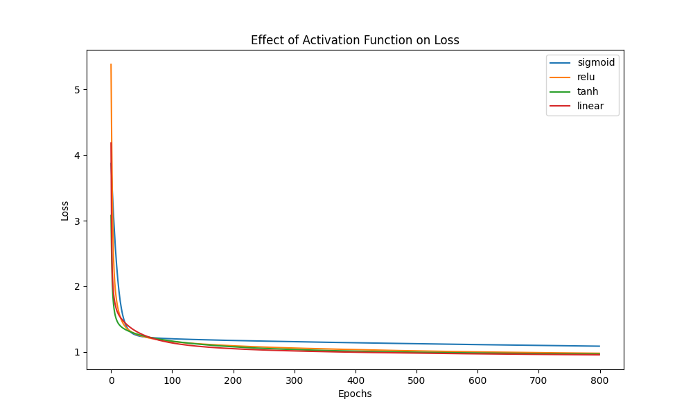
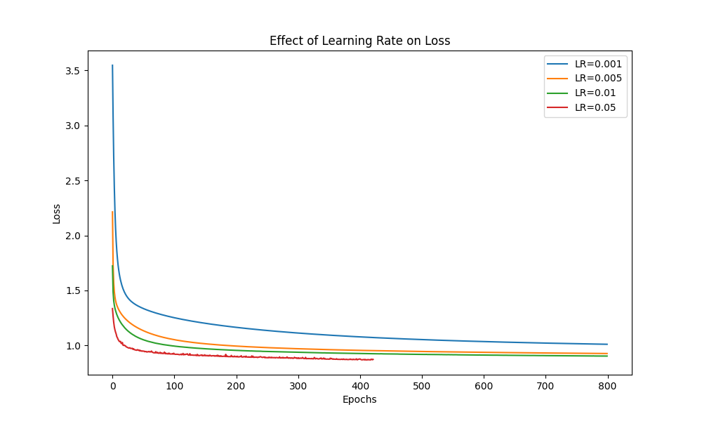
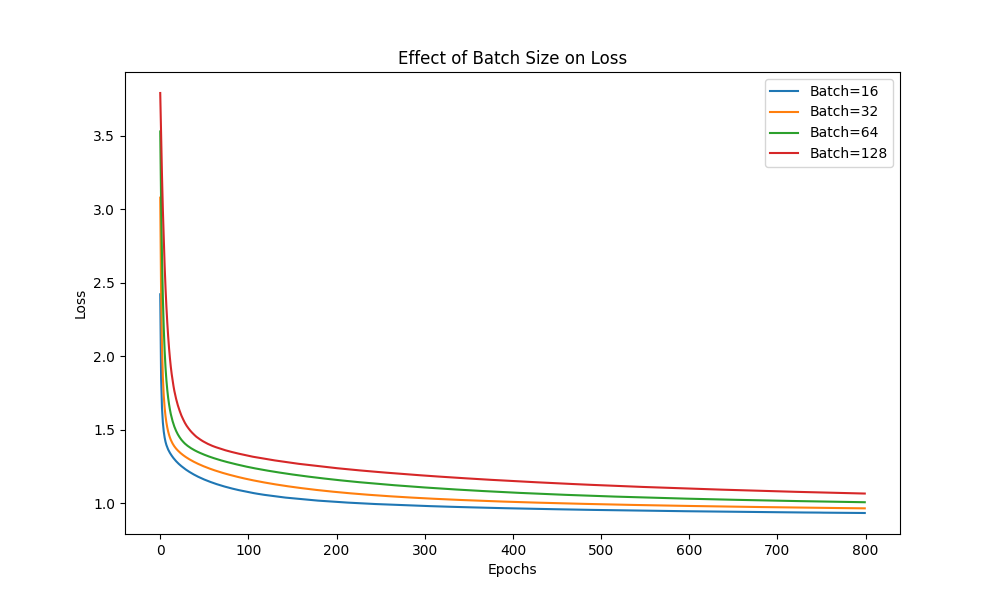

### 1. Effect of Non-linearity (Activation Functions):
   **(Activation functions tested: Sigmoid, ReLU, Tanh, Linear)**
   
   - **Sigmoid and Tanh**: These two functions show very similar patterns. Both achieve faster convergence in the initial epochs but plateau around a loss of 1.0 after around 100 epochs. The "S-shaped" curve characteristic of sigmoid and tanh helps in non-linearity, allowing the model to adjust weights efficiently in the beginning, but both suffer from diminishing gradients as training progresses, leading to slower updates later.
   - **ReLU**: This function shows slower initial convergence compared to Tanh and Sigmoid, as seen in the higher loss at the start. However, ReLU tends to achieve a lower overall loss after about 200 epochs. This indicates that ReLU avoids the vanishing gradient problem more effectively, especially over longer training sessions.
   - **Linear**: Although usually not ideal for deep networks because they lack the ability to capture non-linear patterns, essential for most complex tasks. for this dataset, the linear activation performs comparably to other non-linear functions

   **Observation**: Non-linear activations (Sigmoid, Tanh, ReLU) lead to faster and more effective learning. ReLU appears to perform better over extended training.

### 2. Effect of Learning Rate:
   **(Learning rates tested: 0.001, 0.005, 0.01, 0.05)**
   
   - **LR = 0.001**: Shows the slowest convergence, with a gradual decrease in loss. The model does not fully converge even after 800 epochs, indicating that a lower learning rate results in more stable but slower learning.
   - **LR = 0.005 and 0.01**: Both of these learning rates show similar behavior. They converge more quickly compared to 0.001 and reach a minimum loss earlier (around 200-300 epochs). However, LR = 0.01 converges slightly faster and to a lower loss than LR = 0.005.
   - **LR = 0.05**: This learning rate converges very quickly, but there is more volatility in the loss curve, which suggests that the model is overshooting the optimal solution. After around 100 epochs, the loss instability leads to early stopping. 
   **Observation**: Higher learning rates (like 0.05) converge faster but may lead to instability and overshooting. Moderate learning rates (0.01) seem to offer the best balance of convergence speed and stability. A very low learning rate (0.001) results in slow convergence, requiring significantly more epochs to reach optimal performance.

### 3. Effect of Batch Size:
   **(Batch sizes tested: 16, 32, 64, 128)**
   
   - **Batch size 16**: The smallest batch size converges the fastest, as smaller batches allow more frequent updates to the weights. However, the smaller batch size also results in noisier convergence, with fluctuations in the loss curve during the early stages of training.
   - **Batch size 32**: Offers a balanced performance, converging quickly with more stability than batch size 16. The model reaches a low loss with less noise compared to batch size 16, making it a good compromise between frequency of updates and stability.
   - **Batch size 64**: Slightly slower convergence than batch size 32, but the curve is more stable with fewer fluctuations. The larger batch size reduces the variance in weight updates, contributing to more stable but slower learning.
   - **Batch size 128**: This results in the slowest convergence. While the loss curve is the smoothest, it takes much longer to reach a similar loss compared to smaller batch sizes. The reduced number of updates per epoch with this larger batch size contributes to this slower convergence.

   **Observation**: Smaller batch sizes (16, 32) lead to faster convergence but with more noise, whereas larger batch sizes (64, 128) smooth out the learning but slow down the convergence. Batch size 32 appears to be the best compromise between convergence speed and stability.

## 2.6 Multi-Label Classification

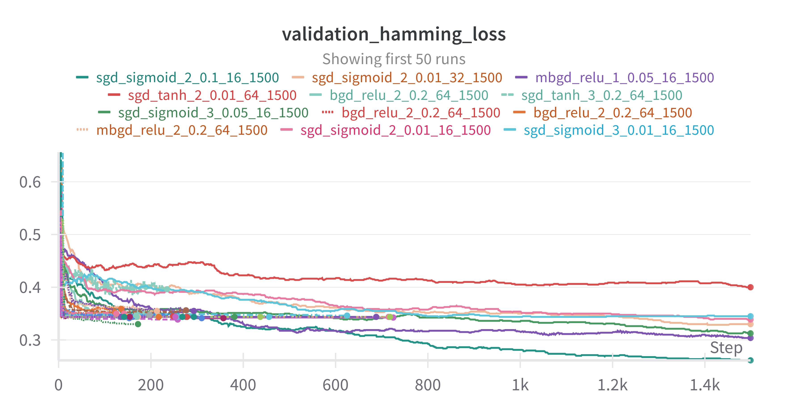

<details>
  <summary>View Table</summary>

| Activation   |   Batch Size | Hidden Layers   | Optimizer   |   Learning Rate |   Max Epochs |   Validation Accuracy |   Epoch |   F1 Score |   Precision |   Recall |   Hamming Accuracy |   Hamming Loss |
|:-------------|-------------:|:----------------|:------------|----------------:|-------------:|----------------------:|--------:|-----------:|------------:|---------:|-------------------:|---------------:|
| sigmoid      |           16 | [128,64]        | sgd         |            0.1  |         1500 |                  0.11 |    1500 |   0.692005 |    0.727483 | 0.659827 |            0.73875 |        0.26125 |
| sigmoid      |           32 | [128,64]        | sgd         |            0.01 |         1500 |                  0.06 |    1500 |   0.593874 |    0.618561 | 0.571082 |            0.67    |        0.33    |
| relu         |           16 | [128]           | mbgd        |            0.05 |         1500 |                  0.05 |    1500 |   0.664255 |    0.663834 | 0.664675 |            0.69625 |        0.30375 |
| tanh         |           64 | [64,64]         | sgd         |            0.01 |         1500 |                  0.05 |    1500 |   0.552861 |    0.553342 | 0.552381 |            0.6     |        0.4     |
| relu         |           64 | [128,64]        | bgd         |            0.2  |         1500 |                  0.02 |     217 |   0.563987 |    0.583624 | 0.545628 |            0.6525  |        0.3475  |
| tanh         |           64 | [64,64,32]      | sgd         |            0.2  |         1500 |                  0.01 |     236 |   0.539263 |    0.540961 | 0.537576 |            0.59875 |        0.40125 |
| sigmoid      |           16 | [64,64,32]      | sgd         |            0.05 |         1500 |                  0.01 |    1500 |   0.617054 |    0.656833 | 0.581818 |            0.6875  |        0.3125  |
| relu         |           64 | [64,32]         | bgd         |            0.2  |         1500 |                  0.01 |     249 |   0.542047 |    0.580128 | 0.508658 |            0.65625 |        0.34375 |
| relu         |           64 | [64,32]         | bgd         |            0.2  |         1500 |                  0.01 |     137 |   0.506441 |    0.510522 | 0.502424 |            0.64125 |        0.35875 |
| relu         |           64 | [128,64]        | mbgd        |            0.2  |         1500 |                  0.01 |     214 |   0.533115 |    0.549813 | 0.517403 |            0.645   |        0.355   |
| sigmoid      |           16 | [64,32]         | sgd         |            0.01 |         1500 |                  0.01 |    1500 |   0.562842 |    0.605957 | 0.525455 |            0.66125 |        0.33875 |
| sigmoid      |           16 | [64,64,32]      | sgd         |            0.01 |         1500 |                  0.01 |    1500 |   0.528458 |    0.55617  | 0.503377 |            0.655   |        0.345   |
| relu         |           64 | [64,64,32]      | mbgd        |            0.1  |         1500 |                  0    |     198 |   0.460169 |    0.427673 | 0.498009 |            0.6525  |        0.3475  |
| relu         |           16 | [64,64,32]      | bgd         |            0.05 |         1500 |                  0    |     294 |   0.523973 |    0.538203 | 0.510476 |            0.645   |        0.355   |
| relu         |           64 | [128,64]        | mbgd        |            0.2  |         1500 |                  0    |     143 |   0.497065 |    0.494672 | 0.499481 |            0.64875 |        0.35125 |
| relu         |           64 | [64,64,32]      | mbgd        |            0.2  |         1500 |                  0    |     169 |   0.396226 |    0.328125 | 0.5      |            0.65625 |        0.34375 |
| relu         |           64 | [64,64,32]      | mbgd        |            0.2  |         1500 |                  0    |     155 |   0.396226 |    0.328125 | 0.5      |            0.65625 |        0.34375 |
| relu         |           64 | [128,64]        | sgd         |            0.2  |         1500 |                  0    |     173 |   0.592377 |    0.67356  | 0.528658 |            0.67    |        0.33    |
| relu         |           64 | [64,32]         | sgd         |            0.2  |         1500 |                  0    |     358 |   0.626584 |    0.828947 | 0.503636 |            0.65875 |        0.34125 |
| relu         |           64 | [128,64]        | sgd         |            0.2  |         1500 |                  0    |     726 |   0.554182 |    0.614844 | 0.504416 |            0.6575  |        0.3425  |
| relu         |           64 | [128,64]        | bgd         |            0.2  |         1500 |                  0    |     173 |   0.396226 |    0.328125 | 0.5      |            0.65625 |        0.34375 |
| relu         |           64 | [64,64,32]      | bgd         |            0.1  |         1500 |                  0    |     277 |   0.396226 |    0.328125 | 0.5      |            0.65625 |        0.34375 |
| relu         |           64 | [64,64,32]      | bgd         |            0.2  |         1500 |                  0    |     457 |   0.396226 |    0.328125 | 0.5      |            0.65625 |        0.34375 |
| relu         |           64 | [64,64,32]      | mbgd        |            0.2  |         1500 |                  0    |     170 |   0.396226 |    0.328125 | 0.5      |            0.65625 |        0.34375 |
| relu         |           64 | [64,64,32]      | mbgd        |            0.2  |         1500 |                  0    |     150 |   0.396226 |    0.328125 | 0.5      |            0.65625 |        0.34375 |
| relu         |           64 | [64,32]         | bgd         |            0.2  |         1500 |                  0    |     154 |   0.554256 |    0.603704 | 0.512294 |            0.65875 |        0.34125 |
| relu         |           64 | [64,64,32]      | mbgd        |            0.2  |         1500 |                  0    |     279 |   0.396226 |    0.328125 | 0.5      |            0.65625 |        0.34375 |
| relu         |           64 | [64,64,32]      | mbgd        |            0.2  |         1500 |                  0    |     294 |   0.396226 |    0.328125 | 0.5      |            0.65625 |        0.34375 |
| relu         |           64 | [64,64,32]      | mbgd        |            0.2  |         1500 |                  0    |     156 |   0.396226 |    0.328125 | 0.5      |            0.65625 |        0.34375 |
| relu         |           64 | [64,64,32]      | bgd         |            0.2  |         1500 |                  0    |     170 |   0.396226 |    0.328125 | 0.5      |            0.65625 |        0.34375 |
| relu         |           32 | [64,64,32]      | mbgd        |            0.1  |         1500 |                  0    |     382 |   0.396226 |    0.328125 | 0.5      |            0.65625 |        0.34375 |
| relu         |           64 | [64,64,32]      | bgd         |            0.2  |         1500 |                  0    |     218 |   0.396226 |    0.328125 | 0.5      |            0.65625 |        0.34375 |
| relu         |           64 | [64,64,32]      | mbgd        |            0.2  |         1500 |                  0    |     161 |   0.396226 |    0.328125 | 0.5      |            0.65625 |        0.34375 |
| relu         |           64 | [64,64,32]      | mbgd        |            0.2  |         1500 |                  0    |     716 |   0.396226 |    0.328125 | 0.5      |            0.65625 |        0.34375 |
| relu         |           64 | [128,64]        | mbgd        |            0.2  |         1500 |                  0    |     626 |   0.497277 |    0.494752 | 0.499827 |            0.65375 |        0.34625 |
| relu         |           64 | [64,32]         | bgd         |            0.2  |         1500 |                  0    |     259 |   0.591243 |    0.705177 | 0.509004 |            0.66125 |        0.33875 |
| relu         |           64 | [128,64]        | bgd         |            0.2  |         1500 |                  0    |     277 |   0.506855 |    0.511905 | 0.501905 |            0.64625 |        0.35375 |
| relu         |           64 | [64,64,32]      | mbgd        |            0.2  |         1500 |                  0    |     438 |   0.396226 |    0.328125 | 0.5      |            0.65625 |        0.34375 |
| relu         |           64 | [64,64,32]      | mbgd        |            0.2  |         1500 |                  0    |     136 |   0.396226 |    0.328125 | 0.5      |            0.65625 |        0.34375 |
| relu         |           64 | [64,64,32]      | bgd         |            0.2  |         1500 |                  0    |     169 |   0.47481  |    0.452889 | 0.498961 |            0.65375 |        0.34625 |
| relu         |           64 | [64,64,32]      | mbgd        |            0.2  |         1500 |                  0    |     155 |   0.396226 |    0.328125 | 0.5      |            0.65625 |        0.34375 |
| relu         |           64 | [64,64,32]      | mbgd        |            0.2  |         1500 |                  0    |     143 |   0.396226 |    0.328125 | 0.5      |            0.65625 |        0.34375 |
| relu         |           32 | [64,64,32]      | mbgd        |            0.1  |         1500 |                  0    |     258 |   0.396226 |    0.328125 | 0.5      |            0.65625 |        0.34375 |
| relu         |           64 | [64,32]         | sgd         |            0.2  |         1500 |                  0    |     311 |   0.553968 |    0.599463 | 0.514892 |            0.65875 |        0.34125 |
| relu         |           64 | [128,64]        | sgd         |            0.2  |         1500 |                  0    |     123 |   0.501177 |    0.502098 | 0.50026  |            0.6475  |        0.3525  |
| relu         |           64 | [64,64,32]      | mbgd        |            0.1  |         1500 |                  0    |     269 |   0.396226 |    0.328125 | 0.5      |            0.65625 |        0.34375 |
| relu         |           64 | [64,64,32]      | bgd         |            0.2  |         1500 |                  0    |     719 |   0.396226 |    0.328125 | 0.5      |            0.65625 |        0.34375 |
| relu         |           64 | [128,64]        | bgd         |            0.2  |         1500 |                  0    |     126 |   0.483723 |    0.470465 | 0.497749 |            0.64875 |        0.35125 |
| relu         |           64 | [64,64,32]      | bgd         |            0.2  |         1500 |                  0    |     689 |   0.396226 |    0.328125 | 0.5      |            0.65625 |        0.34375 |
| relu         |           64 | [64,64,32]      | mbgd        |            0.1  |         1500 |                  0    |     254 |   0.396226 |    0.328125 | 0.5      |            0.65625 |        0.34375 |
| relu         |           64 | [64,64,32]      | bgd         |            0.2  |         1500 |                  0    |     210 |   0.396226 |    0.328125 | 0.5      |            0.65625 |        0.34375 |
| tanh         |           16 | [64,64,32]      | bgd         |            0.05 |         1500 |                  0    |     970 |   0.532479 |    0.532836 | 0.532121 |            0.5825  |        0.4175  |
| relu         |           64 | [64,64,32]      | mbgd        |            0.2  |         1500 |                  0    |     167 |   0.396226 |    0.328125 | 0.5      |            0.65625 |        0.34375 |
| relu         |           64 | [128,64]        | sgd         |            0.2  |         1500 |                  0    |     241 |   0.488093 |    0.477848 | 0.498788 |            0.65125 |        0.34875 |
| relu         |           64 | [64,64,32]      | mbgd        |            0.2  |         1500 |                  0    |     163 |   0.396226 |    0.328125 | 0.5      |            0.65625 |        0.34375 |
| relu         |           64 | [64,64,32]      | mbgd        |            0.05 |         1500 |                  0    |     391 |   0.396226 |    0.328125 | 0.5      |            0.65625 |        0.34375 |
| relu         |           64 | [128,64]        | bgd         |            0.2  |         1500 |                  0    |     166 |   0.396226 |    0.328125 | 0.5      |            0.65625 |        0.34375 |
| relu         |           64 | [128,64]        | sgd         |            0.2  |         1500 |                  0    |     337 |   0.497277 |    0.494752 | 0.499827 |            0.65375 |        0.34625 |
| relu         |           64 | [64,64,32]      | mbgd        |            0.2  |         1500 |                  0    |     163 |   0.396226 |    0.328125 | 0.5      |            0.65625 |        0.34375 |
| relu         |           64 | [64,64,32]      | bgd         |            0.2  |         1500 |                  0    |     152 |   0.396226 |    0.328125 | 0.5      |            0.65625 |        0.34375 |
| relu         |           64 | [128,64]        | mbgd        |            0.2  |         1500 |                  0    |     122 |   0.542629 |    0.580334 | 0.509524 |            0.65625 |        0.34375 |
| relu         |           64 | [64,64,32]      | mbgd        |            0.1  |         1500 |                  0    |     245 |   0.396226 |    0.328125 | 0.5      |            0.65625 |        0.34375 |
| relu         |           64 | [64,64,32]      | bgd         |            0.2  |         1500 |                  0    |     473 |   0.396226 |    0.328125 | 0.5      |            0.65625 |        0.34375 |
| relu         |           64 | [64,64,32]      | mbgd        |            0.1  |         1500 |                  0    |     283 |   0.396226 |    0.328125 | 0.5      |            0.65625 |        0.34375 |

</details>

3. To assess the performance of the best model identified through hyperparameter tuning, evaluate it on the test set and report the metrics as outlined above

| Parameter                   | Value        |
|-----------------------------|--------------|
| Activation                  | sigmoid      |
| Batch Size                  | 16           |
| Hidden Layers               | [128, 64]    |
| Learning Rate               | 0.1          |
| Max Epochs                  | 1500         |
| Optimizer                   | sgd          |

On test set,

| Metric           | Value                          |
|------------------|--------------------------------|
| Accuracy         | 0.07                           |
| Precision        | 0.689729222513694              |
| Recall           | 0.6378038179033538             |
| F1 Score         | 0.6627510096480106             |
| Hamming Loss     | 0.2925                         |
| Hamming Accuracy | 0.7075                         |

## 2.7 Analysis

### Single lbel classifiction

True:
[2 3 3 3 3 3 4 3 5 1 3 3 2 3 2 2 3 3 3 3 2 2 2 3 3 3 3 3 3 4 3 2 3 3 2 2 3
 2 3 3 1 2 3 1 3 2 2 3 4 2 3 4 2 2 4 4 4 3 3 2 2 3 2 3 5 2 2 3 3 5 2 2 3 2
 3 2 2 2 3 3 2 4 3 2 3 2 2 3 3 2 4 2 2 3 3 2 2 2 0 2 3 2 0 3 2 3 3 2 3 3 2
 1 4 4 3] 

Predicted:
[2 3 4 2 3 2 3 3 3 2 3 3 2 3 2 2 3 3 3 3 2 2 2 2 3 3 2 2 3 3 3 2 3 3 3 3 3
 2 3 3 2 2 2 3 3 2 2 3 3 3 3 4 3 3 3 3 4 3 2 2 3 2 2 3 3 2 3 3 2 4 2 2 3 2
 2 2 2 2 3 3 2 3 3 2 3 2 2 3 2 2 3 2 3 2 3 2 2 2 2 2 3 2 2 3 2 3 3 2 3 2 2
 2 3 4 2]

## Class Distribution (Original → Adjusted)
0 → 3: Least frequent
5 → 8: Second least frequent
1 → 4: Third least frequent
4 → 7: Fourth most frequent
3 → 6: Second most frequent
2 → 5: Most frequent

## Class-wise Performance

### Class 3 
- Actual occurrences: 2
- Correct predictions: 0
- Accuracy: 0%

### Class 8 
- Actual occurrences: 3
- Correct predictions: 0
- Accuracy: 0%

### Class 4 
- Actual occurrences: 4
- Correct predictions: 0
- Accuracy: 0%

### Class 7 
- Actual occurrences: 8
- Correct predictions: 2
- Accuracy: 25%

### Class 6 
- Actual occurrences: 53
- Correct predictions: 37
- Accuracy: 69.81%

### Class 5
- Actual occurrences: 44
- Correct predictions: 30
- Accuracy: 68.18%

## Analysis

1. Best performing classes:
   - Class 6 (69.81% accuracy)
   - Class 5 (68.18% accuracy)
   
   These classes are also the two most frequent in the dataset, which  contributed to their better performance. The model had more examples to learn from, leading to more accurate predictions.

2. Moderate performing class:
   - Class 7 (25% accuracy)
   
   This class had fewer examples, which may have limited the model's ability to learn its characteristics effectively.

3. Worst performing classes:
   - Classes 3, 8, and 4 (0% accuracy)
   
   These classes had very few examples in the dataset, which severely limited the model's ability to learn and predict them accurately. The model likely defaulted to predicting the more common classes instead.

4. Overall trends:
   - The model's performance strongly correlates with the frequency of classes in the dataset.
   - There's a clear imbalance in the dataset, with classes 5 and 6 dominating.
   - The model struggles with rare classes, failing to predict them at all.


### Performance on Multi-Label Classification:
In the multi-label scenario, where the target is a multi-hot encoded vector of length 8, there are a few patterns to note:
1. **Class Confusion and Overlap:**
   - If there are overlapping labels in the multi-label output (i.e., one data point belongs to multiple classes), the model might find it difficult to distinguish between those classes, leading to higher classification errors.
   
2. **Rare Labels:**
   - Labels that rarely appear together may not be learned well by the model. If there are labels that occur in only a few instances, the MLP may not get enough data during training to learn how to associate those labels correctly.

### Potential Reasons for Class Performance:
1. **Class Imbalance:**
   - If the dataset has an imbalanced distribution of classes (as you hinted with Classes 4 and 5 being rare), the model is likely biased toward predicting the majority class. This could explain why your MLP frequently predicts Class 2 or Class 3 and performs poorly on Classes 0, 1, 4, and 5.

2. **Complexity of Features:**
   - If certain classes have more complex or overlapping features with other classes, the MLP might have a harder time distinguishing between them, especially if it's not deep enough to capture intricate patterns in the data.

3. **Training Data Limitations:**
   - If some classes are underrepresented in the dataset or have less distinguishing features compared to others, the model will naturally perform poorly on those classes. You might need to look at adding more training data for the underperforming classes or using techniques like SMOTE to generate synthetic examples.

### Next Steps:
- **Confusion Matrix:** It would help to create a confusion matrix to better visualize where the model is making classification errors. This would give you a clear picture of which specific classes are getting confused with each other.
- **Class Balancing Techniques:** Consider oversampling the underrepresented classes or using a weighted loss function to give more importance to the minority classes during training.
- **Further Model Tuning:** Adjusting the architecture of your MLP (e.g., more layers or neurons) or trying different activation functions could improve the model's ability to capture more complex relationships between classes.

Would you like help generating a confusion matrix or implementing any of these techniques?

### Multi-label Classification Analysis

Predictions [['beauty', 'books', 'home'], ['beauty'], ['clothing'], ['clothing', 'food'], ['sports'], ['electronics'], ['clothing', 'food'], ['books', 'electronics', 'sports'], ['beauty', 'clothing'], ['books', 'electronics'], ['books', 'home'], ['beauty', 'books', 'food'], ['furniture'], ['books', 'furniture', 'home'], ['home'], ['beauty'], ['food', 'furniture'], ['food', 'sports'], ['food'], ['books', 'home'], ['clothing'], ['clothing', 'furniture', 'home', 'sports'], ['beauty'], ['electronics'], ['books', 'clothing'], ['furniture'], ['books'], ['electronics', 'home'], ['electronics', 'furniture'], ['sports'], ['books'], ['sports'], ['beauty', 'furniture', 'sports'], ['furniture'], ['beauty'], ['food', 'home'], ['beauty'], ['sports'], ['books', 'home'], ['food', 'furniture', 'home'], ['clothing', 'sports'], ['sports'], ['home'], ['furniture', 'sports'], ['food', 'home'], ['beauty', 'books', 'clothing', 'sports'], ['beauty'], ['beauty'], ['beauty', 'food'], ['clothing'], ['books', 'electronics', 'sports'], ['beauty', 'food'], ['electronics'], ['beauty', 'clothing'], ['beauty', 'clothing', 'food'], ['electronics'], ['food', 'sports'], ['electronics'], ['books', 'home'], ['electronics', 'food', 'home'], ['home', 'sports'], ['beauty'], ['clothing', 'sports'], ['clothing', 'food'], ['beauty'], ['furniture'], ['clothing'], ['clothing'], ['books', 'food', 'furniture'], ['beauty', 'books'], ['books', 'food', 'home'], ['home'], ['clothing', 'electronics'], ['beauty', 'food'], ['clothing'], ['beauty', 'clothing'], ['food', 'furniture'], ['electronics', 'home'], ['beauty'], ['beauty'], ['sports'], ['sports'], ['sports'], ['clothing', 'food'], ['beauty', 'electronics'], ['books', 'home'], ['sports'], ['beauty', 'books'], ['furniture'], ['clothing', 'electronics', 'sports'], ['books', 'home'], ['food', 'furniture'], ['books', 'electronics'], ['beauty'], ['electronics'], ['food'], ['furniture'], ['books', 'electronics'], ['books', 'food'], ['books', 'electronics']]


Actual [['beauty', 'books', 'home'], ['beauty'], ['clothing'], ['clothing', 'food'], ['sports'], ['electronics'], ['clothing', 'food'], ['books', 'electronics', 'sports'], ['beauty', 'clothing'], ['books', 'electronics'], ['books', 'home'], ['beauty', 'books', 'food'], ['furniture'], ['books', 'furniture', 'home'], ['home'], ['beauty'], ['food', 'furniture'], ['food', 'sports'], ['food'], ['books', 'home'], ['clothing'], ['clothing', 'furniture', 'home', 'sports'], ['beauty'], ['electronics'], ['books', 'clothing'], ['furniture'], ['books'], ['electronics', 'home'], ['electronics', 'furniture'], ['sports'], ['books'], ['sports'], ['beauty', 'furniture', 'sports'], ['furniture'], ['beauty'], ['food', 'home'], ['beauty'], ['sports'], ['books', 'home'], ['food', 'furniture', 'home'], ['clothing', 'sports'], ['sports'], ['home'], ['furniture', 'sports'], ['food', 'home'], ['beauty', 'books', 'clothing', 'sports'], ['beauty'], ['beauty'], ['beauty', 'food'], ['clothing'], ['books', 'electronics', 'sports'], ['beauty', 'food'], ['electronics'], ['beauty', 'clothing'], ['beauty', 'clothing', 'food'], ['electronics'], ['food', 'sports'], ['electronics'], ['books', 'home'], ['electronics', 'food', 'home'], ['home', 'sports'], ['beauty'], ['clothing', 'sports'], ['clothing', 'food'], ['beauty'], ['furniture'], ['clothing'], ['clothing'], ['books', 'food', 'furniture'], ['beauty', 'books'], ['books', 'food', 'home'], ['home'], ['clothing', 'electronics'], ['beauty', 'food'], ['clothing'], ['beauty', 'clothing'], ['food', 'furniture'], ['electronics', 'home'], ['beauty'], ['beauty'], ['sports'], ['sports'], ['sports'], ['clothing', 'food'], ['beauty', 'electronics'], ['books', 'home'], ['sports'], ['beauty', 'books'], ['furniture'], ['clothing', 'electronics', 'sports'], ['books', 'home'], ['food', 'furniture'], ['books', 'electronics'], ['beauty'], ['electronics'], ['food'], ['furniture'], ['books', 'electronics'], ['books', 'food'], ['books', 'electronics'], ['beauty', 'food', 'home', 'sports'], ['beauty', 'furniture', 'home', 'sports'], ['clothing', 'food', 'furniture', 'home'], ['beauty', 'clothing', 'furniture'], ['sports'], ['electronics', 'food'], ['food', 'furniture'], ['beauty', 'books', 'home', 'sports'], ['beauty', 'books', 'furniture'], ['beauty', 'clothing', 'electronics', 'food', 'home', 'sports'], ['beauty', 'books', 'clothing', 'sports'], ['beauty', 'sports'], ['clothing', 'electronics', 'furniture', 'sports'], ['home'], ['home'], ['beauty', 'electronics', 'furniture'], ['clothing', 'electronics', 'food', 'furniture', 'sports'], ['food'], ['beauty', 'clothing', 'electronics', 'food'], ['beauty', 'food', 'home', 'sports'], ['clothing'], ['books', 'home'], ['beauty', 'electronics'], ['books', 'electronics'], ['books', 'clothing', 'furniture'], ['beauty', 'electronics', 'furniture'], ['books', 'clothing', 'electronics'], ['food', 'home'], ['clothing', 'electronics', 'home'], ['furniture', 'sports'], ['books', 'clothing'], ['sports'], ['clothing', 'sports'], ['beauty', 'furniture', 'sports'], ['beauty', 'furniture'], ['books', 'home', 'sports'], ['beauty', 'food', 'sports'], ['sports'], ['beauty', 'books'], ['electronics', 'food', 'home'], ['clothing', 'food', 'furniture'], ['clothing', 'furniture', 'home', 'sports'], ['books', 'clothing', 'electronics', 'home'], ['clothing', 'electronics', 'home', 'sports'], ['clothing', 'home', 'sports'], ['clothing', 'electronics', 'furniture', 'sports'], ['beauty'], ['beauty', 'books'], ['beauty', 'home'], ['clothing', 'food'], ['books'], ['beauty', 'books', 'clothing', 'furniture', 'home'], ['clothing', 'electronics', 'furniture', 'home'], ['clothing', 'electronics', 'home'], ['food', 'home'], ['beauty', 'clothing', 'electronics', 'home'], ['food'], ['beauty', 'electronics'], ['clothing', 'food', 'home'], ['beauty', 'food', 'home'], ['beauty', 'books', 'clothing', 'food', 'sports'], ['beauty', 'clothing', 'home'], ['beauty', 'books', 'sports'], ['clothing'], ['beauty', 'home', 'sports'], ['beauty', 'books', 'electronics', 'furniture', 'home'], ['beauty', 'clothing', 'food'], ['books', 'clothing', 'food', 'furniture', 'home'], ['books', 'electronics', 'food', 'sports'], ['beauty', 'furniture', 'sports'], ['beauty', 'food'], ['beauty', 'home', 'sports'], ['books', 'clothing', 'sports'], ['electronics', 'food', 'home', 'sports'], ['beauty', 'clothing', 'electronics'], ['clothing', 'furniture'], ['beauty', 'books', 'furniture', 'sports'], ['clothing', 'electronics', 'furniture', 'home'], ['beauty', 'food', 'furniture', 'home'], ['beauty', 'clothing'], ['books', 'electronics', 'food', 'home', 'sports'], ['books', 'sports'], ['electronics', 'home', 'sports'], ['food', 'furniture'], ['beauty'], ['books', 'clothing', 'electronics', 'food'], ['electronics', 'sports'], ['beauty'], ['beauty', 'books', 'furniture'], ['clothing'], ['books', 'furniture', 'sports'], ['books', 'electronics', 'furniture', 'sports'], ['books', 'electronics', 'home'], ['beauty', 'clothing', 'electronics', 'food'], ['electronics', 'food', 'sports'], ['books', 'food'], ['beauty', 'clothing', 'food', 'furniture'], ['books', 'electronics'], ['beauty', 'books', 'clothing', 'food', 'home'], ['beauty', 'books', 'clothing', 'furniture']]

1. Beauty
   - Generally good performance
   - Often correctly identified
   - Some false negatives (missed classifications)

2. Books
   - Moderate performance
   - Some accurate predictions, but also misses

3. Clothing
   - Mixed performance
   - Some accurate predictions, but also misses and false positives

4. Electronics
   - Good performance
   - Often correctly identified when present
   - Few false positives

5. Food
   - Moderate performance
   - Some accurate predictions, but also misses

6. Furniture
   - Poor performance
   - Often missed or incorrectly predicted

7. Home
   - Moderate performance
   - Some accurate predictions, but also misses

8. Sports
   - Good performance
   - Often correctly identified when present
   - Few false positives

1. Best performing classes:
   - Electronics and Sports
   - Reason: These categories might have more distinct features or patterns that the model can easily recognize.

2. Worst performing class:
   - Furniture
   - Reason: This category might have overlapping features with other categories (e.g., Home) or might not have enough distinct characteristics for the model to learn.

3. Moderate performing classes:
   - Books, Clothing, Food, and Home
   - These categories might have some distinct features but also share similarities with other categories, making classification more challenging.

4. Beauty category:
   - Good performance overall, but with some missed classifications
   - This could be due to its potential overlap with other categories like Clothing or Home

#### Exact Matches

1. ['beauty']
2. ['clothing']
3. ['sports']
4. ['electronics']
5. ['furniture']
6. ['books']
7. ['home']
8. ['food']
9. ['books', 'electronics']
10. ['clothing', 'food']

These exact matches demonstrate that the model correctly predicts single-label instances much more often, and 2 label instances at maximum. Beyond 3 labels, the predictions never match exactly.

- Accuracy: 0.07 (This seems low, but it's for exact matches across all labels, which is challenging in multi-label classification)
- Precision: 0.6897 (About 69% of predicted labels are correct)
- Recall: 0.6378 (About 64% of actual labels are correctly predicted)
- F1 Score: 0.6628 
- Hamming Accuracy: 0.7075 (About 71% of individual label predictions are correct)

These metrics suggest that while the model struggles with exact matches across all labels (low accuracy), it performs reasonably well in predicting individual labels (higher Hamming Accuracy, Precision, and Recall).


## 3.1 Data Preprocessing

| Attribute   |       Mean |   Standard Deviation |       Min |      Max |
|:------------|-----------:|---------------------:|----------:|---------:|
| CRIM        |   3.55973  |             8.65049  |   0.00632 |  88.9762 |
| ZN          |  11.0425   |            23.2138   |   0       | 100      |
| INDUS       |  11.856    |            18.3705   |   0.46    | 391      |
| CHAS        |   0.107692 |             0.896361 |   0       |  19.2    |
| NOX         |   1.32609  |            17.4654   |   0.385   | 396.9    |
| RM          |   6.29777  |             0.757256 |   3.561   |  12.92   |
| AGE         |  68.5609   |            27.895    |   2.9     | 100      |
| DIS         |   3.77586  |             2.09562  |   1.1296  |  12.1265 |
| RAD         |   9.45224  |             8.68252  |   1       |  24      |
| TAX         | 406.852    |           167.748    | 187       | 711      |
| PTRATIO     |  18.4832   |             2.16296  |  12.6     |  22      |
| B           | 357.204    |            90.6927   |   0.32    | 396.9    |
| LSTAT       |  12.6793   |             7.12381  |   1.73    |  37.97   |
| MEDV        |  22.4887   |             9.14391  |   5       |  50      |

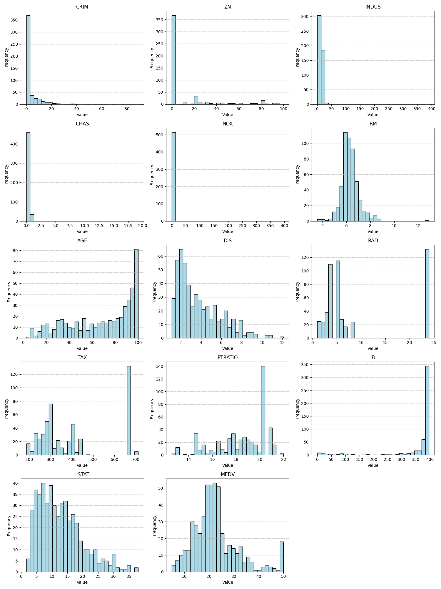

Normalized, standardized and partitioned in dat/interim/Housing

## 3.3 Model Training & Hyperparameter Tuning using W&B

1. Plot the trend of loss values (MSE) with change in these hyperparameters
using W&B. 

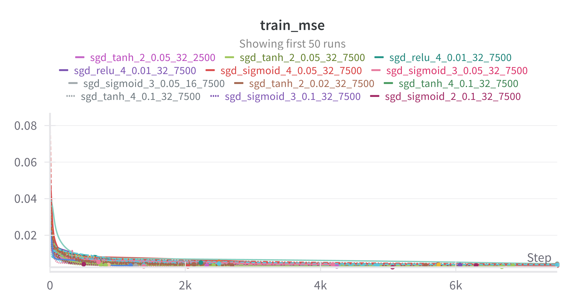

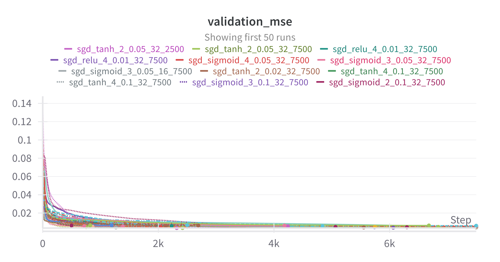


2. Generate a table listing all the hyperparameters tested and their corre-
sponding metrics mentioned above.

<details>
  <summary>View Table</summary>

| Activation   |   Batch Size | Hidden Layers   | Optimizer   |   Learning Rate |   Max Epochs |   Epoch |    Validation MAE |   Validation R2 |   Validation RMSE |   Validation MSE |
|:-------------|-------------:|:----------------|:------------|----------------:|-------------:|--------:|------------------:|----------------:|------------------:|-----------------:|
| tanh         |           32 | [8,8]           | sgd         |           0.05  |         2500 |    2319 |      0.0461126    |    0.937644     |      0.0594282    |     0.00353171   |
| tanh         |           32 | [8,8]           | sgd         |           0.05  |         7500 |    2419 |      0.0460064    |    0.937358     |      0.0595647    |     0.00354795   |
| relu         |           32 | [8,8,8,8]       | sgd         |           0.01  |         7500 |    6064 |      0.0480955    |    0.92985      |      0.063033     |     0.00397315   |
| relu         |           32 | [8,8,8,8]       | sgd         |           0.01  |         7500 |    6064 |      0.0480955    |    0.92985      |      0.063033     |     0.00397315   |
| sigmoid      |           32 | [8,8,8,8]       | sgd         |           0.05  |         7500 |    7500 |      0.0513998    |    0.926452     |      0.0645416    |     0.00416561   |
| sigmoid      |           32 | [8,8,8]         | sgd         |           0.05  |         7500 |    7500 |      0.050345     |    0.926311     |      0.0646034    |     0.00417359   |
| sigmoid      |           16 | [8,8,8]         | sgd         |           0.05  |         7500 |    7500 |      0.050345     |    0.926311     |      0.0646034    |     0.00417359   |
| tanh         |           32 | [8,8]           | sgd         |           0.02  |         7500 |    5553 |      0.0520869    |    0.926238     |      0.0646356    |     0.00417775   |
| tanh         |           32 | [8,8,8,8]       | sgd         |           0.1   |         7500 |    1267 |      0.0515471    |    0.92571      |      0.0648664    |     0.00420765   |
| tanh         |           32 | [8,8,8,8]       | sgd         |           0.1   |         7500 |    1267 |      0.0515471    |    0.92571      |      0.0648664    |     0.00420765   |
| sigmoid      |           32 | [8,8,8]         | sgd         |           0.1   |         7500 |    5740 |      0.0514562    |    0.922166     |      0.0663955    |     0.00440836   |
| sigmoid      |           32 | [8,8]           | sgd         |           0.1   |         7500 |    6300 |      0.0517871    |    0.92177      |      0.0665642    |     0.0044308    |
| sigmoid      |           32 | [16,16]         | sgd         |           0.01  |         7500 |    7500 |      0.0510006    |    0.919047     |      0.0677129    |     0.00458504   |
| tanh         |           32 | [16,8]          | sgd         |           0.1   |         7500 |     752 |      0.0526153    |    0.91895      |      0.0677534    |     0.00459052   |
| tanh         |           16 | [16]            | sgd         |           0.02  |         2500 |    2500 |      0.0547531    |    0.91753      |      0.0683443    |     0.00467094   |
| sigmoid      |           32 | [8,8,8,8]       | sgd         |           0.02  |         7500 |    7500 |      0.0546192    |    0.916942     |      0.0685876    |     0.00470426   |
| sigmoid      |           32 | [16]            | sgd         |           0.05  |         7500 |    6844 |      0.049476     |    0.914889     |      0.0694303    |     0.00482057   |
| tanh         |           32 | [8,16]          | sgd         |           0.02  |         7500 |    5065 |      0.0499408    |    0.914763     |      0.0694814    |     0.00482767   |
| sigmoid      |           32 | [16,16]         | sgd         |           0.02  |         7500 |    5746 |      0.052962     |    0.913447     |      0.0700156    |     0.00490219   |
| sigmoid      |           32 | [16,16]         | sgd         |           0.02  |         7500 |    5746 |      0.052962     |    0.913447     |      0.0700156    |     0.00490219   |
| sigmoid      |           32 | [16,16]         | sgd         |           0.02  |         7500 |    5746 |      0.052962     |    0.913447     |      0.0700156    |     0.00490219   |
| tanh         |           32 | [16,8]          | sgd         |           0.02  |         7500 |    2040 |      0.0516722    |    0.91168      |      0.0707269    |     0.0050023    |
| tanh         |           32 | [16,8]          | sgd         |           0.02  |         7500 |    2040 |      0.0516722    |    0.91168      |      0.0707269    |     0.0050023    |
| tanh         |           32 | [16,8]          | sgd         |           0.02  |         7500 |    2040 |      0.0516722    |    0.91168      |      0.0707269    |     0.0050023    |
| tanh         |           16 | [16,16]         | sgd         |           0.02  |         2500 |     864 |      0.0548346    |    0.910401     |      0.0712373    |     0.00507476   |
| sigmoid      |           16 | [16,8]          | sgd         |           0.02  |         7500 |    7500 |      0.0531579    |    0.908742     |      0.0718936    |     0.00516869   |
| sigmoid      |           32 | [8,8,8]         | sgd         |           0.02  |         7500 |    7500 |      0.0554361    |    0.907607     |      0.0723395    |     0.005233     |
| sigmoid      |           16 | [8,8,8]         | sgd         |           0.02  |         7500 |    7500 |      0.0554361    |    0.907607     |      0.0723395    |     0.005233     |
| relu         |           16 | [8,8]           | sgd         |           0.1   |         2500 |    1388 |      0.0560939    |    0.905185     |      0.0732814    |     0.00537016   |
| tanh         |           32 | [16,8]          | sgd         |           0.05  |         7500 |    1388 |      0.0534516    |    0.904908     |      0.0733883    |     0.00538584   |
| tanh         |           32 | [16,8]          | sgd         |           0.05  |         7500 |    1388 |      0.0534516    |    0.904908     |      0.0733883    |     0.00538584   |
| tanh         |           32 | [8,8,8]         | sgd         |           0.02  |         7500 |    4841 |      0.0591327    |    0.902523     |      0.074303     |     0.00552094   |
| tanh         |           32 | [8,16]          | sgd         |           0.01  |         7500 |    4242 |      0.0519698    |    0.901216     |      0.0747994    |     0.00559495   |
| tanh         |           32 | [16,16]         | sgd         |           0.005 |         7500 |    2130 |      0.0579976    |    0.896737     |      0.0764766    |     0.00584867   |
| relu         |           32 | [16]            | sgd         |           0.02  |         7500 |    2231 |      0.0557307    |    0.896106     |      0.0767097    |     0.00588438   |
| relu         |           16 | [8]             | sgd         |           0.2   |         2500 |     719 |      0.0606815    |    0.895799     |      0.0768231    |     0.00590179   |
| sigmoid      |           32 | [16]            | sgd         |           0.01  |         7500 |    7500 |      0.0582896    |    0.893764     |      0.0775696    |     0.00601704   |
| sigmoid      |           32 | [8,16]          | sgd         |           0.02  |         7500 |    7500 |      0.0546606    |    0.89337      |      0.0777133    |     0.00603935   |
| sigmoid      |           32 | [8,16]          | sgd         |           0.02  |         7500 |    7500 |      0.0546606    |    0.89337      |      0.0777133    |     0.00603935   |
| relu         |           32 | [8,8,8,8]       | sgd         |           0.05  |         7500 |    4183 |      0.0609699    |    0.891213     |      0.0784951    |     0.00616148   |
| relu         |           32 | [8,8,8,8]       | sgd         |           0.05  |         7500 |    4183 |      0.0609699    |    0.891213     |      0.0784951    |     0.00616148   |
| tanh         |           16 | [16,8]          | sgd         |           0.02  |          500 |     500 |      0.059436     |    0.888061     |      0.0796243    |     0.00634003   |
| relu         |           32 | [16,16]         | sgd         |           0.01  |         7500 |    6681 |      0.0583651    |    0.887694     |      0.0797548    |     0.00636083   |
| tanh         |           32 | [16,16]         | sgd         |           0.05  |         7500 |     822 |      0.0598779    |    0.884499     |      0.0808813    |     0.00654179   |
| tanh         |           32 | [16,16]         | sgd         |           0.05  |         7500 |     822 |      0.0598779    |    0.884499     |      0.0808813    |     0.00654179   |
| tanh         |           32 | [16,16]         | sgd         |           0.05  |         7500 |     822 |      0.0598779    |    0.884499     |      0.0808813    |     0.00654179   |
| sigmoid      |           32 | [16,8]          | sgd         |           0.02  |         2500 |    2500 |      0.0573432    |    0.882035     |      0.0817396    |     0.00668136   |
| tanh         |           32 | [8,16]          | sgd         |           0.05  |         7500 |    1193 |      0.0552786    |    0.881133     |      0.0820514    |     0.00673244   |
| tanh         |           32 | [8,16]          | sgd         |           0.05  |         7500 |    1193 |      0.0552786    |    0.881133     |      0.0820514    |     0.00673244   |
| tanh         |           16 | [16,8]          | mbgd        |           0.1   |         7500 |    2693 |      0.0591654    |    0.880645     |      0.0822198    |     0.00676009   |
| sigmoid      |           16 | [8,16]          | sgd         |           0.2   |          500 |     500 |      0.05988      |    0.880007     |      0.0824392    |     0.00679623   |
| tanh         |           32 | [16,8]          | sgd         |           0.05  |         2500 |     240 |      0.063303     |    0.877022     |      0.0834582    |     0.00696527   |
| tanh         |           32 | [8,8]           | sgd         |           0.01  |         2500 |    2500 |      0.061906     |    0.875604     |      0.083938     |     0.00704558   |
| sigmoid      |           32 | [8]             | sgd         |           0.05  |         2500 |    2500 |      0.0636818    |    0.874952     |      0.0841576    |     0.00708251   |
| tanh         |           32 | [8,8,8]         | sgd         |           0.01  |         7500 |    7500 |      0.0589475    |    0.871971     |      0.0851547    |     0.00725133   |
| tanh         |           32 | [8,16]          | sgd         |           0.01  |         2500 |    2500 |      0.0616249    |    0.871005     |      0.0854755    |     0.00730607   |
| tanh         |           16 | [16]            | mbgd        |           0.05  |         2500 |    2500 |      0.0608237    |    0.869617     |      0.0859342    |     0.00738469   |
| tanh         |           16 | [16,16]         | mbgd        |           0.1   |         2500 |     861 |      0.0620645    |    0.863578     |      0.0879018    |     0.00772673   |
| tanh         |           32 | [8]             | mbgd        |           0.2   |         7500 |    5185 |      0.0628693    |    0.863362     |      0.0879713    |     0.00773894   |
| sigmoid      |           16 | [16,8]          | sgd         |           0.1   |          500 |     500 |      0.0615492    |    0.861693     |      0.0885068    |     0.00783345   |
| sigmoid      |           16 | [8,8,8,8]       | sgd         |           0.01  |         7500 |    7500 |      0.0640906    |    0.860663     |      0.088836     |     0.00789184   |
| sigmoid      |           16 | [8,8,8,8]       | sgd         |           0.01  |         7500 |    7500 |      0.0640906    |    0.860663     |      0.088836     |     0.00789184   |
| relu         |           32 | [8,16]          | sgd         |           0.01  |         7500 |    2456 |      0.0674855    |    0.858294     |      0.0895879    |     0.008026     |
| tanh         |           16 | [16,8]          | sgd         |           0.01  |          500 |     500 |      0.0676046    |    0.857583     |      0.0898123    |     0.00806625   |
| tanh         |           16 | [16,8]          | sgd         |           0.01  |          500 |     500 |      0.0676046    |    0.857583     |      0.0898123    |     0.00806625   |
| tanh         |           32 | [8,8,8]         | mbgd        |           0.2   |         7500 |    3143 |      0.0653223    |    0.855328     |      0.0905206    |     0.00819398   |
| tanh         |           16 | [8,8]           | mbgd        |           0.05  |         7500 |    4642 |      0.067766     |    0.848317     |      0.0926881    |     0.00859108   |
| relu         |           32 | [16,8]          | sgd         |           0.01  |         2500 |    2500 |      0.0752193    |    0.832288     |      0.0974623    |     0.0094989    |
| sigmoid      |           16 | [8,8,8,8]       | sgd         |           0.02  |         2500 |    2500 |      0.0683339    |    0.828459     |      0.0985688    |     0.00971581   |
| sigmoid      |           32 | [8,8,8,8]       | sgd         |           0.02  |         2500 |    2500 |      0.0683339    |    0.828459     |      0.0985688    |     0.00971581   |
| relu         |           32 | [16,8]          | sgd         |           0.002 |         7500 |    7500 |      0.0710603    |    0.824638     |      0.0996605    |     0.00993221   |
| sigmoid      |           32 | [8,8,8]         | mbgd        |           0.1   |         7500 |    7500 |      0.0692585    |    0.823282     |      0.100045     |     0.010009     |
| relu         |           32 | [16]            | sgd         |           0.05  |         7500 |    2140 |      0.0757461    |    0.822787     |      0.100185     |     0.0100371    |
| tanh         |           32 | [8,8,8]         | sgd         |           0.02  |         2500 |    2500 |      0.0622458    |    0.821685     |      0.100496     |     0.0100995    |
| tanh         |           16 | [8,8]           | mbgd        |           0.01  |         7500 |    7500 |      0.0724671    |    0.820424     |      0.100851     |     0.0101709    |
| relu         |           16 | [8,8]           | sgd         |           0.05  |         7500 |     996 |      0.0647535    |    0.817427     |      0.101689     |     0.0103407    |
| relu         |           16 | [16]            | sgd         |           0.1   |         7500 |     385 |      0.0765482    |    0.812771     |      0.102977     |     0.0106043    |
| relu         |           16 | [8,8,8]         | sgd         |           0.01  |         7500 |    4739 |      0.0702395    |    0.806521     |      0.104682     |     0.0109583    |
| tanh         |           32 | [8]             | sgd         |           0.02  |          500 |     500 |      0.0737958    |    0.806327     |      0.104735     |     0.0109693    |
| sigmoid      |           16 | [16,16]         | mbgd        |           0.05  |         2500 |    2500 |      0.0748547    |    0.803112     |      0.1056       |     0.0111514    |
| relu         |           32 | [16,16]         | mbgd        |           0.01  |         7500 |    7244 |      0.0810775    |    0.800919     |      0.106187     |     0.0112756    |
| relu         |           32 | [16,16]         | mbgd        |           0.01  |         7500 |    7244 |      0.0810775    |    0.800919     |      0.106187     |     0.0112756    |
| tanh         |           16 | [8,8,8]         | sgd         |           0.05  |         2500 |     331 |      0.0690654    |    0.800662     |      0.106255     |     0.0112901    |
| relu         |           32 | [16,16]         | sgd         |           0.05  |          500 |     136 |      0.0713664    |    0.800609     |      0.106269     |     0.0112931    |
| relu         |           32 | [16,16]         | sgd         |           0.05  |          500 |     136 |      0.0713664    |    0.800609     |      0.106269     |     0.0112931    |
| relu         |           32 | [16,16]         | sgd         |           0.05  |          500 |     136 |      0.0713664    |    0.800609     |      0.106269     |     0.0112931    |
| relu         |           32 | [16,16]         | sgd         |           0.05  |         2500 |     176 |      0.069882     |    0.799983     |      0.106436     |     0.0113286    |
| relu         |           32 | [16,16]         | sgd         |           0.05  |         2500 |     176 |      0.069882     |    0.799983     |      0.106436     |     0.0113286    |
| relu         |           32 | [16,16]         | sgd         |           0.05  |         2500 |     176 |      0.069882     |    0.799983     |      0.106436     |     0.0113286    |
| tanh         |           32 | [8,8,8,8]       | sgd         |           0.2   |          500 |     111 |      0.0727645    |    0.798319     |      0.106878     |     0.0114229    |
| relu         |           32 | [16,16]         | sgd         |           0.05  |         7500 |     276 |      0.0685526    |    0.797603     |      0.107067     |     0.0114634    |
| relu         |           16 | [16,8]          | sgd         |           0.02  |         7500 |    1657 |      0.0748477    |    0.794448     |      0.107899     |     0.0116421    |
| relu         |           32 | [8]             | sgd         |           0.01  |         7500 |    3221 |      0.0679661    |    0.791886     |      0.108569     |     0.0117872    |
| relu         |           16 | [16]            | sgd         |           0.02  |          500 |     500 |      0.075892     |    0.789154     |      0.109279     |     0.0119419    |
| sigmoid      |           32 | [8,8,8,8]       | sgd         |           0.2   |          500 |     500 |      0.0723384    |    0.78749      |      0.10971      |     0.0120362    |
| relu         |           16 | [8,8]           | sgd         |           0.02  |         7500 |     873 |      0.07199      |    0.787483     |      0.109712     |     0.0120366    |
| relu         |           32 | [8,8]           | sgd         |           0.02  |         7500 |     873 |      0.07199      |    0.787483     |      0.109712     |     0.0120366    |
| tanh         |           32 | [8,8,8]         | sgd         |           0.2   |         2500 |     256 |      0.0723715    |    0.784372     |      0.110512     |     0.0122128    |
| tanh         |           16 | [8,8,8]         | sgd         |           0.2   |         2500 |     256 |      0.0723715    |    0.784372     |      0.110512     |     0.0122128    |
| tanh         |           32 | [8,8,8]         | sgd         |           0.2   |         2500 |     256 |      0.0723715    |    0.784372     |      0.110512     |     0.0122128    |
| tanh         |           32 | [8,8]           | bgd         |           0.1   |         7500 |    7500 |      0.0792142    |    0.782486     |      0.110994     |     0.0123196    |
| tanh         |           32 | [8,8,8,8]       | sgd         |           0.2   |         7500 |     251 |      0.0681317    |    0.782447     |      0.111004     |     0.0123218    |
| tanh         |           16 | [8,8,8,8]       | sgd         |           0.2   |         7500 |     251 |      0.0681317    |    0.782447     |      0.111004     |     0.0123218    |
| tanh         |           32 | [8,8,8,8]       | sgd         |           0.2   |         7500 |     251 |      0.0681317    |    0.782447     |      0.111004     |     0.0123218    |
| sigmoid      |           32 | [8,8,8,8]       | sgd         |           0.1   |          500 |     500 |      0.0758446    |    0.78237      |      0.111023     |     0.0123262    |
| relu         |           32 | [16]            | sgd         |           0.05  |         2500 |     425 |      0.0857435    |    0.780582     |      0.111479     |     0.0124275    |
| tanh         |           32 | [8,16]          | sgd         |           0.1   |         2500 |     118 |      0.091943     |    0.778147     |      0.112095     |     0.0125654    |
| tanh         |           32 | [8,8,8]         | sgd         |           0.05  |         7500 |     431 |      0.0738987    |    0.778078     |      0.112113     |     0.0125693    |
| tanh         |           32 | [8,8,8]         | sgd         |           0.05  |         7500 |     431 |      0.0738987    |    0.778078     |      0.112113     |     0.0125693    |
| tanh         |           32 | [8,8,8]         | sgd         |           0.05  |         7500 |     431 |      0.0738987    |    0.778078     |      0.112113     |     0.0125693    |
| relu         |           32 | [16,16]         | sgd         |           0.01  |          500 |     469 |      0.0752018    |    0.77626      |      0.112571     |     0.0126722    |
| relu         |           16 | [16,16]         | sgd         |           0.01  |         2500 |     509 |      0.0750159    |    0.775927     |      0.112655     |     0.0126911    |
| tanh         |           32 | [8,8,8]         | sgd         |           0.2   |         7500 |     356 |      0.076156     |    0.775197     |      0.112838     |     0.0127325    |
| relu         |           32 | [8,8,8,8]       | sgd         |           0.02  |         7500 |    1061 |      0.0680759    |    0.774938     |      0.112903     |     0.0127472    |
| relu         |           32 | [8,8,8,8]       | sgd         |           0.02  |         7500 |    1061 |      0.0680759    |    0.774938     |      0.112903     |     0.0127472    |
| relu         |           32 | [8,8,8,8]       | sgd         |           0.02  |         7500 |    1061 |      0.0680759    |    0.774938     |      0.112903     |     0.0127472    |
| relu         |           32 | [8,8]           | sgd         |           0.02  |         2500 |     451 |      0.0756736    |    0.774367     |      0.113046     |     0.0127794    |
| tanh         |           32 | [16,8]          | bgd         |           0.2   |         2500 |    2500 |      0.0863855    |    0.766225     |      0.115068     |     0.0132406    |
| relu         |           32 | [8,8,8,8]       | sgd         |           0.02  |         2500 |     740 |      0.0709203    |    0.7662       |      0.115074     |     0.013242     |
| relu         |           16 | [8,8,8,8]       | sgd         |           0.02  |         2500 |     740 |      0.0709203    |    0.7662       |      0.115074     |     0.013242     |
| relu         |           32 | [8,8,8,8]       | sgd         |           0.02  |         2500 |     740 |      0.0709203    |    0.7662       |      0.115074     |     0.013242     |
| relu         |           32 | [8,8,8,8]       | sgd         |           0.02  |         2500 |     740 |      0.0709203    |    0.7662       |      0.115074     |     0.013242     |
| sigmoid      |           32 | [8]             | sgd         |           0.05  |          500 |     500 |      0.077392     |    0.765619     |      0.115217     |     0.013275     |
| relu         |           32 | [8,8,8]         | sgd         |           0.02  |         2500 |     562 |      0.0675688    |    0.765569     |      0.115229     |     0.0132778    |
| relu         |           32 | [8,8,8]         | sgd         |           0.02  |         2500 |     562 |      0.0675688    |    0.765569     |      0.115229     |     0.0132778    |
| relu         |           32 | [8,8,8]         | sgd         |           0.1   |         2500 |     283 |      0.0736778    |    0.764402     |      0.115516     |     0.0133439    |
| relu         |           32 | [8,8,8]         | sgd         |           0.1   |         2500 |     283 |      0.0736778    |    0.764402     |      0.115516     |     0.0133439    |
| relu         |           32 | [8,8,8]         | sgd         |           0.1   |         2500 |     283 |      0.0736778    |    0.764402     |      0.115516     |     0.0133439    |
| relu         |           32 | [8,8,8]         | sgd         |           0.1   |         2500 |     283 |      0.0736778    |    0.764402     |      0.115516     |     0.0133439    |
| relu         |           32 | [8,8,8]         | sgd         |           0.1   |         2500 |     283 |      0.0736778    |    0.764402     |      0.115516     |     0.0133439    |
| relu         |           32 | [8,8,8]         | sgd         |           0.1   |         2500 |     283 |      0.0736778    |    0.764402     |      0.115516     |     0.0133439    |
| relu         |           32 | [8,8,8]         | sgd         |           0.1   |         2500 |     283 |      0.0736778    |    0.764402     |      0.115516     |     0.0133439    |
| relu         |           32 | [16]            | mbgd        |           0.1   |         2500 |    2086 |      0.0870119    |    0.763949     |      0.115627     |     0.0133695    |
| relu         |           16 | [16,8]          | sgd         |           0.05  |         7500 |    1313 |      0.0775177    |    0.761489     |      0.116228     |     0.0135088    |
| relu         |           32 | [8,8,8,8]       | sgd         |           0.02  |          500 |     429 |      0.076616     |    0.758047     |      0.117063     |     0.0137038    |
| relu         |           32 | [8,8,8,8]       | sgd         |           0.02  |          500 |     429 |      0.076616     |    0.758047     |      0.117063     |     0.0137038    |
| relu         |           32 | [8,8,8,8]       | sgd         |           0.02  |          500 |     429 |      0.076616     |    0.758047     |      0.117063     |     0.0137038    |
| relu         |           32 | [8,8,8,8]       | sgd         |           0.02  |          500 |     429 |      0.076616     |    0.758047     |      0.117063     |     0.0137038    |
| relu         |           32 | [8,8,8]         | sgd         |           0.02  |          500 |     358 |      0.0713102    |    0.755648     |      0.117642     |     0.0138397    |
| tanh         |           32 | [8,8,8,8]       | sgd         |           0.1   |          500 |     126 |      0.0769451    |    0.754267     |      0.117974     |     0.0139179    |
| relu         |           32 | [16,8]          | sgd         |           0.02  |          500 |     415 |      0.0878978    |    0.753145     |      0.118243     |     0.0139814    |
| sigmoid      |           32 | [8,8,8,8]       | sgd         |           0.02  |          500 |     500 |      0.081493     |    0.751351     |      0.118672     |     0.0140831    |
| tanh         |           32 | [16]            | bgd         |           0.05  |         7500 |    7500 |      0.0835878    |    0.751162     |      0.118717     |     0.0140937    |
| relu         |           32 | [8,16]          | mbgd        |           0.02  |         7500 |    6557 |      0.0776124    |    0.750964     |      0.118764     |     0.014105     |
| tanh         |           32 | [16,8]          | bgd         |           0.05  |         7500 |    7500 |      0.0885068    |    0.749262     |      0.11917      |     0.0142014    |
| tanh         |           32 | [16,8]          | bgd         |           0.05  |         7500 |    7500 |      0.0885068    |    0.749262     |      0.11917      |     0.0142014    |
| sigmoid      |           16 | [16,8]          | mbgd        |           0.02  |         7500 |    4221 |      0.0809882    |    0.747893     |      0.119495     |     0.0142789    |
| relu         |           32 | [8,8,8]         | sgd         |           0.05  |         7500 |     424 |      0.076809     |    0.747268     |      0.119642     |     0.0143143    |
| relu         |           32 | [8,8,8]         | sgd         |           0.05  |         7500 |     424 |      0.076809     |    0.747268     |      0.119642     |     0.0143143    |
| tanh         |           32 | [8,8,8,8]       | sgd         |           0.2   |         2500 |     151 |      0.0784429    |    0.746911     |      0.119727     |     0.0143345    |
| tanh         |           16 | [8,8,8,8]       | sgd         |           0.2   |         2500 |     151 |      0.0784429    |    0.746911     |      0.119727     |     0.0143345    |
| tanh         |           16 | [16]            | mbgd        |           0.002 |         7500 |    7500 |      0.0851054    |    0.745772     |      0.119996     |     0.0143991    |
| relu         |           16 | [8]             | bgd         |           0.2   |         7500 |    7500 |      0.0912331    |    0.744169     |      0.120374     |     0.0144898    |
| sigmoid      |           16 | [16,8]          | sgd         |           0.01  |          500 |     500 |      0.0818386    |    0.740664     |      0.121196     |     0.0146884    |
| relu         |           32 | [8,8,8]         | sgd         |           0.1   |         7500 |     737 |      0.0753949    |    0.738009     |      0.121814     |     0.0148387    |
| relu         |           32 | [8,8,8]         | sgd         |           0.1   |         7500 |     737 |      0.0753949    |    0.738009     |      0.121814     |     0.0148387    |
| relu         |           32 | [8,8,8]         | sgd         |           0.1   |         7500 |     737 |      0.0753949    |    0.738009     |      0.121814     |     0.0148387    |
| relu         |           32 | [8,8,8]         | sgd         |           0.1   |         7500 |     737 |      0.0753949    |    0.738009     |      0.121814     |     0.0148387    |
| relu         |           32 | [8,8,8]         | sgd         |           0.1   |         7500 |     737 |      0.0753949    |    0.738009     |      0.121814     |     0.0148387    |
| relu         |           32 | [8,8,8]         | sgd         |           0.1   |         7500 |     737 |      0.0753949    |    0.738009     |      0.121814     |     0.0148387    |
| relu         |           32 | [8,8]           | bgd         |           0.1   |         7500 |    7500 |      0.0859452    |    0.737739     |      0.121877     |     0.014854     |
| relu         |           16 | [8,8,8]         | mbgd        |           0.02  |         7500 |    1986 |      0.0823519    |    0.735032     |      0.122504     |     0.0150073    |
| relu         |           32 | [8,8,8]         | mbgd        |           0.02  |         7500 |    2581 |      0.0857296    |    0.734208     |      0.122695     |     0.015054     |
| sigmoid      |           32 | [16]            | mbgd        |           0.01  |         7500 |    4786 |      0.0823497    |    0.733624     |      0.12283      |     0.0150871    |
| relu         |           32 | [8]             | mbgd        |           0.1   |         2500 |     930 |      0.0861544    |    0.729115     |      0.123865     |     0.0153425    |
| tanh         |           32 | [8,8]           | bgd         |           0.05  |         7500 |    7500 |      0.0867101    |    0.728013     |      0.124116     |     0.0154049    |
| relu         |           32 | [8,8,8]         | sgd         |           0.05  |         2500 |     166 |      0.0809225    |    0.72618      |      0.124534     |     0.0155087    |
| relu         |           32 | [8,8,8]         | sgd         |           0.05  |         2500 |     166 |      0.0809225    |    0.72618      |      0.124534     |     0.0155087    |
| relu         |           32 | [8,8,8]         | sgd         |           0.05  |         2500 |     166 |      0.0809225    |    0.72618      |      0.124534     |     0.0155087    |
| relu         |           32 | [8,8,8]         | sgd         |           0.05  |         2500 |     166 |      0.0809225    |    0.72618      |      0.124534     |     0.0155087    |
| relu         |           32 | [8,8,8]         | sgd         |           0.05  |         2500 |     166 |      0.0809225    |    0.72618      |      0.124534     |     0.0155087    |
| relu         |           32 | [8,8,8]         | sgd         |           0.05  |         2500 |     166 |      0.0809225    |    0.72618      |      0.124534     |     0.0155087    |
| relu         |           32 | [8,8,8]         | sgd         |           0.05  |         2500 |     166 |      0.0809225    |    0.72618      |      0.124534     |     0.0155087    |
| relu         |           32 | [8,8,8]         | sgd         |           0.05  |         2500 |     166 |      0.0809225    |    0.72618      |      0.124534     |     0.0155087    |
| relu         |           32 | [8,8,8]         | sgd         |           0.05  |         2500 |     166 |      0.0809225    |    0.72618      |      0.124534     |     0.0155087    |
| relu         |           32 | [8,8,8]         | sgd         |           0.05  |         2500 |     166 |      0.0809225    |    0.72618      |      0.124534     |     0.0155087    |
| relu         |           32 | [8,8,8]         | sgd         |           0.05  |         2500 |     166 |      0.0809225    |    0.72618      |      0.124534     |     0.0155087    |
| relu         |           32 | [8,8,8]         | sgd         |           0.05  |         2500 |     166 |      0.0809225    |    0.72618      |      0.124534     |     0.0155087    |
| relu         |           32 | [8,8,8]         | sgd         |           0.05  |         2500 |     166 |      0.0809225    |    0.72618      |      0.124534     |     0.0155087    |
| sigmoid      |           16 | [16,16]         | bgd         |           0.05  |         7500 |    7500 |      0.0845974    |    0.724251     |      0.124972     |     0.015618     |
| relu         |           32 | [16,8]          | sgd         |           0.01  |          500 |     436 |      0.0902133    |    0.723362     |      0.125173     |     0.0156683    |
| sigmoid      |           16 | [16,16]         | sgd         |           0.05  |         2500 |     137 |      0.085809     |    0.722763     |      0.125309     |     0.0157022    |
| tanh         |           32 | [8,8]           | sgd         |           0.002 |          500 |     500 |      0.0888458    |    0.721321     |      0.125634     |     0.0157839    |
| sigmoid      |           16 | [16,16]         | sgd         |           0.05  |         7500 |     237 |      0.0926707    |    0.718619     |      0.126242     |     0.0159369    |
| sigmoid      |           32 | [16,16]         | sgd         |           0.05  |         7500 |     237 |      0.0926707    |    0.718619     |      0.126242     |     0.0159369    |
| sigmoid      |           16 | [16,16]         | sgd         |           0.05  |         7500 |     237 |      0.0926707    |    0.718619     |      0.126242     |     0.0159369    |
| tanh         |           16 | [8,8]           | mbgd        |           0.002 |         7500 |    7500 |      0.088208     |    0.718277     |      0.126318     |     0.0159563    |
| relu         |           32 | [8,8,8,8]       | sgd         |           0.05  |         2500 |     270 |      0.0795344    |    0.717997     |      0.126381     |     0.0159722    |
| relu         |           32 | [8,8,8,8]       | sgd         |           0.05  |         2500 |     270 |      0.0795344    |    0.717997     |      0.126381     |     0.0159722    |
| relu         |           32 | [8,8,8,8]       | sgd         |           0.05  |         2500 |     270 |      0.0795344    |    0.717997     |      0.126381     |     0.0159722    |
| relu         |           32 | [8,8,8,8]       | sgd         |           0.05  |         2500 |     270 |      0.0795344    |    0.717997     |      0.126381     |     0.0159722    |
| relu         |           32 | [8,8,8,8]       | sgd         |           0.05  |         2500 |     270 |      0.0795344    |    0.717997     |      0.126381     |     0.0159722    |
| relu         |           32 | [8,8,8,8]       | sgd         |           0.05  |         2500 |     270 |      0.0795344    |    0.717997     |      0.126381     |     0.0159722    |
| relu         |           32 | [8,8,8,8]       | sgd         |           0.05  |         2500 |     270 |      0.0795344    |    0.717997     |      0.126381     |     0.0159722    |
| relu         |           32 | [8,8,8,8]       | sgd         |           0.05  |         2500 |     270 |      0.0795344    |    0.717997     |      0.126381     |     0.0159722    |
| sigmoid      |           16 | [8,8]           | mbgd        |           0.05  |         2500 |    2500 |      0.0862139    |    0.717952     |      0.126391     |     0.0159747    |
| tanh         |           32 | [16,8]          | bgd         |           0.1   |         2500 |    2500 |      0.0923209    |    0.716924     |      0.126621     |     0.0160329    |
| relu         |           32 | [8,8,8]         | sgd         |           0.05  |          500 |     126 |      0.083177     |    0.713952     |      0.127284     |     0.0162013    |
| relu         |           32 | [8,8,8]         | sgd         |           0.05  |          500 |     126 |      0.083177     |    0.713952     |      0.127284     |     0.0162013    |
| relu         |           32 | [8,8,8]         | sgd         |           0.05  |          500 |     126 |      0.083177     |    0.713952     |      0.127284     |     0.0162013    |
| relu         |           32 | [8,8,8]         | sgd         |           0.05  |          500 |     126 |      0.083177     |    0.713952     |      0.127284     |     0.0162013    |
| relu         |           32 | [8,8,8]         | sgd         |           0.05  |          500 |     126 |      0.083177     |    0.713952     |      0.127284     |     0.0162013    |
| relu         |           32 | [8,8,8,8]       | sgd         |           0.05  |          500 |     147 |      0.0778346    |    0.712766     |      0.127548     |     0.0162684    |
| relu         |           32 | [8,8,8,8]       | sgd         |           0.05  |          500 |     147 |      0.0778346    |    0.712766     |      0.127548     |     0.0162684    |
| relu         |           32 | [8,8,8,8]       | sgd         |           0.05  |          500 |     147 |      0.0778346    |    0.712766     |      0.127548     |     0.0162684    |
| relu         |           32 | [8,8,8,8]       | sgd         |           0.05  |          500 |     147 |      0.0778346    |    0.712766     |      0.127548     |     0.0162684    |
| relu         |           16 | [8,16]          | sgd         |           0.01  |          500 |     316 |      0.0905122    |    0.711319     |      0.127869     |     0.0163504    |
| tanh         |           16 | [8,8,8,8]       | mbgd        |           0.01  |         2500 |    2500 |      0.0935447    |    0.707349     |      0.128745     |     0.0165753    |
| relu         |           16 | [8,8,8]         | mbgd        |           0.02  |         2500 |     692 |      0.0923326    |    0.705193     |      0.129218     |     0.0166974    |
| tanh         |           32 | [16,16]         | bgd         |           0.05  |         7500 |    7500 |      0.090282     |    0.704358     |      0.129401     |     0.0167447    |
| tanh         |           32 | [16,16]         | bgd         |           0.05  |         7500 |    7500 |      0.090282     |    0.704358     |      0.129401     |     0.0167447    |
| relu         |           16 | [8]             | bgd         |           0.1   |         7500 |    7500 |      0.0901708    |    0.702412     |      0.129826     |     0.0168549    |
| relu         |           32 | [8,8,8]         | bgd         |           0.05  |         7500 |    7500 |      0.0894336    |    0.698076     |      0.130769     |     0.0171004    |
| relu         |           32 | [8,8,8]         | bgd         |           0.05  |         7500 |    7500 |      0.0894336    |    0.698076     |      0.130769     |     0.0171004    |
| relu         |           16 | [16,8]          | mbgd        |           0.1   |         7500 |    2050 |      0.0843982    |    0.696468     |      0.131117     |     0.0171915    |
| tanh         |           32 | [8]             | mbgd        |           0.01  |         7500 |    7500 |      0.0917469    |    0.684213     |      0.133737     |     0.0178856    |
| sigmoid      |           32 | [8,8]           | mbgd        |           0.05  |         2500 |    2021 |      0.0924468    |    0.677415     |      0.135169     |     0.0182706    |
| tanh         |           16 | [8]             | mbgd        |           0.2   |          500 |     185 |      0.0931659    |    0.675548     |      0.13556      |     0.0183764    |
| tanh         |           16 | [8]             | mbgd        |           0.2   |          500 |     185 |      0.0931659    |    0.675548     |      0.13556      |     0.0183764    |
| relu         |           16 | [16,8]          | mbgd        |           0.005 |         7500 |    6902 |      0.0931878    |    0.672774     |      0.136138     |     0.0185335    |
| relu         |           32 | [16]            | mbgd        |           0.2   |         2500 |     548 |      0.0964257    |    0.671832     |      0.136334     |     0.0185869    |
| relu         |           32 | [16]            | mbgd        |           0.2   |         2500 |     548 |      0.0964257    |    0.671832     |      0.136334     |     0.0185869    |
| tanh         |           32 | [8,16]          | mbgd        |           0.01  |         2500 |    2500 |      0.0933912    |    0.671424     |      0.136418     |     0.01861      |
| sigmoid      |           32 | [16,8]          | bgd         |           0.05  |         7500 |    7500 |      0.0924511    |    0.671231     |      0.136458     |     0.0186209    |
| relu         |           16 | [8,8,8,8]       | sgd         |           0.01  |          500 |     500 |      0.0742084    |    0.669697     |      0.136776     |     0.0187078    |
| tanh         |           32 | [8,8,8]         | sgd         |           0.1   |         2500 |     220 |      0.0940858    |    0.66808      |      0.137111     |     0.0187994    |
| tanh         |           32 | [16]            | bgd         |           0.02  |         7500 |    7500 |      0.0987474    |    0.667638     |      0.137202     |     0.0188244    |
| sigmoid      |           32 | [8]             | mbgd        |           0.02  |         7500 |    4787 |      0.095611     |    0.663507     |      0.138052     |     0.0190584    |
| sigmoid      |           32 | [8,8]           | bgd         |           0.1   |         7500 |    7500 |      0.0953924    |    0.660639     |      0.138639     |     0.0192209    |
| relu         |           16 | [16,16]         | mbgd        |           0.005 |         7500 |    3737 |      0.0944719    |    0.65254      |      0.140284     |     0.0196796    |
| sigmoid      |           32 | [8]             | mbgd        |           0.2   |         2500 |     553 |      0.0940959    |    0.652283     |      0.140336     |     0.0196941    |
| sigmoid      |           16 | [8,16]          | sgd         |           0.01  |          500 |     500 |      0.0950465    |    0.643851     |      0.142027     |     0.0201717    |
| relu         |           32 | [8,8]           | mbgd        |           0.02  |         7500 |    1691 |      0.0987146    |    0.643643     |      0.142068     |     0.0201834    |
| relu         |           32 | [16,16]         | sgd         |           0.02  |          500 |     202 |      0.0931502    |    0.641662     |      0.142463     |     0.0202957    |
| relu         |           32 | [16,16]         | sgd         |           0.02  |         2500 |     242 |      0.0922187    |    0.636683     |      0.143449     |     0.0205776    |
| relu         |           32 | [16,16]         | sgd         |           0.02  |         2500 |     242 |      0.0922187    |    0.636683     |      0.143449     |     0.0205776    |
| relu         |           32 | [16,16]         | sgd         |           0.02  |         2500 |     242 |      0.0922187    |    0.636683     |      0.143449     |     0.0205776    |
| relu         |           32 | [16,16]         | sgd         |           0.02  |         2500 |     242 |      0.0922187    |    0.636683     |      0.143449     |     0.0205776    |
| relu         |           32 | [16,16]         | sgd         |           0.02  |         2500 |     242 |      0.0922187    |    0.636683     |      0.143449     |     0.0205776    |
| relu         |           32 | [16,16]         | sgd         |           0.02  |         2500 |     242 |      0.0922187    |    0.636683     |      0.143449     |     0.0205776    |
| relu         |           32 | [16,16]         | mbgd        |           0.01  |         2500 |    2500 |      0.102345     |    0.636649     |      0.143456     |     0.0205796    |
| relu         |           32 | [8,8]           | mbgd        |           0.05  |         2500 |     544 |      0.0987013    |    0.636296     |      0.143526     |     0.0205996    |
| relu         |           32 | [16,16]         | mbgd        |           0.02  |         7500 |    3116 |      0.0975573    |    0.632624     |      0.144248     |     0.0208076    |
| relu         |           32 | [8]             | bgd         |           0.1   |         2500 |    2500 |      0.101313     |    0.630447     |      0.144675     |     0.0209308    |
| tanh         |           32 | [16,8]          | bgd         |           0.02  |         7500 |    7500 |      0.10121      |    0.628293     |      0.145096     |     0.0210529    |
| tanh         |           32 | [16,8]          | bgd         |           0.02  |         7500 |    7500 |      0.10121      |    0.628293     |      0.145096     |     0.0210529    |
| tanh         |           32 | [8]             | mbgd        |           0.02  |         2500 |    2500 |      0.100966     |    0.625898     |      0.145563     |     0.0211885    |
| tanh         |           32 | [16,8]          | mbgd        |           0.005 |         2500 |    2500 |      0.101846     |    0.625841     |      0.145574     |     0.0211917    |
| relu         |           16 | [8,8,8]         | sgd         |           0.002 |         2500 |     644 |      0.0979678    |    0.622109     |      0.146298     |     0.0214031    |
| relu         |           32 | [8,8,8]         | sgd         |           0.01  |         2500 |     182 |      0.0963079    |    0.62195      |      0.146329     |     0.0214121    |
| relu         |           32 | [8,8,8]         | sgd         |           0.01  |         2500 |     182 |      0.0963079    |    0.62195      |      0.146329     |     0.0214121    |
| relu         |           32 | [8,8,8]         | sgd         |           0.01  |         2500 |     182 |      0.0963079    |    0.62195      |      0.146329     |     0.0214121    |
| relu         |           32 | [16,16]         | sgd         |           0.02  |         7500 |     342 |      0.0939724    |    0.620415     |      0.146626     |     0.0214991    |
| tanh         |           32 | [8,8,8,8]       | bgd         |           0.05  |         7500 |    7500 |      0.105609     |    0.618747     |      0.146947     |     0.0215935    |
| tanh         |           32 | [8,8,8,8]       | bgd         |           0.05  |         7500 |    7500 |      0.105609     |    0.618747     |      0.146947     |     0.0215935    |
| relu         |           32 | [16,8]          | sgd         |           0.1   |          500 |      33 |      0.102502     |    0.618323     |      0.147029     |     0.0216175    |
| relu         |           32 | [16,8]          | sgd         |           0.05  |         2500 |     154 |      0.0997938    |    0.61603      |      0.14747      |     0.0217474    |
| relu         |           32 | [16,8]          | sgd         |           0.05  |         2500 |     154 |      0.0997938    |    0.61603      |      0.14747      |     0.0217474    |
| relu         |           32 | [16,8]          | sgd         |           0.05  |         2500 |     154 |      0.0997938    |    0.61603      |      0.14747      |     0.0217474    |
| relu         |           32 | [16,8]          | mbgd        |           0.005 |         7500 |    7500 |      0.101816     |    0.609566     |      0.148706     |     0.0221135    |
| relu         |           32 | [8,16]          | mbgd        |           0.005 |         7500 |    7500 |      0.0980177    |    0.607192     |      0.149158     |     0.022248     |
| relu         |           32 | [8,8,8]         | sgd         |           0.005 |          500 |     220 |      0.101013     |    0.605762     |      0.149429     |     0.022329     |
| tanh         |           32 | [16,8]          | sgd         |           0.1   |          500 |      34 |      0.120415     |    0.593034     |      0.151822     |     0.0230499    |
| relu         |           32 | [8,8,8]         | sgd         |           0.1   |          500 |      61 |      0.102729     |    0.588951     |      0.152582     |     0.0232811    |
| relu         |           32 | [8,8,8]         | sgd         |           0.1   |          500 |      61 |      0.102729     |    0.588951     |      0.152582     |     0.0232811    |
| relu         |           32 | [8,8,8]         | sgd         |           0.1   |          500 |      61 |      0.102729     |    0.588951     |      0.152582     |     0.0232811    |
| relu         |           32 | [8,8,8]         | sgd         |           0.1   |          500 |      61 |      0.102729     |    0.588951     |      0.152582     |     0.0232811    |
| relu         |           32 | [8,8,8]         | sgd         |           0.1   |          500 |      61 |      0.102729     |    0.588951     |      0.152582     |     0.0232811    |
| relu         |           32 | [8,8,8]         | sgd         |           0.1   |          500 |      61 |      0.102729     |    0.588951     |      0.152582     |     0.0232811    |
| tanh         |           32 | [16,16]         | mbgd        |           0.005 |         2500 |     552 |      0.10547      |    0.581604     |      0.153939     |     0.0236972    |
| sigmoid      |           32 | [8]             | mbgd        |           0.01  |         2500 |    2500 |      0.110288     |    0.56916      |      0.156212     |     0.0244021    |
| tanh         |           32 | [8,16]          | bgd         |           0.05  |         7500 |    7500 |      0.103329     |    0.568978     |      0.156244     |     0.0244123    |
| tanh         |           32 | [8,16]          | bgd         |           0.05  |         7500 |    7500 |      0.103329     |    0.568978     |      0.156244     |     0.0244123    |
| tanh         |           32 | [8,16]          | bgd         |           0.05  |         7500 |    7500 |      0.103329     |    0.568978     |      0.156244     |     0.0244123    |
| relu         |           16 | [16,8]          | mbgd        |           0.002 |         7500 |    7500 |      0.106438     |    0.567558     |      0.156502     |     0.0244928    |
| tanh         |           16 | [16,16]         | bgd         |           0.01  |         2500 |    2500 |      0.108751     |    0.567155     |      0.156575     |     0.0245156    |
| tanh         |           32 | [16,16]         | bgd         |           0.01  |         2500 |    2500 |      0.108751     |    0.567155     |      0.156575     |     0.0245156    |
| relu         |           16 | [8]             | bgd         |           0.2   |         2500 |    2500 |      0.111691     |    0.56115      |      0.157657     |     0.0248557    |
| relu         |           16 | [8]             | bgd         |           0.2   |         2500 |    2500 |      0.111691     |    0.56115      |      0.157657     |     0.0248557    |
| tanh         |           16 | [16,16]         | bgd         |           0.005 |         7500 |    7500 |      0.106447     |    0.558052     |      0.158213     |     0.0250312    |
| tanh         |           32 | [8,8]           | bgd         |           0.02  |         7500 |    7500 |      0.112643     |    0.555804     |      0.158614     |     0.0251585    |
| relu         |           16 | [16,8]          | mbgd        |           0.005 |         2500 |    2500 |      0.109405     |    0.548683     |      0.159881     |     0.0255618    |
| tanh         |           32 | [8,8,8]         | bgd         |           0.05  |         7500 |    7500 |      0.115642     |    0.542182     |      0.161028     |     0.02593      |
| relu         |           32 | [16,16]         | bgd         |           0.1   |          500 |     500 |      0.114687     |    0.535364     |      0.162223     |     0.0263162    |
| relu         |           32 | [16,16]         | mbgd        |           0.005 |         2500 |    2135 |      0.115714     |    0.534868     |      0.162309     |     0.0263443    |
| relu         |           32 | [16,16]         | mbgd        |           0.005 |         2500 |    2135 |      0.115714     |    0.534868     |      0.162309     |     0.0263443    |
| tanh         |           32 | [16,8]          | bgd         |           0.01  |         7500 |    7500 |      0.110185     |    0.531438     |      0.162907     |     0.0265385    |
| tanh         |           32 | [16,8]          | bgd         |           0.01  |         7500 |    7500 |      0.110185     |    0.531438     |      0.162907     |     0.0265385    |
| relu         |           32 | [8,8,8]         | bgd         |           0.05  |         2500 |    2500 |      0.110674     |    0.52826      |      0.163458     |     0.0267186    |
| sigmoid      |           16 | [8,16]          | bgd         |           0.2   |         2500 |    2500 |      0.111032     |    0.524001     |      0.164194     |     0.0269598    |
| tanh         |           32 | [8]             | mbgd        |           0.1   |          500 |     340 |      0.109313     |    0.520641     |      0.164773     |     0.0271501    |
| tanh         |           32 | [8]             | mbgd        |           0.1   |          500 |     340 |      0.109313     |    0.520641     |      0.164773     |     0.0271501    |
| tanh         |           32 | [16,16]         | bgd         |           0.05  |          500 |     500 |      0.117639     |    0.520212     |      0.164847     |     0.0271744    |
| sigmoid      |           16 | [16]            | bgd         |           0.02  |         7500 |    7500 |      0.120211     |    0.515944     |      0.165578     |     0.0274161    |
| relu         |           32 | [16,8]          | mbgd        |           0.01  |         2500 |    1600 |      0.117335     |    0.507258     |      0.167057     |     0.0279081    |
| tanh         |           32 | [16,8]          | mbgd        |           0.002 |         2500 |    2500 |      0.113124     |    0.503        |      0.167777     |     0.0281493    |
| relu         |           32 | [8,16]          | sgd         |           0.02  |         7500 |     170 |      0.104358     |    0.50252      |      0.167858     |     0.0281764    |
| relu         |           16 | [8,16]          | sgd         |           0.02  |         7500 |     170 |      0.104358     |    0.50252      |      0.167858     |     0.0281764    |
| relu         |           32 | [8,8,8,8]       | bgd         |           0.01  |         7500 |    7500 |      0.115551     |    0.500534     |      0.168193     |     0.0282889    |
| relu         |           32 | [8,16]          | sgd         |           0.02  |          500 |      30 |      0.104171     |    0.496061     |      0.168944     |     0.0285422    |
| relu         |           32 | [8,8,8,8]       | bgd         |           0.02  |         2500 |    2500 |      0.113262     |    0.494804     |      0.169155     |     0.0286134    |
| relu         |           16 | [16,16]         | bgd         |           0.05  |         7500 |    7500 |      0.103066     |    0.491188     |      0.169759     |     0.0288182    |
| relu         |           32 | [16,16]         | bgd         |           0.05  |         7500 |    7500 |      0.103066     |    0.491188     |      0.169759     |     0.0288182    |
| relu         |           32 | [8,8,8]         | bgd         |           0.02  |         7500 |    7500 |      0.117201     |    0.48834      |      0.170234     |     0.0289796    |
| relu         |           32 | [8,8,8]         | bgd         |           0.02  |         7500 |    7500 |      0.117201     |    0.48834      |      0.170234     |     0.0289796    |
| relu         |           32 | [16,8]          | bgd         |           0.02  |         7500 |    7500 |      0.115576     |    0.486663     |      0.170513     |     0.0290745    |
| relu         |           16 | [16,8]          | bgd         |           0.02  |         7500 |    7500 |      0.115576     |    0.486663     |      0.170513     |     0.0290745    |
| relu         |           16 | [16,16]         | bgd         |           0.02  |         7500 |    7500 |      0.118045     |    0.484833     |      0.170816     |     0.0291782    |
| relu         |           32 | [16,16]         | bgd         |           0.02  |         7500 |    7500 |      0.118045     |    0.484833     |      0.170816     |     0.0291782    |
| relu         |           16 | [16,8]          | mbgd        |           0.02  |          500 |     405 |      0.116716     |    0.482357     |      0.171226     |     0.0293184    |
| relu         |           32 | [16]            | mbgd        |           0.1   |          500 |     194 |      0.111318     |    0.47296      |      0.172773     |     0.0298506    |
| tanh         |           16 | [16,8]          | bgd         |           0.02  |         2500 |    2500 |      0.113917     |    0.470859     |      0.173118     |     0.0299697    |
| tanh         |           32 | [16,8]          | bgd         |           0.02  |         2500 |    2500 |      0.113917     |    0.470859     |      0.173118     |     0.0299697    |
| sigmoid      |           32 | [8,8]           | bgd         |           0.05  |         2500 |    2500 |      0.11675      |    0.460284     |      0.174839     |     0.0305686    |
| relu         |           32 | [8,8]           | bgd         |           0.02  |         7500 |    7500 |      0.122619     |    0.451717     |      0.176221     |     0.0310538    |
| relu         |           32 | [8]             | bgd         |           0.02  |         7500 |    7500 |      0.113687     |    0.451038     |      0.17633      |     0.0310923    |
| relu         |           16 | [8,16]          | sgd         |           0.002 |          500 |     500 |      0.106617     |    0.444842     |      0.177322     |     0.0314432    |
| tanh         |           32 | [8,8,8,8]       | bgd         |           0.02  |         7500 |    7183 |      0.123265     |    0.4421       |      0.17776      |     0.0315985    |
| tanh         |           32 | [8,8,8,8]       | bgd         |           0.02  |         7500 |    7183 |      0.123265     |    0.4421       |      0.17776      |     0.0315985    |
| sigmoid      |           32 | [16,16]         | bgd         |           0.01  |         7500 |    7500 |      0.120948     |    0.439091     |      0.178238     |     0.0317689    |
| relu         |           32 | [8,8]           | mbgd        |           0.05  |          500 |     149 |      0.127103     |    0.438631     |      0.178311     |     0.031795     |
| tanh         |           32 | [8,8,8,8]       | bgd         |           0.01  |         7500 |    7500 |      0.125509     |    0.429144     |      0.179812     |     0.0323323    |
| tanh         |           32 | [8,8,8]         | bgd         |           0.02  |         7500 |    7500 |      0.126092     |    0.423428     |      0.18071      |     0.0326561    |
| tanh         |           32 | [8,8,8]         | bgd         |           0.02  |         7500 |    7500 |      0.126092     |    0.423428     |      0.18071      |     0.0326561    |
| tanh         |           32 | [8,8,8,8]       | bgd         |           0.02  |         2500 |    2500 |      0.126473     |    0.421855     |      0.180956     |     0.0327452    |
| sigmoid      |           16 | [16]            | mbgd        |           0.002 |         2500 |    2500 |      0.133926     |    0.417866     |      0.181579     |     0.0329711    |
| tanh         |           16 | [8,8,8,8]       | mbgd        |           0.005 |          500 |     345 |      0.129456     |    0.414428     |      0.182115     |     0.0331658    |
| relu         |           16 | [8,8,8]         | mbgd        |           0.1   |          500 |      30 |      0.123832     |    0.411618     |      0.182551     |     0.0333249    |
| tanh         |           32 | [8,8,8,8]       | bgd         |           0.01  |         2500 |    2500 |      0.126002     |    0.400617     |      0.18425      |     0.033948     |
| tanh         |           32 | [8,16]          | bgd         |           0.01  |         7500 |    7500 |      0.122814     |    0.399226     |      0.184464     |     0.0340268    |
| tanh         |           32 | [8,16]          | bgd         |           0.01  |         7500 |    7500 |      0.122814     |    0.399226     |      0.184464     |     0.0340268    |
| relu         |           16 | [16,8]          | bgd         |           0.01  |         7500 |    7500 |      0.123398     |    0.391934     |      0.18558      |     0.0344398    |
| relu         |           32 | [16,8]          | bgd         |           0.01  |         7500 |    7500 |      0.123398     |    0.391934     |      0.18558      |     0.0344398    |
| relu         |           32 | [16,8]          | bgd         |           0.01  |         7500 |    7500 |      0.123398     |    0.391934     |      0.18558      |     0.0344398    |
| sigmoid      |           32 | [8,16]          | bgd         |           0.01  |         7500 |    7500 |      0.130168     |    0.367286     |      0.189304     |     0.0358358    |
| sigmoid      |           32 | [8,16]          | bgd         |           0.01  |         7500 |    7500 |      0.130168     |    0.367286     |      0.189304     |     0.0358358    |
| relu         |           16 | [8,8,8]         | bgd         |           0.1   |         7500 |    1588 |      0.131467     |    0.366531     |      0.189417     |     0.0358786    |
| relu         |           32 | [16,16]         | bgd         |           0.01  |         7500 |    7500 |      0.131317     |    0.366492     |      0.189422     |     0.0358808    |
| sigmoid      |           16 | [8,16]          | mbgd        |           0.01  |          500 |     163 |      0.13417      |    0.338012     |      0.193633     |     0.0374939    |
| sigmoid      |           16 | [8,8]           | mbgd        |           0.005 |          500 |      65 |      0.132384     |    0.336105     |      0.193912     |     0.0376019    |
| tanh         |           16 | [16,8]          | bgd         |           0.01  |         2500 |    2500 |      0.125689     |    0.329261     |      0.194909     |     0.0379895    |
| tanh         |           32 | [16,8]          | bgd         |           0.01  |         2500 |    2500 |      0.125689     |    0.329261     |      0.194909     |     0.0379895    |
| sigmoid      |           16 | [8,8,8]         | bgd         |           0.01  |         7500 |    7500 |      0.136662     |    0.300545     |      0.199038     |     0.039616     |
| relu         |           32 | [8]             | mbgd        |           0.2   |          500 |      33 |      0.14118      |    0.293841     |      0.199989     |     0.0399956    |
| tanh         |           16 | [8,8]           | bgd         |           0.005 |         2500 |    2500 |      0.138244     |    0.290747     |      0.200427     |     0.0401709    |
| tanh         |           32 | [8,8]           | mbgd        |           0.2   |          500 |      55 |      0.130138     |    0.287283     |      0.200916     |     0.0403671    |
| tanh         |           32 | [8,16]          | bgd         |           0.05  |         2500 |    2500 |      0.129933     |    0.27871      |      0.20212      |     0.0408527    |
| tanh         |           32 | [8,16]          | bgd         |           0.05  |         2500 |    2500 |      0.129933     |    0.27871      |      0.20212      |     0.0408527    |
| tanh         |           32 | [8,16]          | bgd         |           0.05  |         2500 |    2500 |      0.129933     |    0.27871      |      0.20212      |     0.0408527    |
| tanh         |           32 | [8,8,8]         | bgd         |           0.1   |         7500 |     216 |      0.14122      |    0.259087     |      0.204851     |     0.0419641    |
| tanh         |           32 | [8,8,8]         | bgd         |           0.1   |         7500 |     216 |      0.14122      |    0.259087     |      0.204851     |     0.0419641    |
| tanh         |           32 | [8,8,8]         | bgd         |           0.1   |         7500 |     216 |      0.14122      |    0.259087     |      0.204851     |     0.0419641    |
| relu         |           32 | [8]             | bgd         |           0.005 |         7500 |    7500 |      0.139605     |    0.255463     |      0.205352     |     0.0421693    |
| relu         |           16 | [8,8,8,8]       | mbgd        |           0.01  |         2500 |     108 |      0.14372      |    0.255092     |      0.205403     |     0.0421903    |
| relu         |           32 | [8,8,8,8]       | bgd         |           0.005 |         7500 |    7500 |      0.136486     |    0.253564     |      0.205613     |     0.0422768    |
| sigmoid      |           32 | [8]             | bgd         |           0.02  |         2500 |    2500 |      0.151817     |    0.236027     |      0.208015     |     0.0432702    |
| relu         |           32 | [8,16]          | bgd         |           0.05  |         2500 |    2500 |      0.145343     |    0.225938     |      0.209384     |     0.0438416    |
| relu         |           32 | [8]             | bgd         |           0.01  |         2500 |    2500 |      0.146393     |    0.208027     |      0.211792     |     0.044856     |
| tanh         |           16 | [8,8,8]         | bgd         |           0.005 |         2500 |    2500 |      0.147919     |    0.205526     |      0.212127     |     0.0449977    |
| sigmoid      |           16 | [8,8,8]         | mbgd        |           0.01  |          500 |     163 |      0.146892     |    0.197818     |      0.213153     |     0.0454342    |
| relu         |           32 | [8,8,8,8]       | mbgd        |           0.01  |         7500 |     227 |      0.150221     |    0.190999     |      0.214057     |     0.0458204    |
| tanh         |           32 | [8,8,8]         | bgd         |           0.02  |          500 |     500 |      0.151899     |    0.181167     |      0.215354     |     0.0463773    |
| relu         |           32 | [16,8]          | mbgd        |           0.1   |          500 |      71 |      0.141829     |    0.173818     |      0.216318     |     0.0467936    |
| relu         |           32 | [8,16]          | bgd         |           0.02  |          500 |     493 |      0.154972     |    0.1696       |      0.21687      |     0.0470324    |
| relu         |           32 | [16,16]         | mbgd        |           0.1   |          500 |      29 |      0.150249     |    0.15414      |      0.218879     |     0.0479081    |
| relu         |           32 | [8,8,8]         | bgd         |           0.01  |         2500 |    2500 |      0.1482       |    0.152556     |      0.219084     |     0.0479978    |
| tanh         |           16 | [8]             | bgd         |           0.005 |         7500 |    7500 |      0.147167     |    0.145551     |      0.219988     |     0.0483946    |
| relu         |           32 | [8,16]          | mbgd        |           0.02  |         2500 |      90 |      0.149614     |    0.136842     |      0.221106     |     0.0488878    |
| relu         |           32 | [8,8,8]         | mbgd        |           0.002 |         2500 |     828 |      0.153772     |    0.126574     |      0.222417     |     0.0494694    |
| sigmoid      |           32 | [16,16]         | mbgd        |           0.002 |          500 |     500 |      0.161846     |    0.120083     |      0.223242     |     0.049837     |
| relu         |           32 | [8,8,8,8]       | mbgd        |           0.01  |          500 |      87 |      0.146627     |    0.105677     |      0.225062     |     0.0506529    |
| relu         |           32 | [8,8]           | mbgd        |           0.02  |          500 |      65 |      0.157277     |    0.0985961    |      0.225951     |     0.051054     |
| sigmoid      |           32 | [16]            | mbgd        |           0.002 |         2500 |    2500 |      0.169423     |    0.0982297    |      0.225997     |     0.0510747    |
| tanh         |           32 | [16,16]         | bgd         |           0.01  |          500 |     500 |      0.16235      |    0.089434     |      0.227097     |     0.0515729    |
| relu         |           16 | [8,8,8]         | bgd         |           0.005 |         2500 |    2500 |      0.158416     |    0.0800966    |      0.228258     |     0.0521018    |
| tanh         |           32 | [8,16]          | mbgd        |           0.1   |          500 |      37 |      0.150711     |    0.0735702    |      0.229066     |     0.0524714    |
| sigmoid      |           32 | [8]             | bgd         |           0.05  |          500 |     500 |      0.172774     |    0.0654058    |      0.230074     |     0.0529338    |
| sigmoid      |           32 | [8,8,8]         | bgd         |           0.01  |          500 |     500 |      0.162648     |    0.0574786    |      0.231047     |     0.0533828    |
| tanh         |           16 | [8,8,8]         | bgd         |           0.005 |          500 |     500 |      0.180709     |    0.00673434   |      0.237185     |     0.0562569    |
| relu         |           32 | [16,8]          | mbgd        |           0.2   |         7500 |     573 |      0.174998     |   -0.0029408    |      0.238338     |     0.0568049    |
| tanh         |           32 | [16]            | bgd         |           0.05  |          500 |     500 |      0.16657      |   -0.0187136    |      0.240205     |     0.0576982    |
| tanh         |           16 | [16]            | bgd         |           0.05  |          500 |     500 |      0.16657      |   -0.0187136    |      0.240205     |     0.0576982    |
| relu         |           16 | [16,16]         | mbgd        |           0.002 |          500 |     500 |      0.179596     |   -0.0203771    |      0.240401     |     0.0577924    |
| relu         |           32 | [8,16]          | mbgd        |           0.1   |          500 |      13 |      0.169489     |   -0.0502229    |      0.243891     |     0.0594828    |
| relu         |           32 | [8,16]          | bgd         |           0.2   |          500 |      20 |      0.169452     |   -0.0533828    |      0.244258     |     0.0596618    |
| relu         |           32 | [16,16]         | bgd         |           0.2   |         2500 |     246 |      0.169435     |   -0.0559649    |      0.244557     |     0.0598081    |
| tanh         |           32 | [8,16]          | bgd         |           0.002 |         7500 |    7500 |      0.187741     |   -0.0617997    |      0.245232     |     0.0601385    |
| relu         |           32 | [16,8]          | bgd         |           0.02  |          500 |     500 |      0.171967     |   -0.0766232    |      0.246937     |     0.0609781    |
| sigmoid      |           32 | [8,8,8,8]       | mbgd        |           0.002 |          500 |      42 |      0.175094     |   -0.0801975    |      0.247347     |     0.0611806    |
| relu         |           16 | [16,16]         | mbgd        |           0.2   |          500 |      42 |      0.170642     |   -0.0988782    |      0.249477     |     0.0622386    |
| relu         |           32 | [8,16]          | mbgd        |           0.2   |          500 |      20 |      0.170651     |   -0.0990753    |      0.249499     |     0.0622498    |
| sigmoid      |           32 | [8,8,8,8]       | bgd         |           0.1   |         2500 |      56 |      0.17355      |   -0.105193     |      0.250192     |     0.0625963    |
| sigmoid      |           32 | [8,8,8,8]       | bgd         |           0.1   |          500 |      16 |      0.173962     |   -0.109163     |      0.250641     |     0.0628211    |
| sigmoid      |           32 | [8,8,8,8]       | bgd         |           0.1   |          500 |      16 |      0.173962     |   -0.109163     |      0.250641     |     0.0628211    |
| sigmoid      |           16 | [8,8,8,8]       | mbgd        |           0.05  |          500 |      22 |      0.172455     |   -0.11764      |      0.251597     |     0.0633012    |
| sigmoid      |           32 | [16]            | bgd         |           0.005 |         7500 |    7500 |      0.194936     |   -0.192521     |      0.259889     |     0.0675423    |
| relu         |           32 | [8,8,8,8]       | sgd         |           0.1   |         2500 |      54 |      0.182877     |   -0.268149     |      0.268003     |     0.0718258    |
| relu         |           32 | [8,8,8,8]       | sgd         |           0.1   |         2500 |      54 |      0.182877     |   -0.268149     |      0.268003     |     0.0718258    |
| relu         |           32 | [8,8,8,8]       | sgd         |           0.1   |         2500 |      54 |      0.182877     |   -0.268149     |      0.268003     |     0.0718258    |
| relu         |           32 | [8,8,8,8]       | sgd         |           0.1   |         2500 |      54 |      0.182877     |   -0.268149     |      0.268003     |     0.0718258    |
| relu         |           32 | [8,8,8,8]       | sgd         |           0.1   |         2500 |      54 |      0.182877     |   -0.268149     |      0.268003     |     0.0718258    |
| relu         |           32 | [8,8,8,8]       | sgd         |           0.1   |          500 |      14 |      0.182877     |   -0.268149     |      0.268003     |     0.0718258    |
| relu         |           32 | [8,8,8,8]       | sgd         |           0.1   |         2500 |      54 |      0.182877     |   -0.268149     |      0.268003     |     0.0718258    |
| relu         |           32 | [8,8,8,8]       | sgd         |           0.1   |         2500 |      54 |      0.182877     |   -0.268149     |      0.268003     |     0.0718258    |
| relu         |           32 | [8,8,8,8]       | sgd         |           0.1   |         7500 |     154 |      0.182877     |   -0.268149     |      0.268003     |     0.0718258    |
| relu         |           32 | [8,8,8,8]       | sgd         |           0.1   |          500 |      14 |      0.182877     |   -0.268149     |      0.268003     |     0.0718258    |
| relu         |           32 | [8,8,8,8]       | sgd         |           0.1   |          500 |      14 |      0.182877     |   -0.268149     |      0.268003     |     0.0718258    |
| relu         |           32 | [8,8,8,8]       | sgd         |           0.1   |          500 |      14 |      0.182877     |   -0.268149     |      0.268003     |     0.0718258    |
| relu         |           32 | [8,8,8,8]       | sgd         |           0.1   |         2500 |      54 |      0.182877     |   -0.268149     |      0.268003     |     0.0718258    |
| relu         |           32 | [8,8,8,8]       | sgd         |           0.1   |         2500 |      54 |      0.182877     |   -0.268149     |      0.268003     |     0.0718258    |
| relu         |           32 | [8,8,8,8]       | sgd         |           0.1   |         7500 |     154 |      0.182877     |   -0.268149     |      0.268003     |     0.0718258    |
| relu         |           32 | [8,8,8,8]       | sgd         |           0.1   |         7500 |     154 |      0.182877     |   -0.268149     |      0.268003     |     0.0718258    |
| relu         |           32 | [8,8,8,8]       | sgd         |           0.1   |         2500 |      54 |      0.182877     |   -0.268149     |      0.268003     |     0.0718258    |
| relu         |           32 | [8,16]          | sgd         |           0.1   |         2500 |      52 |      0.182877     |   -0.268149     |      0.268003     |     0.0718258    |
| relu         |           32 | [8,8,8,8]       | sgd         |           0.1   |         2500 |      54 |      0.182877     |   -0.268149     |      0.268003     |     0.0718258    |
| relu         |           32 | [8,8,8,8]       | sgd         |           0.1   |         7500 |     154 |      0.182877     |   -0.268149     |      0.268003     |     0.0718258    |
| relu         |           32 | [8,8,8,8]       | sgd         |           0.1   |         2500 |      54 |      0.182877     |   -0.268149     |      0.268003     |     0.0718258    |
| relu         |           32 | [8,8,8,8]       | sgd         |           0.1   |         2500 |      54 |      0.182877     |   -0.268149     |      0.268003     |     0.0718258    |
| relu         |           32 | [8,8,8,8]       | sgd         |           0.1   |          500 |      14 |      0.182877     |   -0.268149     |      0.268003     |     0.0718258    |
| relu         |           32 | [8,8,8,8]       | sgd         |           0.1   |         2500 |      54 |      0.182877     |   -0.268149     |      0.268003     |     0.0718258    |
| relu         |           32 | [8,8,8,8]       | sgd         |           0.1   |         7500 |     154 |      0.182877     |   -0.268149     |      0.268003     |     0.0718258    |
| relu         |           32 | [8,8,8,8]       | sgd         |           0.1   |         2500 |      54 |      0.182877     |   -0.268149     |      0.268003     |     0.0718258    |
| relu         |           32 | [8,8,8,8]       | sgd         |           0.1   |         2500 |      54 |      0.182877     |   -0.268149     |      0.268003     |     0.0718258    |
| relu         |           32 | [16,16]         | sgd         |           0.1   |         2500 |      52 |      0.182877     |   -0.268149     |      0.268003     |     0.0718258    |
| relu         |           32 | [16,16]         | sgd         |           0.1   |         7500 |     152 |      0.182877     |   -0.268149     |      0.268003     |     0.0718258    |
| relu         |           32 | [16,16]         | sgd         |           0.1   |         2500 |      52 |      0.182877     |   -0.268149     |      0.268003     |     0.0718258    |
| relu         |           32 | [16,16]         | sgd         |           0.1   |         2500 |      52 |      0.182877     |   -0.268149     |      0.268003     |     0.0718258    |
| relu         |           32 | [16,16]         | sgd         |           0.1   |         2500 |      52 |      0.182877     |   -0.268149     |      0.268003     |     0.0718258    |
| relu         |           32 | [16,16]         | sgd         |           0.1   |          500 |      12 |      0.182877     |   -0.268149     |      0.268003     |     0.0718258    |
| relu         |           32 | [16,16]         | sgd         |           0.1   |         7500 |     152 |      0.182877     |   -0.268149     |      0.268003     |     0.0718258    |
| relu         |           32 | [16,16]         | sgd         |           0.1   |         2500 |      52 |      0.182877     |   -0.268149     |      0.268003     |     0.0718258    |
| relu         |           32 | [16,16]         | sgd         |           0.1   |         2500 |      52 |      0.182877     |   -0.268149     |      0.268003     |     0.0718258    |
| relu         |           32 | [16,16]         | sgd         |           0.1   |         2500 |      52 |      0.182877     |   -0.268149     |      0.268003     |     0.0718258    |
| relu         |           32 | [16,16]         | sgd         |           0.1   |          500 |      12 |      0.182877     |   -0.268149     |      0.268003     |     0.0718258    |
| relu         |           32 | [16,16]         | sgd         |           0.1   |          500 |      12 |      0.182877     |   -0.268149     |      0.268003     |     0.0718258    |
| relu         |           32 | [16,16]         | sgd         |           0.1   |         2500 |      52 |      0.182877     |   -0.268149     |      0.268003     |     0.0718258    |
| relu         |           32 | [16,16]         | bgd         |           0.005 |         2500 |    2500 |      0.208303     |   -0.286527     |      0.269938     |     0.0728667    |
| sigmoid      |           16 | [16,16]         | bgd         |           0.005 |          500 |     500 |      0.207183     |   -0.373158     |      0.278879     |     0.0777733    |
| relu         |           32 | [8,16]          | mbgd        |           0.05  |          500 |      82 |      0.243886     |   -0.418673     |      0.283463     |     0.0803512    |
| relu         |           32 | [8,16]          | mbgd        |           0.05  |          500 |      82 |      0.243886     |   -0.418673     |      0.283463     |     0.0803512    |
| relu         |           32 | [16,16]         | bgd         |           0.01  |          500 |     500 |      0.22486      |   -0.433876     |      0.284978     |     0.0812123    |
| relu         |           32 | [8,8,8]         | sgd         |           0.2   |         2500 |      51 |      0.203195     |   -0.448756     |      0.286453     |     0.0820551    |
| relu         |           32 | [8,8,8]         | sgd         |           0.2   |         2500 |      51 |      0.203195     |   -0.448756     |      0.286453     |     0.0820551    |
| relu         |           32 | [16,8]          | sgd         |           0.2   |         2500 |      51 |      0.203195     |   -0.448756     |      0.286453     |     0.0820551    |
| relu         |           32 | [16,8]          | sgd         |           0.2   |         2500 |      51 |      0.203195     |   -0.448756     |      0.286453     |     0.0820551    |
| relu         |           32 | [8,8,8]         | sgd         |           0.2   |         2500 |      51 |      0.203195     |   -0.448756     |      0.286453     |     0.0820551    |
| relu         |           32 | [8,8,8]         | sgd         |           0.2   |         7500 |     151 |      0.203195     |   -0.448756     |      0.286453     |     0.0820551    |
| relu         |           32 | [8,8,8,8]       | sgd         |           0.2   |          500 |      11 |      0.203195     |   -0.448756     |      0.286453     |     0.0820551    |
| relu         |           32 | [8,8,8]         | sgd         |           0.2   |         7500 |     151 |      0.203195     |   -0.448756     |      0.286453     |     0.0820551    |
| relu         |           32 | [8,8,8,8]       | sgd         |           0.2   |         2500 |      51 |      0.203195     |   -0.448756     |      0.286453     |     0.0820551    |
| relu         |           32 | [8,8,8,8]       | sgd         |           0.2   |         2500 |      51 |      0.203195     |   -0.448756     |      0.286453     |     0.0820551    |
| relu         |           32 | [16,16]         | sgd         |           0.2   |         2500 |      52 |      0.203195     |   -0.448756     |      0.286453     |     0.0820551    |
| relu         |           32 | [8,8,8,8]       | sgd         |           0.2   |         7500 |     151 |      0.203195     |   -0.448756     |      0.286453     |     0.0820551    |
| relu         |           32 | [8,8,8]         | sgd         |           0.2   |         7500 |     151 |      0.203195     |   -0.448756     |      0.286453     |     0.0820551    |
| relu         |           32 | [16,16]         | sgd         |           0.2   |         2500 |      52 |      0.203195     |   -0.448756     |      0.286453     |     0.0820551    |
| relu         |           32 | [16,16]         | sgd         |           0.2   |          500 |      12 |      0.203195     |   -0.448756     |      0.286453     |     0.0820551    |
| relu         |           32 | [8,8,8]         | sgd         |           0.2   |          500 |      11 |      0.203195     |   -0.448756     |      0.286453     |     0.0820551    |
| relu         |           32 | [16,16]         | sgd         |           0.2   |         2500 |      52 |      0.203195     |   -0.448756     |      0.286453     |     0.0820551    |
| relu         |           32 | [8,8,8,8]       | sgd         |           0.2   |          500 |      11 |      0.203195     |   -0.448756     |      0.286453     |     0.0820551    |
| relu         |           32 | [8,8,8,8]       | sgd         |           0.2   |          500 |      11 |      0.203195     |   -0.448756     |      0.286453     |     0.0820551    |
| relu         |           32 | [8,8,8,8]       | sgd         |           0.2   |          500 |      11 |      0.203195     |   -0.448756     |      0.286453     |     0.0820551    |
| relu         |           32 | [8,8,8,8]       | sgd         |           0.2   |         7500 |     151 |      0.203195     |   -0.448756     |      0.286453     |     0.0820551    |
| relu         |           32 | [8,8,8]         | sgd         |           0.2   |          500 |      11 |      0.203195     |   -0.448756     |      0.286453     |     0.0820551    |
| relu         |           32 | [8,8,8,8]       | sgd         |           0.2   |          500 |      11 |      0.203195     |   -0.448756     |      0.286453     |     0.0820551    |
| relu         |           32 | [8,8,8,8]       | sgd         |           0.2   |          500 |      11 |      0.203195     |   -0.448756     |      0.286453     |     0.0820551    |
| relu         |           32 | [16,16]         | sgd         |           0.2   |         2500 |      52 |      0.203195     |   -0.448756     |      0.286453     |     0.0820551    |
| relu         |           16 | [8,8,8,8]       | sgd         |           0.2   |         7500 |     151 |      0.203195     |   -0.448756     |      0.286453     |     0.0820551    |
| relu         |           32 | [8,8,8,8]       | sgd         |           0.2   |         7500 |     151 |      0.203195     |   -0.448756     |      0.286453     |     0.0820551    |
| relu         |           32 | [8,8,8,8]       | sgd         |           0.2   |         2500 |      51 |      0.203195     |   -0.448756     |      0.286453     |     0.0820551    |
| relu         |           32 | [8,8,8,8]       | sgd         |           0.2   |          500 |      11 |      0.203195     |   -0.448756     |      0.286453     |     0.0820551    |
| relu         |           32 | [8,8,8,8]       | sgd         |           0.2   |          500 |      11 |      0.203195     |   -0.448756     |      0.286453     |     0.0820551    |
| relu         |           32 | [8,8,8,8]       | sgd         |           0.2   |         2500 |      51 |      0.203195     |   -0.448756     |      0.286453     |     0.0820551    |
| relu         |           32 | [16,8]          | sgd         |           0.2   |         2500 |      51 |      0.203195     |   -0.448756     |      0.286453     |     0.0820551    |
| relu         |           32 | [16,16]         | sgd         |           0.2   |         2500 |      52 |      0.203195     |   -0.448756     |      0.286453     |     0.0820551    |
| relu         |           32 | [8,8,8,8]       | sgd         |           0.2   |          500 |      11 |      0.203195     |   -0.448756     |      0.286453     |     0.0820551    |
| relu         |           32 | [8,8,8]         | sgd         |           0.2   |          500 |      11 |      0.203195     |   -0.448756     |      0.286453     |     0.0820551    |
| relu         |           32 | [8,8,8,8]       | sgd         |           0.2   |         2500 |      51 |      0.203195     |   -0.448756     |      0.286453     |     0.0820551    |
| relu         |           32 | [8,8,8]         | sgd         |           0.2   |         2500 |      51 |      0.203195     |   -0.448756     |      0.286453     |     0.0820551    |
| relu         |           32 | [8,8,8,8]       | sgd         |           0.2   |         2500 |      51 |      0.203195     |   -0.448756     |      0.286453     |     0.0820551    |
| relu         |           32 | [8,8,8,8]       | sgd         |           0.2   |          500 |      11 |      0.203195     |   -0.448756     |      0.286453     |     0.0820551    |
| relu         |           32 | [8,8,8]         | sgd         |           0.2   |         2500 |      51 |      0.203195     |   -0.448756     |      0.286453     |     0.0820551    |
| relu         |           32 | [16,16]         | sgd         |           0.2   |          500 |      12 |      0.203195     |   -0.448756     |      0.286453     |     0.0820551    |
| relu         |           32 | [8,8]           | sgd         |           0.2   |         7500 |     152 |      0.203195     |   -0.448756     |      0.286453     |     0.0820551    |
| relu         |           32 | [8,8,8]         | sgd         |           0.2   |         2500 |      51 |      0.203195     |   -0.448756     |      0.286453     |     0.0820551    |
| relu         |           32 | [8,8,8]         | sgd         |           0.2   |         7500 |     151 |      0.203195     |   -0.448756     |      0.286453     |     0.0820551    |
| relu         |           32 | [8,8,8,8]       | sgd         |           0.2   |          500 |      11 |      0.203195     |   -0.448756     |      0.286453     |     0.0820551    |
| relu         |           32 | [8,8,8,8]       | sgd         |           0.2   |         2500 |      51 |      0.203195     |   -0.448756     |      0.286453     |     0.0820551    |
| relu         |           32 | [8,8,8]         | sgd         |           0.2   |         2500 |      51 |      0.203195     |   -0.448756     |      0.286453     |     0.0820551    |
| relu         |           32 | [16,16]         | sgd         |           0.2   |         2500 |      52 |      0.203195     |   -0.448756     |      0.286453     |     0.0820551    |
| relu         |           32 | [8,8,8]         | sgd         |           0.2   |          500 |      11 |      0.203195     |   -0.448756     |      0.286453     |     0.0820551    |
| relu         |           32 | [8,8,8,8]       | sgd         |           0.2   |         2500 |      51 |      0.203195     |   -0.448756     |      0.286453     |     0.0820551    |
| relu         |           32 | [16,16]         | sgd         |           0.2   |         2500 |      52 |      0.203195     |   -0.448756     |      0.286453     |     0.0820551    |
| relu         |           32 | [8,8,8,8]       | sgd         |           0.2   |         2500 |      51 |      0.203195     |   -0.448756     |      0.286453     |     0.0820551    |
| sigmoid      |           32 | [16,16]         | bgd         |           0.002 |          500 |     500 |      0.227789     |   -0.601158     |      0.301143     |     0.0906869    |
| sigmoid      |           16 | [16,8]          | bgd         |           0.01  |          500 |      76 |      0.27847      |   -1.25954      |      0.357738     |     0.127976     |
| tanh         |           32 | [8,8]           | bgd         |           0.002 |          500 |     500 |      0.249242     |   -2.30326      |      0.43254      |     0.187091     |
| tanh         |           32 | [16]            | bgd         |           0.005 |          500 |     500 |      0.410796     |   -4.70735      |      0.568555     |     0.323255     |


</details>

3. Report the parameters for the best model that you get (for the various
values you trained the model on).

| Parameter       | Value        |
|-----------------|--------------|
| Activation      | tanh         |
| Batch Size      | 32           |
| Number of Layers| 2            |
| Hidden Layers   | [8, 8]       |
| Learning Rate   | 0.05         |
| Max Epochs      | 2500         |
| Optimizer       | sgd          |

## 3.4 Evaluating Model (5 marks)

| Epoch | Train Loss | Train MSE | Validation MSE |
|-------|------------|-----------|-----------------|
| 0     | 0.0579     | 0.0579    | 0.0679          |
| 10    | 0.0649     | 0.0649    | 0.0801          |
| 20    | 0.0661     | 0.0661    | 0.0811          |
| 30    | 0.0669     | 0.0669    | 0.0814          |
| 40    | 0.0674     | 0.0674    | 0.0813          |
| 50    | 0.0678     | 0.0678    | 0.0810          |
Early stopping at epoch 52

| Metric       | Value                          |
|--------------|--------------------------------|
| MSE          | 0.009869591684006699           |
| MAE          | 0.06876835495996557            |
| RMSE         | 0.09934581865386534            |
| R2 Score     | 0.7500409203523087             |


Epoch 1/10, Loss: 6.259334192820956
Epoch 2/10, Loss: 5.548498327557013
Epoch 3/10, Loss: 4.964977160225369
Epoch 4/10, Loss: 4.483288198096867
Epoch 5/10, Loss: 4.082735406606526
Epoch 6/10, Loss: 3.7468096620742517
Epoch 7/10, Loss: 3.462558163379566
Epoch 8/10, Loss: 3.219918084870864
Epoch 9/10, Loss: 3.011087371211398
Epoch 10/10, Loss: 2.829989667505953

Classification Task Scores Without Auto Encoders

Accuracy: 0.2561
  Precision (macro): 0.2340
  Recall (macro): 0.2472
  F1-Score (macro): 0.2405
  Precision (micro): 0.2561
  Recall (micro): 0.2561
  F1-Score (micro): 0.2561
time_taken1=55.996248960494995

Classification Task Scores

Accuracy: 0.1402
  Precision (macro): 0.1161
  Recall (macro): 0.1356
  F1-Score (macro): 0.1251
  Precision (micro): 0.1402
  Recall (micro): 0.1402
  F1-Score (micro): 0.1402
time_taken2=46.165589809417725

Note, similar accuracy using 10 epochs, 0.01 vs 200 epochs, 0.2 grad descent, which is weird, best with sigmoid

Epoch 0, Train Loss: 0.0576, Train MSE: 0.0576, Validation MSE: 0.0649
Epoch 10, Train Loss: 0.0688, Train MSE: 0.0688, Validation MSE: 0.0768
Epoch 20, Train Loss: 0.0687, Train MSE: 0.0687, Validation MSE: 0.0774
Epoch 30, Train Loss: 0.0686, Train MSE: 0.0686, Validation MSE: 0.0777
Epoch 40, Train Loss: 0.0686, Train MSE: 0.0686, Validation MSE: 0.0781
Epoch 50, Train Loss: 0.0687, Train MSE: 0.0687, Validation MSE: 0.0786
Early stopping at epoch 52
MSE: 0.01242521717995083            
MAE: 0.07777702730961404            
RMSE: 0.1114684582290023            
R2 Score: 0.7153900598629171
Epoch 1/10, Loss: 3.4216108860291494
Epoch 2/10, Loss: 2.612487385441516
Epoch 3/10, Loss: 2.177920321281458
Epoch 4/10, Loss: 1.9097271345974087
Epoch 5/10, Loss: 1.729737250342207
Epoch 6/10, Loss: 1.601862523298113
Epoch 7/10, Loss: 1.506940171627335
Epoch 8/10, Loss: 1.4344477427370441
Epoch 9/10, Loss: 1.3781229710056127
Epoch 10/10, Loss: 1.3338152897677653
Classification Task Scores
---------------------------
Accuracy: 0.2561
  Precision (macro): 0.2340
  Recall (macro): 0.2472
  F1-Score (macro): 0.2405
  Precision (micro): 0.2561
  Recall (micro): 0.2561
  F1-Score (micro): 0.2561
---------------------------
time_taken1=71.2023024559021
Classification Task Scores
---------------------------
Accuracy: 0.1168
  Precision (macro): 0.0929
  Recall (macro): 0.1132
  F1-Score (macro): 0.1021
  Precision (micro): 0.1168
  Recall (micro): 0.1168
  F1-Score (micro): 0.1168
---------------------------
time_taken2=60.10706067085266


Epoch 0, Train Loss: 4.6611, Train Accuracy: 0.0284, Validation Accuracy: 0.0284
Epoch 1, Train Loss: 4.6142, Train Accuracy: 0.0422, Validation Accuracy: 0.0424
Epoch 2, Train Loss: 4.5588, Train Accuracy: 0.0494, Validation Accuracy: 0.0504
Epoch 3, Train Loss: 4.5001, Train Accuracy: 0.0590, Validation Accuracy: 0.0590
Epoch 4, Train Loss: 4.4364, Train Accuracy: 0.0711, Validation Accuracy: 0.0732
Epoch 5, Train Loss: 4.3591, Train Accuracy: 0.0795, Validation Accuracy: 0.0814
Epoch 6, Train Loss: 4.2994, Train Accuracy: 0.0875, Validation Accuracy: 0.0856
Epoch 7, Train Loss: 4.2509, Train Accuracy: 0.0937, Validation Accuracy: 0.0937
Epoch 8, Train Loss: 4.2035, Train Accuracy: 0.1015, Validation Accuracy: 0.1011
Epoch 9, Train Loss: 4.1601, Train Accuracy: 0.1106, Validation Accuracy: 0.1135
Epoch 10, Train Loss: 4.1255, Train Accuracy: 0.1159, Validation Accuracy: 0.1152
Epoch 11, Train Loss: 4.0851, Train Accuracy: 0.1165, Validation Accuracy: 0.1183
Epoch 12, Train Loss: 4.0427, Train Accuracy: 0.1218, Validation Accuracy: 0.1204
Epoch 13, Train Loss: 4.0031, Train Accuracy: 0.1270, Validation Accuracy: 0.1296
Epoch 14, Train Loss: 3.9584, Train Accuracy: 0.1293, Validation Accuracy: 0.1297
Epoch 15, Train Loss: 3.9193, Train Accuracy: 0.1324, Validation Accuracy: 0.1341
Epoch 16, Train Loss: 3.8784, Train Accuracy: 0.1407, Validation Accuracy: 0.1422
Epoch 17, Train Loss: 3.8436, Train Accuracy: 0.1413, Validation Accuracy: 0.1422
Epoch 18, Train Loss: 3.7834, Train Accuracy: 0.1454, Validation Accuracy: 0.1503
Epoch 19, Train Loss: 3.7368, Train Accuracy: 0.1538, Validation Accuracy: 0.1551
Epoch 20, Train Loss: 3.6829, Train Accuracy: 0.1619, Validation Accuracy: 0.1636
Epoch 21, Train Loss: 3.6554, Train Accuracy: 0.1612, Validation Accuracy: 0.1643
Epoch 22, Train Loss: 3.5942, Train Accuracy: 0.1720, Validation Accuracy: 0.1739
Epoch 23, Train Loss: 3.5529, Train Accuracy: 0.1781, Validation Accuracy: 0.1795
Epoch 24, Train Loss: 3.5299, Train Accuracy: 0.1766, Validation Accuracy: 0.1801
Epoch 25, Train Loss: 3.4887, Train Accuracy: 0.1852, Validation Accuracy: 0.1907
Epoch 26, Train Loss: 3.4565, Train Accuracy: 0.1883, Validation Accuracy: 0.1885
Epoch 27, Train Loss: 3.4267, Train Accuracy: 0.1900, Validation Accuracy: 0.1916
Epoch 28, Train Loss: 3.4136, Train Accuracy: 0.1893, Validation Accuracy: 0.1918
Epoch 29, Train Loss: 3.3789, Train Accuracy: 0.1957, Validation Accuracy: 0.1959
Epoch 30, Train Loss: 3.3574, Train Accuracy: 0.1994, Validation Accuracy: 0.1977
Epoch 31, Train Loss: 3.3391, Train Accuracy: 0.2003, Validation Accuracy: 0.2032
Epoch 32, Train Loss: 3.3114, Train Accuracy: 0.2068, Validation Accuracy: 0.2082
Epoch 33, Train Loss: 3.2833, Train Accuracy: 0.2103, Validation Accuracy: 0.2118
Epoch 34, Train Loss: 3.2731, Train Accuracy: 0.2130, Validation Accuracy: 0.2091
Epoch 35, Train Loss: 3.2768, Train Accuracy: 0.2079, Validation Accuracy: 0.2075
Epoch 36, Train Loss: 3.2289, Train Accuracy: 0.2147, Validation Accuracy: 0.2162
Epoch 37, Train Loss: 3.2190, Train Accuracy: 0.2188, Validation Accuracy: 0.2162
Epoch 38, Train Loss: 3.1923, Train Accuracy: 0.2239, Validation Accuracy: 0.2249
Epoch 39, Train Loss: 3.1920, Train Accuracy: 0.2224, Validation Accuracy: 0.2205
Epoch 40, Train Loss: 3.1569, Train Accuracy: 0.2281, Validation Accuracy: 0.2300
Epoch 41, Train Loss: 3.1542, Train Accuracy: 0.2275, Validation Accuracy: 0.2268
Epoch 42, Train Loss: 3.1404, Train Accuracy: 0.2287, Validation Accuracy: 0.2292
Epoch 43, Train Loss: 3.1424, Train Accuracy: 0.2283, Validation Accuracy: 0.2278
Epoch 44, Train Loss: 3.1213, Train Accuracy: 0.2327, Validation Accuracy: 0.2331
Epoch 45, Train Loss: 3.0988, Train Accuracy: 0.2366, Validation Accuracy: 0.2358
Epoch 46, Train Loss: 3.1008, Train Accuracy: 0.2354, Validation Accuracy: 0.2324
Epoch 47, Train Loss: 3.0877, Train Accuracy: 0.2372, Validation Accuracy: 0.2344
Epoch 48, Train Loss: 3.0772, Train Accuracy: 0.2391, Validation Accuracy: 0.2381
Epoch 49, Train Loss: 3.0718, Train Accuracy: 0.2387, Validation Accuracy: 0.2397
Epoch 50, Train Loss: 3.0766, Train Accuracy: 0.2376, Validation Accuracy: 0.2383
Epoch 51, Train Loss: 3.0447, Train Accuracy: 0.2444, Validation Accuracy: 0.2442
Epoch 52, Train Loss: 3.0656, Train Accuracy: 0.2389, Validation Accuracy: 0.2370
Epoch 53, Train Loss: 3.0437, Train Accuracy: 0.2433, Validation Accuracy: 0.2442
Epoch 54, Train Loss: 3.0401, Train Accuracy: 0.2426, Validation Accuracy: 0.2438
Epoch 55, Train Loss: 3.0299, Train Accuracy: 0.2462, Validation Accuracy: 0.2486
Epoch 56, Train Loss: 3.0315, Train Accuracy: 0.2419, Validation Accuracy: 0.2410
Epoch 57, Train Loss: 3.0197, Train Accuracy: 0.2477, Validation Accuracy: 0.2449
Epoch 58, Train Loss: 3.0271, Train Accuracy: 0.2428, Validation Accuracy: 0.2462
Epoch 59, Train Loss: 3.0135, Train Accuracy: 0.2458, Validation Accuracy: 0.2467
Epoch 60, Train Loss: 3.0056, Train Accuracy: 0.2504, Validation Accuracy: 0.2515
Epoch 61, Train Loss: 2.9940, Train Accuracy: 0.2514, Validation Accuracy: 0.2528
Epoch 62, Train Loss: 3.0000, Train Accuracy: 0.2477, Validation Accuracy: 0.2476
Epoch 63, Train Loss: 2.9880, Train Accuracy: 0.2523, Validation Accuracy: 0.2499
Epoch 64, Train Loss: 2.9934, Train Accuracy: 0.2534, Validation Accuracy: 0.2488
Epoch 65, Train Loss: 2.9800, Train Accuracy: 0.2535, Validation Accuracy: 0.2529
Epoch 66, Train Loss: 2.9910, Train Accuracy: 0.2494, Validation Accuracy: 0.2508
Epoch 67, Train Loss: 2.9746, Train Accuracy: 0.2524, Validation Accuracy: 0.2528
Epoch 68, Train Loss: 2.9702, Train Accuracy: 0.2553, Validation Accuracy: 0.2549
Epoch 69, Train Loss: 2.9774, Train Accuracy: 0.2542, Validation Accuracy: 0.2489
Epoch 70, Train Loss: 2.9597, Train Accuracy: 0.2562, Validation Accuracy: 0.2548
Epoch 71, Train Loss: 2.9568, Train Accuracy: 0.2571, Validation Accuracy: 0.2556
Epoch 72, Train Loss: 2.9551, Train Accuracy: 0.2582, Validation Accuracy: 0.2593
Epoch 73, Train Loss: 2.9694, Train Accuracy: 0.2548, Validation Accuracy: 0.2548
Epoch 74, Train Loss: 2.9428, Train Accuracy: 0.2591, Validation Accuracy: 0.2562
Epoch 75, Train Loss: 2.9452, Train Accuracy: 0.2593, Validation Accuracy: 0.2611
Epoch 76, Train Loss: 2.9519, Train Accuracy: 0.2562, Validation Accuracy: 0.2544
Epoch 77, Train Loss: 2.9298, Train Accuracy: 0.2610, Validation Accuracy: 0.2609
Epoch 78, Train Loss: 2.9383, Train Accuracy: 0.2593, Validation Accuracy: 0.2581
Epoch 79, Train Loss: 2.9269, Train Accuracy: 0.2607, Validation Accuracy: 0.2604
Epoch 80, Train Loss: 2.9399, Train Accuracy: 0.2549, Validation Accuracy: 0.2561
Epoch 81, Train Loss: 2.9338, Train Accuracy: 0.2607, Validation Accuracy: 0.2584
Epoch 82, Train Loss: 2.9193, Train Accuracy: 0.2607, Validation Accuracy: 0.2618
Epoch 83, Train Loss: 2.9185, Train Accuracy: 0.2629, Validation Accuracy: 0.2616
Epoch 84, Train Loss: 2.9199, Train Accuracy: 0.2625, Validation Accuracy: 0.2594
Epoch 85, Train Loss: 2.9077, Train Accuracy: 0.2631, Validation Accuracy: 0.2582
Epoch 86, Train Loss: 2.9404, Train Accuracy: 0.2554, Validation Accuracy: 0.2519
Epoch 87, Train Loss: 2.9135, Train Accuracy: 0.2609, Validation Accuracy: 0.2574
Epoch 88, Train Loss: 2.9087, Train Accuracy: 0.2638, Validation Accuracy: 0.2616
Epoch 89, Train Loss: 2.8975, Train Accuracy: 0.2647, Validation Accuracy: 0.2615
Epoch 90, Train Loss: 2.9002, Train Accuracy: 0.2631, Validation Accuracy: 0.2628
Epoch 91, Train Loss: 2.9031, Train Accuracy: 0.2643, Validation Accuracy: 0.2607
Epoch 92, Train Loss: 2.9288, Train Accuracy: 0.2599, Validation Accuracy: 0.2591
Epoch 93, Train Loss: 2.8896, Train Accuracy: 0.2672, Validation Accuracy: 0.2592
Epoch 94, Train Loss: 2.8895, Train Accuracy: 0.2656, Validation Accuracy: 0.2624
Epoch 95, Train Loss: 2.8793, Train Accuracy: 0.2688, Validation Accuracy: 0.2674
Epoch 96, Train Loss: 2.8795, Train Accuracy: 0.2668, Validation Accuracy: 0.2664
Epoch 97, Train Loss: 2.9060, Train Accuracy: 0.2641, Validation Accuracy: 0.2594
Epoch 98, Train Loss: 2.8859, Train Accuracy: 0.2651, Validation Accuracy: 0.2637
Epoch 99, Train Loss: 2.8848, Train Accuracy: 0.2667, Validation Accuracy: 0.2664
Test Accuracy: 0.25776281331836887
Precision: 0.237878828969582
Recall: 0.25033297455881737
F1 Score: 0.24394705089124158