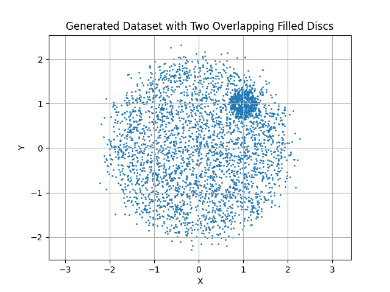
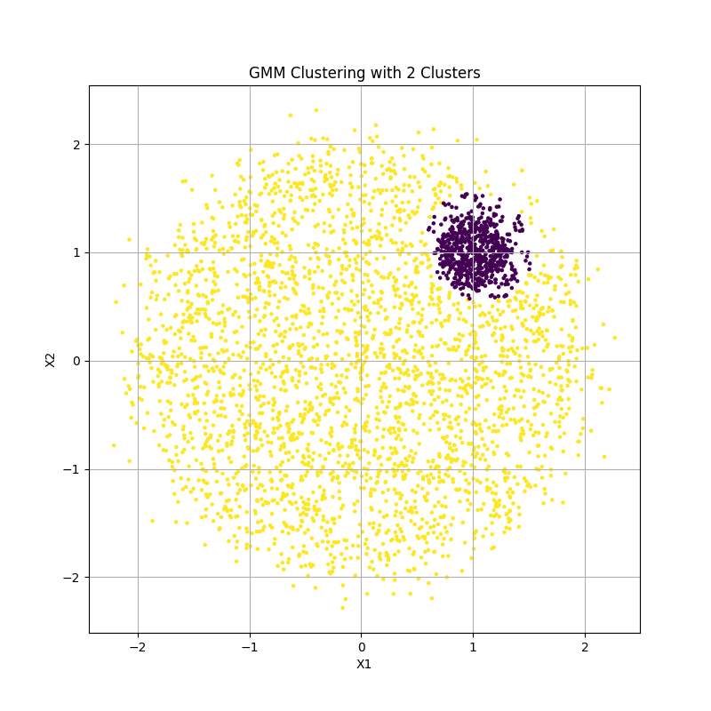
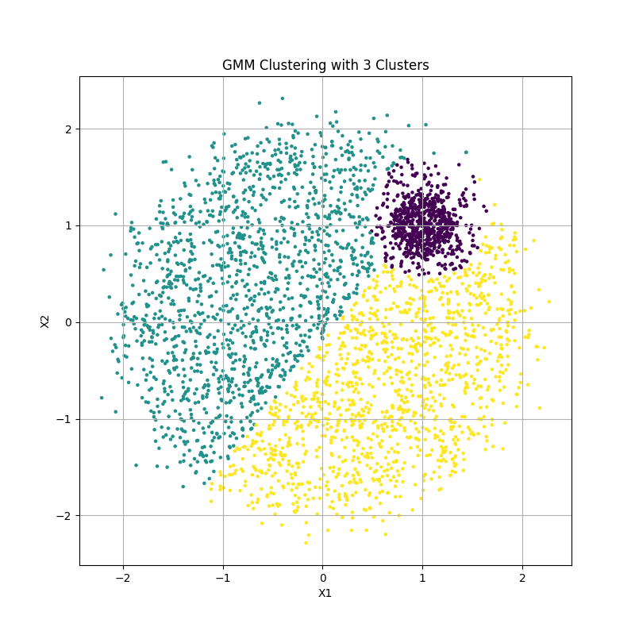
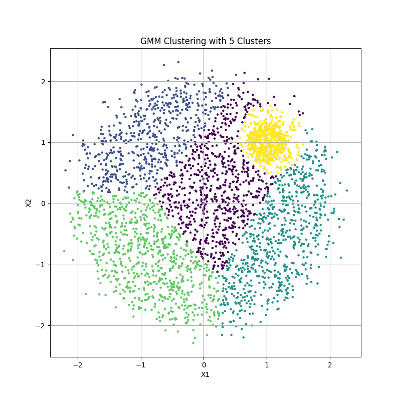
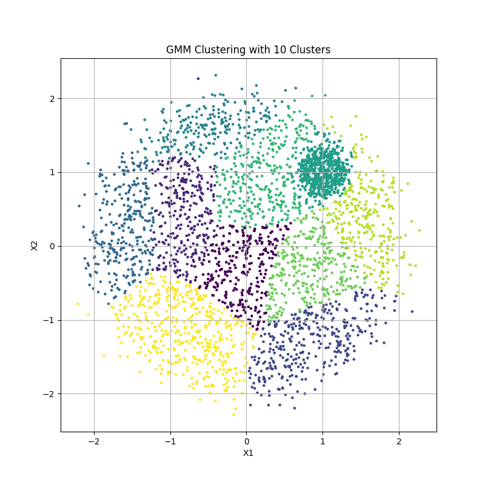
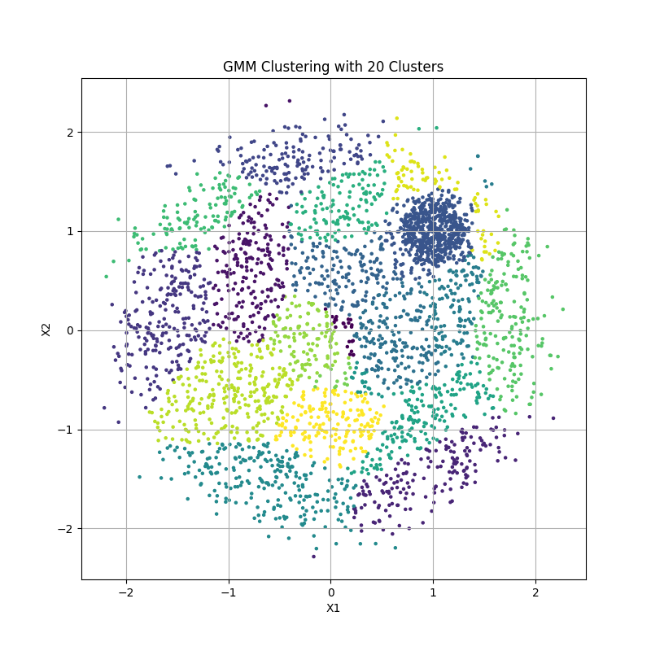
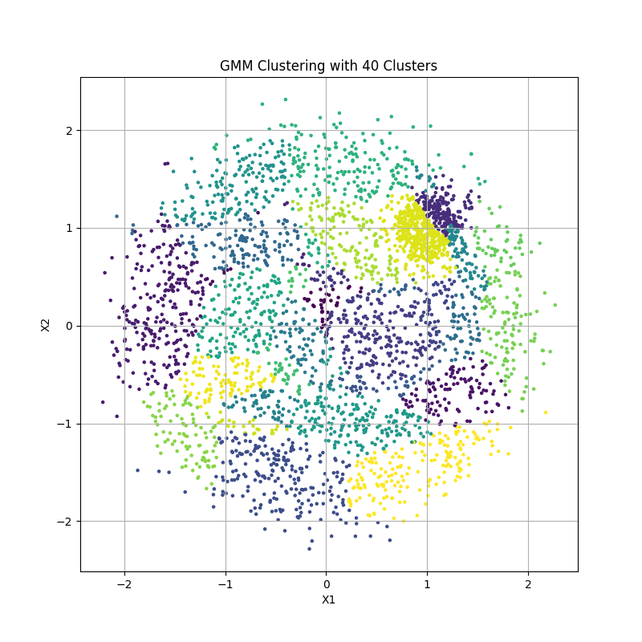

### Task 1 : KDE Class (60)
```python
import numpy as np
import matplotlib.pyplot as plt

class KDE:
    def __init__(self, kernel='gaussian', bandwidth=1.0):
        self.kernel = kernel
        self.bandwidth = bandwidth
        self.data = None
        
    def fit(self, X):
        self.data = np.array(X)
        
    def _gaussian_kernel(self, u):
        return np.exp(-0.5 * u**2) / np.sqrt(2 * np.pi)
    
    def _box_kernel(self, u):
        return 0.5 * (np.abs(u) <= 1).astype(float)
    
    def _triangular_kernel(self, u):
        return (1 - np.abs(u)) * (np.abs(u) <= 1).astype(float)
    
    def _kernel(self, u):
        if self.kernel == 'gaussian':
            return self._gaussian_kernel(u)
        elif self.kernel == 'box':
            return self._box_kernel(u)
        elif self.kernel == 'triangular':
            return self._triangular_kernel(u)
        else:
            raise ValueError("Unknown kernel type. Choose 'gaussian', 'box', or 'triangular'.")
    
    def predict(self, x):
        if self.data is None:
            raise ValueError("Model is not fitted yet. Call 'fit' with training data first.")
        
        x = np.array(x)
        n_samples, n_features = self.data.shape
        kernel_values = np.zeros(n_samples)
        
        for i in range(n_samples):
            u = (x - self.data[i]) / self.bandwidth
            kernel_values[i] = self._kernel(u).prod()
        
        density = kernel_values.sum() / (n_samples * self.bandwidth**n_features)
        
        return density
    
    def visualize(self):
        if self.data is None or self.data.shape[1] != 2:
            raise ValueError("Visualization only supports 2D data.")
        
        x_min, x_max = self.data[:, 0].min() - 1, self.data[:, 0].max() + 1
        y_min, y_max = self.data[:, 1].min() - 1, self.data[:, 1].max() + 1
        x_grid, y_grid = np.meshgrid(np.linspace(x_min, x_max, 100),
                                    np.linspace(y_min, y_max, 100))
        
        grid_points = np.vstack([x_grid.ravel(), y_grid.ravel()]).T
        n_samples = self.data.shape[0]
        n_grid_points = grid_points.shape[0]
        diffs = grid_points[:, np.newaxis, :] - self.data[np.newaxis, :, :]
        scaled_diffs = diffs / self.bandwidth
        kernel_values = self._kernel(scaled_diffs).prod(axis=2)
        density_values = kernel_values.sum(axis=1) / (n_samples * self.bandwidth**self.data.shape[1])
        density_grid = density_values.reshape(x_grid.shape)
        
        plt.figure(figsize=(20, 15))
        
        plt.contourf(x_grid, y_grid, density_grid, levels=20, cmap='viridis')
        
        plt.scatter(self.data[:, 0], self.data[:, 1], c='red', s=5, alpha=0.3, label='Data Points')  # Reduced size and added transparency
        
        plt.title(f"KDE with {self.kernel} kernel")
        plt.colorbar(label='Density')
        plt.legend()
        plt.savefig('assignments/5/figures/kde.png')


if __name__ == '__main__':
    np.random.seed(0)
    data = np.random.randn(100, 2)
    kde = KDE(kernel='gaussian', bandwidth=0.2)
    kde.fit(data)
    point = np.array([0, 0])
    print(f"Density at {point}: {kde.predict(point)}")
    kde.visualize()

```

### Task 2 : Generate Synthetic Data



### Task 3 : KDE vs GMM (30)









1. Different Density Characteristics:
- The dataset has two true generating distributions: one spread out (yellow in k=2) and one compact/dense (purple in k=2)
- The spread-out distribution has higher variance/lower density
- The compact distribution has lower variance/higher density
- The distributions are correctly partioned by the GMM

2. Component Addition Behavior:
- At k=5: The model first subdivides the spread-out (lower density) distribution while keeping the compact (higher density) distribution mostly intact
- At k=40: Only after extensively partitioning the spread-out distribution does the model begin to partition the compact distribution
- This behavior occurs because GMM tries to optimize likelihood, and it can gain more likelihood improvement by splitting regions of lower density first

3. Hard Membership Boundaries:
- The straight-line boundaries appear when we assign points to their most probable component (hard clustering)
- These boundaries represent the decision boundaries where P(cluster_i|x) = P(cluster_j|x) for neighboring clusters i and j
- They form straight lines because:
  - For two Gaussians, the locus of points where the posterior probabilities are equal forms a hyperplane (straight line in 2D)
  - This is because the log-ratio of two Gaussian densities is quadratic, and the decision boundary occurs where this ratio equals zero
  - Mathematically, this boundary is where the distances to the centers of the two Gaussians (weighted by their covariances) are equal


