## KDE
### Task 1 : KDE Class (60)
```python
import numpy as np
import matplotlib.pyplot as plt

class KDE:
    def __init__(self, kernel='gaussian', bandwidth=1.0):
        self.kernel = kernel
        self.bandwidth = bandwidth
        self.data = None
        
    def fit(self, X):
        self.data = np.array(X)
        
    def _gaussian_kernel(self, u):
        return np.exp(-0.5 * u**2) / np.sqrt(2 * np.pi)
    
    def _box_kernel(self, u):
        return 0.5 * (np.abs(u) <= 1).astype(float)
    
    def _triangular_kernel(self, u):
        return (1 - np.abs(u)) * (np.abs(u) <= 1).astype(float)
    
    def _kernel(self, u):
        if self.kernel == 'gaussian':
            return self._gaussian_kernel(u)
        elif self.kernel == 'box':
            return self._box_kernel(u)
        elif self.kernel == 'triangular':
            return self._triangular_kernel(u)
        else:
            raise ValueError("Unknown kernel type. Choose 'gaussian', 'box', or 'triangular'.")
    
    def predict(self, x):
        if self.data is None:
            raise ValueError("Model is not fitted yet. Call 'fit' with training data first.")
        
        x = np.array(x)
        n_samples, n_features = self.data.shape
        kernel_values = np.zeros(n_samples)
        
        for i in range(n_samples):
            u = (x - self.data[i]) / self.bandwidth
            kernel_values[i] = self._kernel(u).prod()
        
        density = kernel_values.sum() / (n_samples * self.bandwidth**n_features)
        
        return density
    
    def visualize(self):
        if self.data is None or self.data.shape[1] != 2:
            raise ValueError("Visualization only supports 2D data.")
        
        x_min, x_max = self.data[:, 0].min() - 1, self.data[:, 0].max() + 1
        y_min, y_max = self.data[:, 1].min() - 1, self.data[:, 1].max() + 1
        x_grid, y_grid = np.meshgrid(np.linspace(x_min, x_max, 100),
                                    np.linspace(y_min, y_max, 100))
        
        grid_points = np.vstack([x_grid.ravel(), y_grid.ravel()]).T
        n_samples = self.data.shape[0]
        n_grid_points = grid_points.shape[0]
        diffs = grid_points[:, np.newaxis, :] - self.data[np.newaxis, :, :]
        scaled_diffs = diffs / self.bandwidth
        kernel_values = self._kernel(scaled_diffs).prod(axis=2)
        density_values = kernel_values.sum(axis=1) / (n_samples * self.bandwidth**self.data.shape[1])
        density_grid = density_values.reshape(x_grid.shape)
        
        plt.figure(figsize=(20, 15))
        
        plt.contourf(x_grid, y_grid, density_grid, levels=20, cmap='viridis')
        
        plt.scatter(self.data[:, 0], self.data[:, 1], c='red', s=5, alpha=0.3, label='Data Points')  # Reduced size and added transparency
        
        plt.title(f"KDE with {self.kernel} kernel")
        plt.colorbar(label='Density')
        plt.legend()
        plt.savefig('assignments/5/figures/kde.png')


if __name__ == '__main__':
    np.random.seed(0)
    data = np.random.randn(100, 2)
    kde = KDE(kernel='gaussian', bandwidth=0.2)
    kde.fit(data)
    point = np.array([0, 0])
    print(f"Density at {point}: {kde.predict(point)}")
    kde.visualize()

```

### Task 2 : Generate Synthetic Data


### Task 3 : KDE vs GMM (30)


1. Different Density Characteristics:
- The dataset has two true generating distributions: one spread out (yellow in k=2) and one compact/dense (purple in k=2)
- The spread-out distribution has higher variance/lower density
- The compact distribution has lower variance/higher density
- The distributions are correctly partioned by the GMM

2. Component Addition Behavior:
- At k=5: The model first subdivides the spread-out (lower density) distribution while keeping the compact (higher density) distribution mostly intact
- At k=40: Only after extensively partitioning the spread-out distribution does the model begin to partition the compact distribution
- This behavior occurs because GMM tries to optimize likelihood, and it can gain more likelihood improvement by splitting regions of lower density first

3. Hard Membership Boundaries:
- The straight-line boundaries appear when we assign points to their most probable component (hard clustering)
- These boundaries represent the decision boundaries where P(cluster_i|x) = P(cluster_j|x) for neighboring clusters i and j
- They form straight lines because:
  - For two Gaussians, the locus of points where the posterior probabilities are equal forms a hyperplane (straight line in 2D)
  - This is because the log-ratio of two Gaussian densities is quadratic, and the decision boundary occurs where this ratio equals zero
  - Mathematically, this boundary is where the distances to the centers of the two Gaussians (weighted by their covariances) are equal


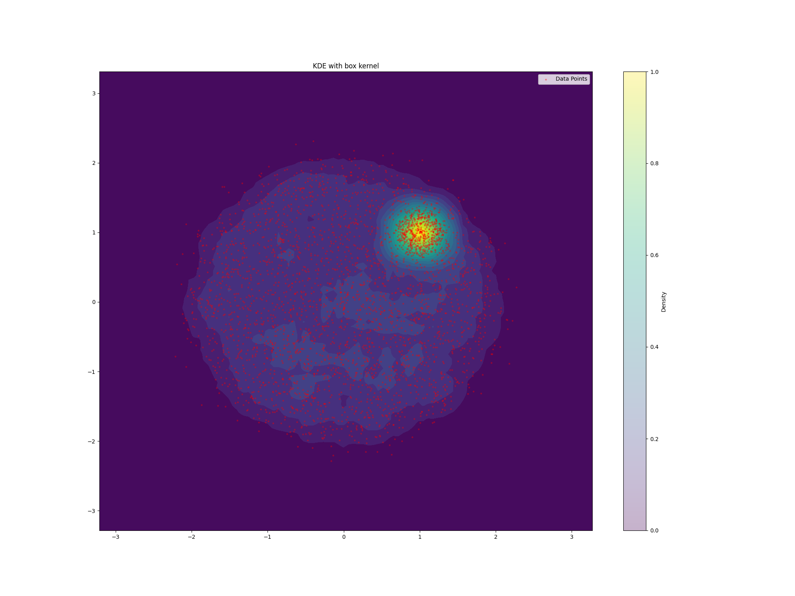
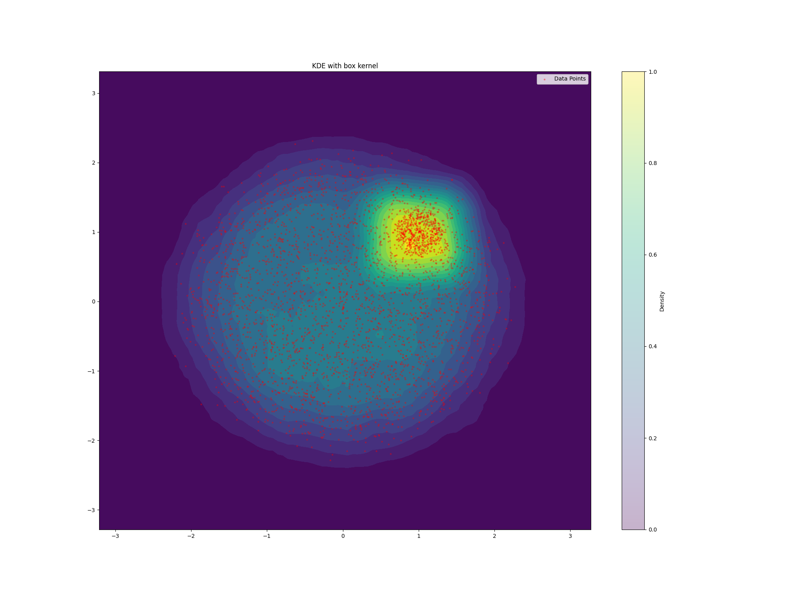
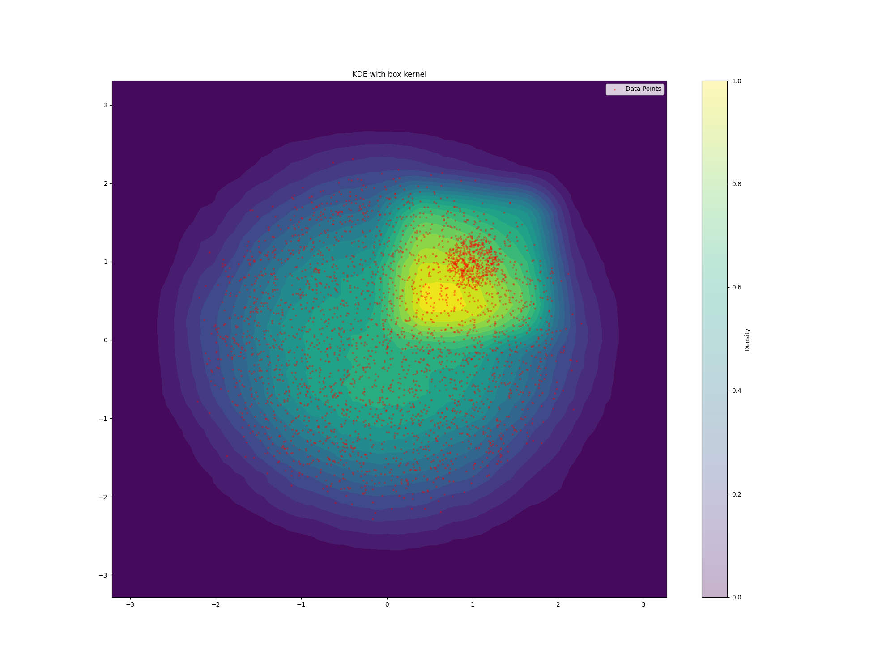

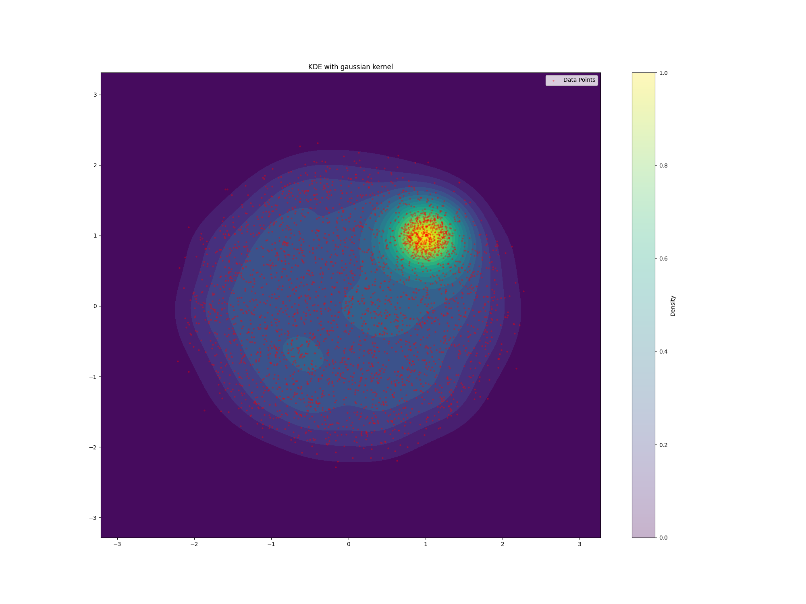
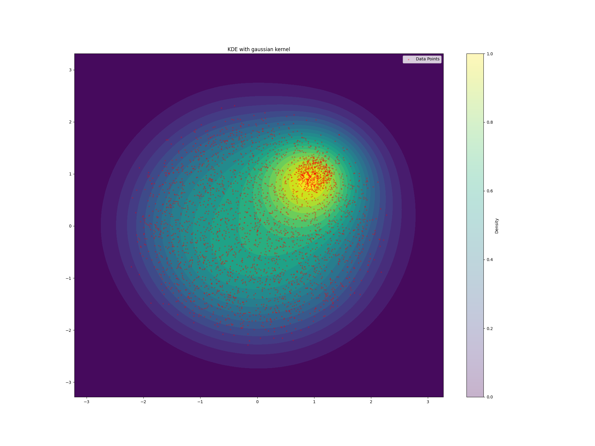
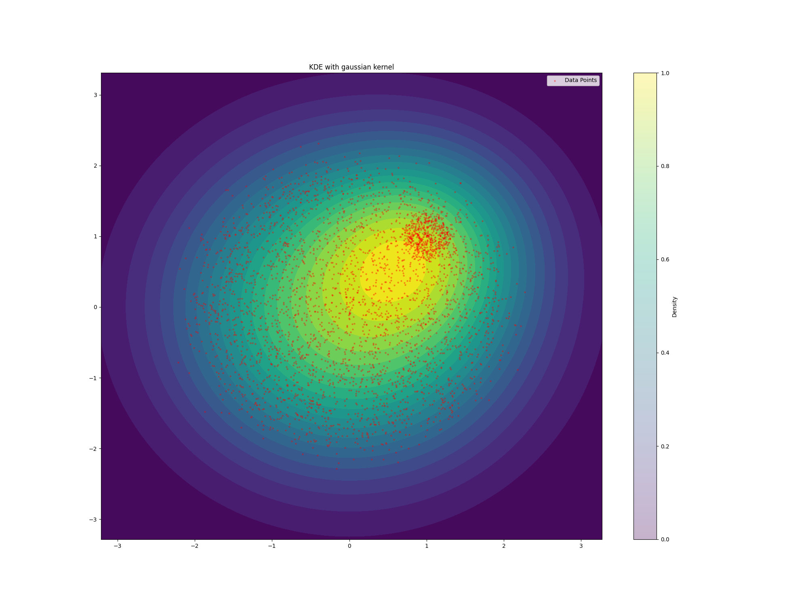

Yes, the KDE fits the data consistently, for the appropriate bandwidth.
Bandwidth = 0.3:
- Shows more local variation and noise in the density estimation
- Clearly captures the high-density region in the top-right very well (shows up as bright yellow/red)
- Less smoothing means it's more sensitive to individual data points
- Risk of overfitting to noise in the data

Bandwidth = 0.6:
- Better balance between smoothing and detail
- Still maintains the distinction of the high-density region in top-right
- Smoother contours across the overall distribution
- Provides a more balanced view of the underlying density

Bandwidth = 0.9:
- Over-smooths the data
- Starts to blur the distinction between the high-density region in top-right and the rest
- Creates a more circular, uniform density pattern
- The peak density starts shifting towards the center of the overall distribution
- Loses important local density information by excessive smoothing

This illustrates the classic bandwidth selection trade-off in KDE:
- Too small (0.3): Fits noise, more jagged density estimation
- Too large (0.9): Over-smooths, loses important local structure
- The middle value (0.6) provides a better balance between noise reduction and maintaining important density features

The key insight is how the high bandwidth starts to "pull" the density estimate toward the center of the data, even though we can clearly see there's a concentrated cluster in the top-right that should have notably higher density than the center region.

## HMMs

### Dataset

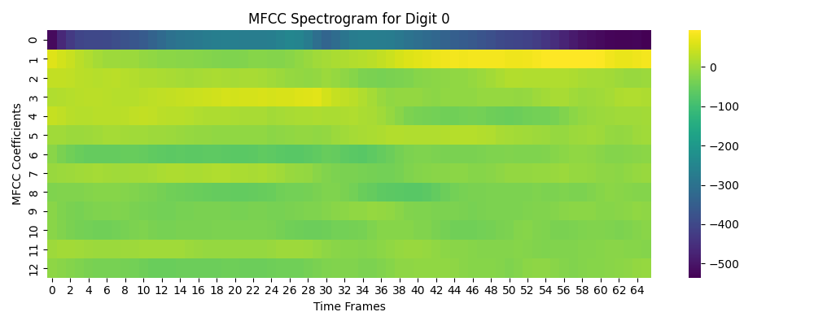
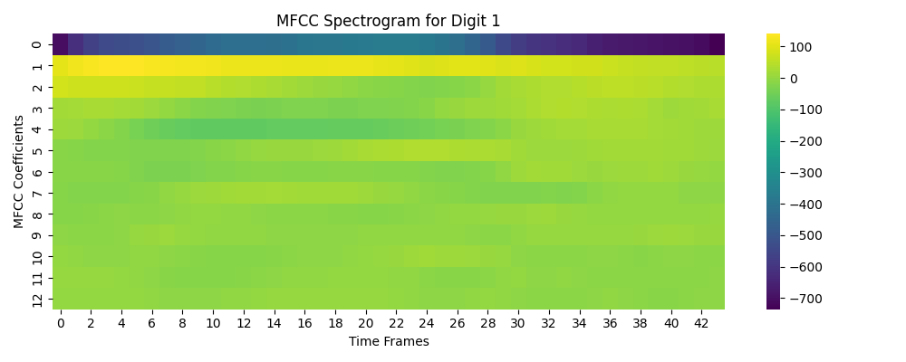
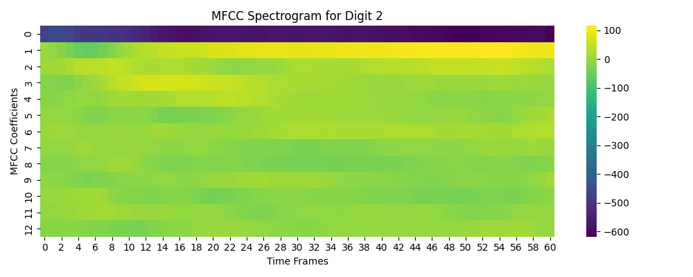
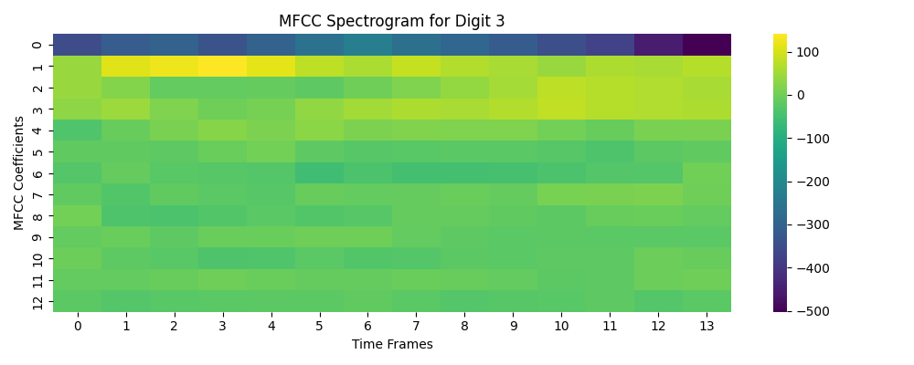
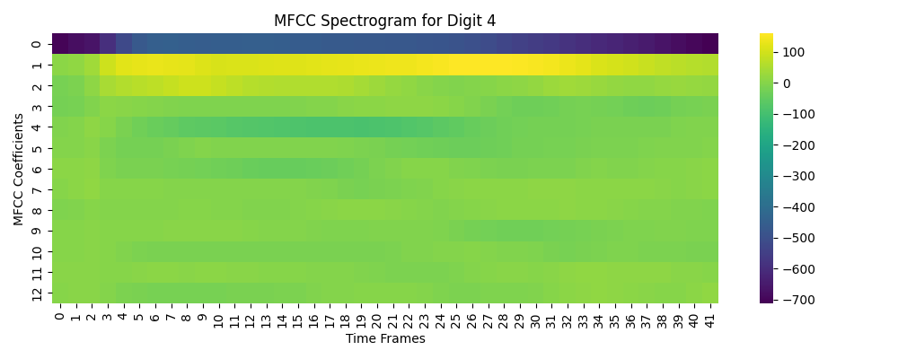
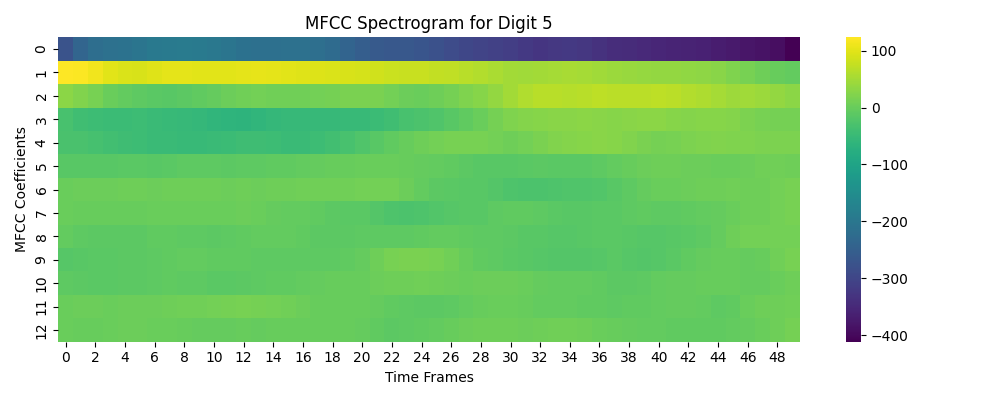
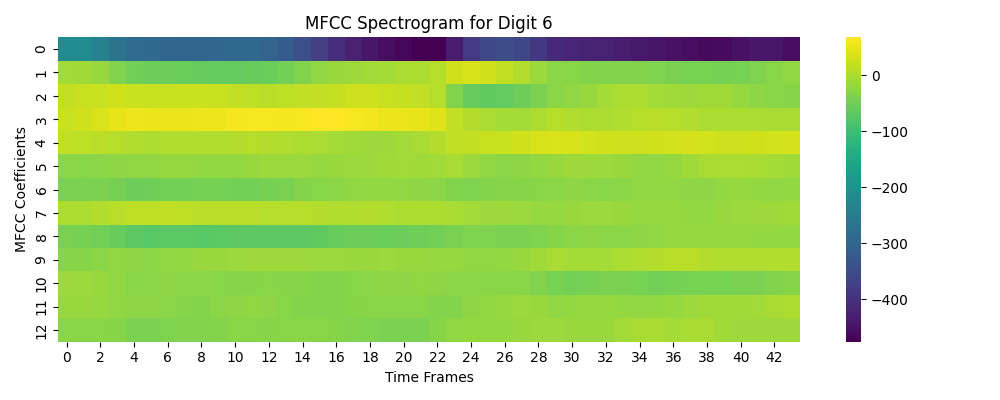
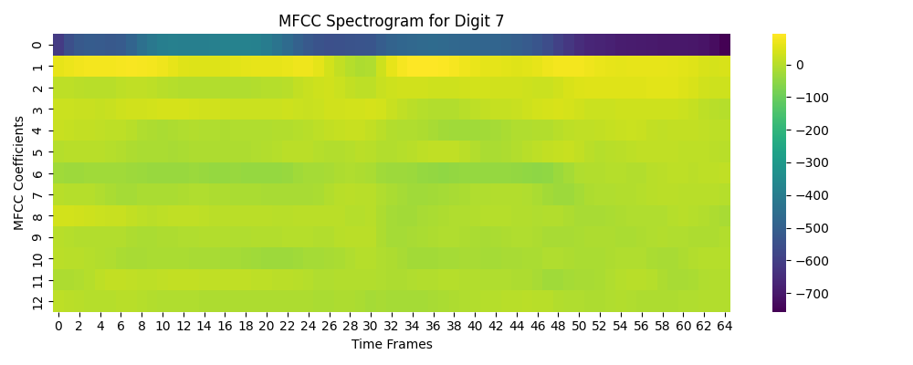
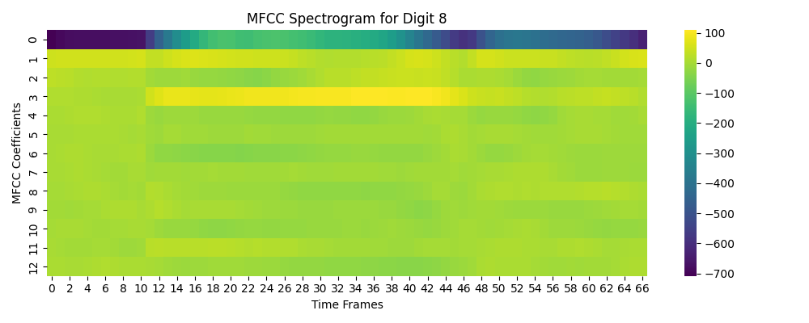
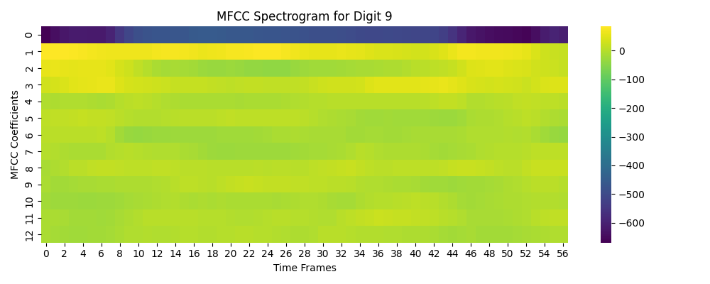

Patterns in MFCC Spectrogram:
1. Temporal Structure:
- Clear temporal progression across time frames (x-axis)
- Sequential patterns in the coefficients (y-axis)
- Different intensities (colors) show varying energy levels in different frequency bands
- Consistent patterns across the utterance, suggesting stable phonetic states

2. State-like Behavior:
- Visible segments with relatively stable coefficients (similar colors)
- Transitions between these stable regions
- This matches well with how speech produces distinct phonetic states

Why HMM is Suitable:
1. Hidden States Map to Phonemes:
- HMMs can model the underlying phonetic states of speech
- Each hidden state can represent a distinct sound unit
- Transitions between states capture how phonemes flow in speech

2. Markov Property Fits Speech:
- Speech has sequential dependencies
- Current sound affects probability of next sound
- HMM's state transitions naturally model this

For the Task Classification:
This is a DECODING task because:
- We have:
  - HMM parameters (trained on each digit)
  - Observation sequence (MFCC features)
- We want: Most probable sequence/class (which digit was spoken)
- It's similar to "What portion was fair/loaded die?" example
- We're finding argmax p(S|O) - most likely digit class given the MFCC observations

Unlike:
- Evaluation: Which just finds probability p(O)
- Learning: Which finds model parameters θ

We're using the trained HMMs to decode which digit was most likely spoken given the MFCC sequence, making this a classic decoding application.

### Metrics

Report: HMM Speech Recognition Performance Analysis

Results:
- Test Accuracy (Original Dataset): 91.83%
- Test Accuracy (Personal Recordings): 28.57%
- Test Accuracy (Personal Recordings + Personal voice in train set): 85.71%

Analysis:

1. Original Dataset Performance (91.83%):
- The high accuracy suggests the HMM models effectively captured the temporal patterns of the MFCC features
- The model successfully learned the distinct characteristics of each digit's pronunciation in the training set
- Consistency in recording conditions (microphone, background noise, speaking style) likely contributed to good performance

2. Personal Recordings Performance (28.57%):
- The significant drop in accuracy reveals challenges in generalization
- Key factors contributing to poor performance:

   a) Dataset Bias:
   - Training data had limited speaker diversity
   - Models may have overfit to specific accent patterns or speaking styles

   b) Recording Conditions:
   - Different microphone quality/characteristics
   - Varying background noise levels
   - Different recording environment acoustics

   c) Speaker Variation:
   - Individual differences in pronunciation
   - Speaking pace variations
   - Accent differences from training data

Note: Adding 5 of my audio recordings to the test set increased the accuracy to 85.71%

## RNNs [OCR]

### Training Progress and Results

| Epoch | Train Loss | Validation ANCC | Random Baseline Accuracy | Example Predictions & Ground Truth |
|-------|------------|-----------------|--------------------------|-----------------------------------|
| 1     | 1.5848     | 0.6248          | 0.0196                   | Predicted: **poiassism**, Actual: **potassium**<br>Predicted: **unaaalaale**, Actual: **unwastable**<br>Predicted: **camplolize**, Actual: **campholide** |
| 2     | 0.5152     | 0.8681          | 0.0189                   | Predicted: **potassium**, Actual: **potassium**<br>Predicted: **unwastable**, Actual: **unwastable**<br>Predicted: **campholide**, Actual: **campholide** |
| 3     | 0.2518     | 0.9148          | 0.0192                   | Predicted: **potassium**, Actual: **potassium**<br>Predicted: **unwastable**, Actual: **unwastable**<br>Predicted: **campholide**, Actual: **campholide** |
| 4     | 0.1816     | 0.9387          | 0.0190                   | Predicted: **potassium**, Actual: **potassium**<br>Predicted: **unwastable**, Actual: **unwastable**<br>Predicted: **campholide**, Actual: **campholide** |
| 5     | 0.1504     | 0.9487          | 0.0192                   | Predicted: **potassium**, Actual: **potassium**<br>Predicted: **unwastable**, Actual: **unwastable**<br>Predicted: **campholide**, Actual: **campholide** |
| 6     | 0.1364     | 0.9441          | 0.0194                   | Predicted: **potassium**, Actual: **potassium**<br>Predicted: **unwastable**, Actual: **unwastable**<br>Predicted: **campholide**, Actual: **campholide** |
| 7     | 0.1225     | 0.9578          | 0.0189                   | Predicted: **potassium**, Actual: **potassium**<br>Predicted: **unwastable**, Actual: **unwastable**<br>Predicted: **campholide**, Actual: **campholide** |
| 8     | 0.1141     | 0.9655          | 0.0191                   | Predicted: **potassium**, Actual: **potassium**<br>Predicted: **unwastable**, Actual: **unwastable**<br>Predicted: **campholide**, Actual: **campholide** |
| 9     | 0.1062     | 0.9453          | 0.0194                   | Predicted: **potassium**, Actual: **potassium**<br>Predicted: **unwastable**, Actual: **unwastable**<br>Predicted: **campholide**, Actual: **campholide** |
| 10    | 0.1018     | 0.9552          | 0.0195                   | Predicted: **potassium**, Actual: **potassium**<br>Predicted: **unwastable**, Actual: **unwastable**<br>Predicted: **campholide**, Actual: **campholide** |


### Analysis of Progress:

- **Training Loss**: As expected, the training loss decreases steadily across epochs, indicating that the model is improving its fit to the training data. The decrease is more rapid in the early epochs and slows down as the model approaches convergence, which is common in deep learning.
  
- **Validation Accuracy (ANCC)**: The validation accuracy improves significantly from 0.6248 in epoch 1 to 0.9552 in epoch 10, showing the model’s increasing ability to predict character sequences correctly. This suggests that the model is generalizing well to the validation data.

- **Random Baseline Accuracy**: The random baseline accuracy remains very low (around 0.019). This serves as a comparison point to show how much better the model performs compared to random guessing. Even in the first epoch, the model significantly outperforms this baseline, and by epoch 10, the model has nearly perfect accuracy compared to random predictions.

### Observations on Predictions:
- In earlier epochs, some predictions are significantly different from the actual targets (e.g., in epoch 1: "poiassism" vs. "potassium").
- By epoch 10, most predictions are either identical to or very close to the actual ground truth (e.g., in epoch 10: "potassium" vs. "potassium").